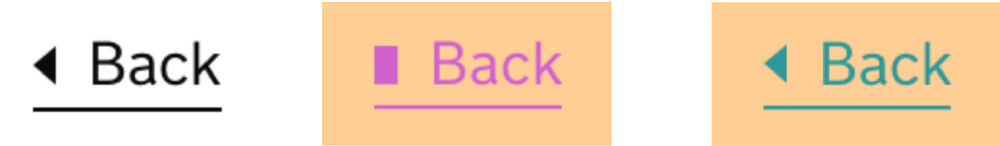
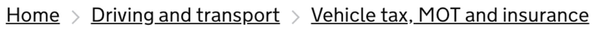
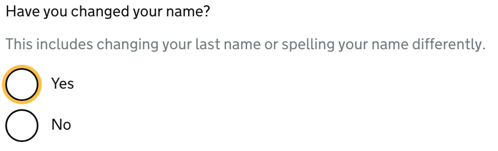
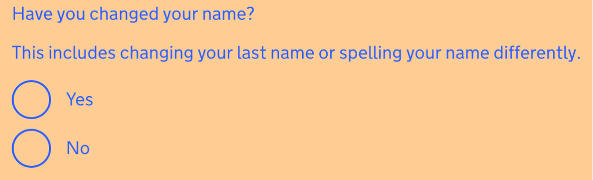
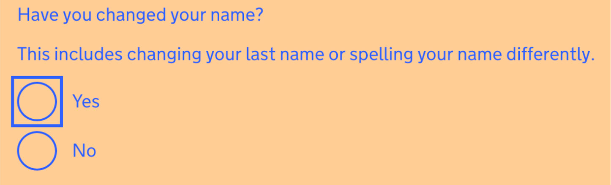
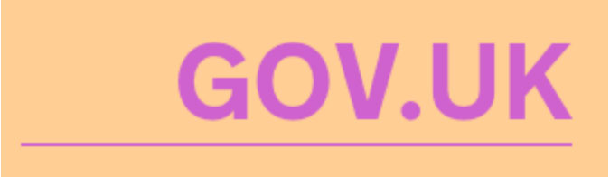
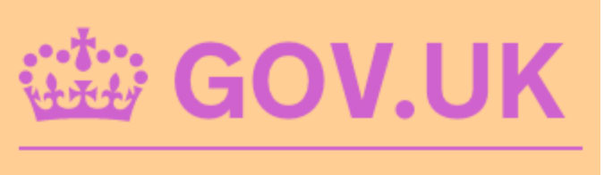
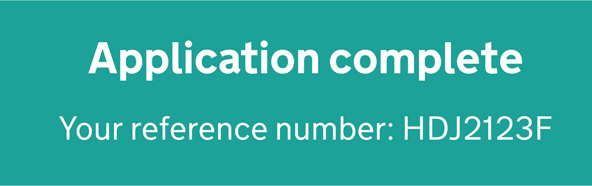

# 讓重要元素消失不見

支援在 GOV.UK 上更改顏色的使用者

當顏色被覆蓋時，GOV.UK 會是什麼樣子

預設情況下，GOV.UK 會嘗試使用最具無障礙的顏色，但有時某些使用者可能需要更改它們。

例如，對光敏感的人可能會發現白色背景太亮，或者患有閱讀障礙的使用者可能會發現某些顏色比其他顏色更容易閱讀。

我們之前在無障礙部落格上研究並討論過[使用者如何以及為何更改網站上的顏色](https://accessibility.blog.gov.uk/2017/03/27/how-users-change-colours-on-websites/)以及團隊需要考慮的一些問題。

英國政府網站設計系統團隊的目標是使 [GOV.UK 前端](https://github.com/alphagov/govuk-frontend)中的任何元件盡可能無障礙化，因此借鑑先前的研究，並嘗試改進最新版本。

下面挑選了一些範例來展示已做出的一些改進。

## 目錄

   - [返回連結（back link）元件](#返回連結back-link元件)
   - [麵包屑（breadcrumbs）元件](#麵包屑breadcrumbs元件)
   - [單選按鈕（radio）元件](#單選按鈕radio元件)
   - [標頭（header）元件](#標頭header元件)
   - [面板（panel）元件](#面板panel元件)

### 返回連結（back link）元件

[返回連結元件](https://design-system.service.gov.uk/components/back-link)有一個三角形箭頭圖標，使用 [CSS 三角形方法](https://css-tricks.com/snippets/css/css-triangle/)實作。

此方法依賴操作 CSS 「border」 屬性來使邊框的某些邊消失。

當覆蓋顏色時，以前不可見的邊框變得可見，進而導致在三角形箭頭的位置渲染了一個矩形。

返回元件的三個版本：第一個按照預期呈現為朝左的三角形，第二個在顏色被覆蓋時損壞而顯示為矩形，第三個在實作修正後顯示朝左的三角形。

透過加入「[clip-path](https://developer.mozilla.org/en-US/docs/Web/CSS/clip-path)」，可以繪製一個與原始三角形相符的多邊形，以確保不會出現矩形。

請注意，[「clip-path」僅在某些瀏覽器中有效，](https://caniuse.com/#feat=css-clip-path)這就是我們（英國政府網站設計系統團隊）同時使用 CSS 三角形方法和「clip-path」的原因。

為了更容易製作這樣的三角形，英國政府網站設計系統團隊[建立了 SCSS mixin](https://github.com/alphagov/govuk-frontend/blob/b40ca0f119468bddb8f662caae8b31931a581e3e/src/helpers/_shape-arrow.scss#L20-L76)。

### 麵包屑（breadcrumbs）元件

[麵包屑元件](https://design-system.service.gov.uk/components/breadcrumbs)用 V 形符號（chevrons）來分隔每個連結。

原始版本使用PNG圖片，當顏色改變時這些圖片就會消失。

為了解決這個問題，英國政府網站設計系統團隊再次使用 CSS 來建立 V 形符號，但您也可以考慮在此處使用 [SVG 圖示](https://css-tricks.com/pretty-good-svg-icon-system/)。

閱讀 [GOV.UK 前端中麵包屑導覽（breadcrumbs）範例的程式碼](https://github.com/alphagov/govuk-frontend/blob/b40ca0f119468bddb8f662caae8b31931a581e3e/src/components/breadcrumbs/_breadcrumbs.scss#L71-L84)

譯註：麵包屑（Breadcrumb），簡單來說就是網頁上方的導覽條、導覽列，讓使用者更容易瀏覽，也利於搜尋引擎爬蟲解析網站。

### 單選按鈕（radio）元件

這個[單選按鈕元件](https://design-system.service.gov.uk/components/radios)[早於 GOV.UK 前端](https://designnotes.blog.gov.uk/2016/11/30/weve-updated-the-radios-and-checkboxes-on-gov-uk/)，是確保更改的顏色受到尊重的一個很好的例子。

當我們導入單選按鈕元件時，我們發現有機會改善[焦點指標（focus indicators）](https://developers.google.com/web/fundamentals/accessibility/focus/)。

焦點狀態對於鍵盤使用者了解他們正在互動的內容非常重要——如果沒有焦點狀態互動，就不清楚按下「Enter」鍵時將與介面的哪一部分進行互動。

以前，當顏色變更時，焦點指標會消失，因為它依賴於「框陰影 (box-shadow)」，因為「輪廓 (outline)」不允許曲線。

為了確保指標可見，除了顏色被覆蓋時顯示的框架陰影之外，我們還新增了透明輪廓。

閱讀 [GOV.UK 前端中單選按鈕範例的程式碼](https://github.com/alphagov/govuk-frontend/blob/b40ca0f119468bddb8f662caae8b31931a581e3e/src/components/radios/_radios.scss#L112-L117)

### 標頭（header）元件

包含 GOV.UK 徽標，但該圖標在覆蓋顏色時會消失，因為它最初是以 PNG
圖片實現。

覆蓋顏色時的標題元件

為了解決這個問題，我們使用了一個內聯 (inline) SVG，它利用 [currentColor](https://css-tricks.com/currentcolor/)作為它的「填滿」屬性。

閱讀 [GOV.UK 前端中標題範例的程式碼](https://github.com/alphagov/govuk-frontend/blob/b40ca0f119468bddb8f662caae8b31931a581e3e/src/components/breadcrumbs/_breadcrumbs.scss#L71-L84)

### 面板（panel）元件

[面板（panel）元件](https://design-system.service.gov.uk/components/panel)使用純色背景使其脫穎而出，但當顏色變更時它就會消失。

覆蓋顏色時的面板元件

我們選擇新增一個透明邊框，無論在什麼情況下都會顯示。

閱讀 [GOV.UK 前端中面板範例的程式碼](https://github.com/alphagov/govuk-frontend/blob/b40ca0f119468bddb8f662caae8b31931a581e3e/src/components/panel/_panel.scss#L15)

這篇部落格文章僅介紹了英國政府網站設計系統團隊為使英國政府網站的元件更具無障礙所做的一小部分工作。查看 [GOV.UK 設計系統](https://design-system.service.gov.uk/components/)以了解更多資訊。

Nick Colley 是負責 GOV.UK 設計系統的前端開發人員。
