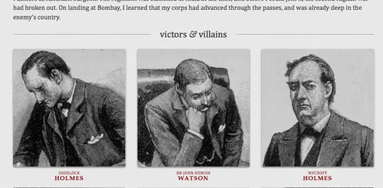
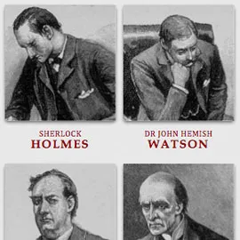
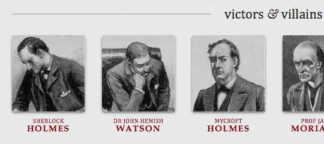
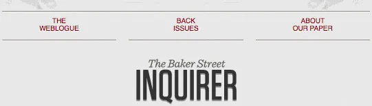

# 響應式設計

響應式網頁設計

> *設計師在印刷媒體中所知道的控制，以及他們在網路媒體中經常渴望的控制，其實只是印刷頁面限制的功能。我們應該懷抱著網路並不具相同的限制這個事實，並為這種靈活性去進行設計。但首先，我們必須「接受事物的變化」。*
>
> 約翰‧奧索普，《網頁設計之道》

英國建築師克裡斯多福·雷恩（Christopher Wren）曾戲稱他選擇的領域「追求永恆」，這種說法有某種吸引力：不像網路經常感覺像是為了下周而努力，而建築學在很大程度上是一門永久性學科。

建築物的基礎先決定占地面積，進而確定了其骨架，進而塑造了外觀。建築過程中的每個階段都比上一階段更加固定、不可變。創意的決策實質上塑造了一個物理空間，定義了人們在其範圍內移動的方式，可能持續數十年甚至數個世紀。

然而，網路上的工作完全是另一回事。我們的工作特點是瞬息萬變，經常在一兩年內就被精鍊或替代。不一致的視窗寬度、螢幕解析度、使用者偏好以及使用者安裝的字體等等，只是我們發布作品時需要考慮的一些難以捉模的因素，而多年來，我們已經非常熟練地做到了這一點。

但情況正在改變，變化的速度可能比我們想像的還要快。預計行動瀏覽將在三到五年內超過桌面瀏覽。三大主流遊戲機中，有兩個具有網頁瀏覽器（其中之一相當出色）。我們正在為滑鼠和鍵盤、T9 鍵盤、手持遊戲控制器和觸控介面進行設計。簡而言之，我們面臨著比以往更多的設備、輸入模式和瀏覽器。

近年來，我遇到了越來越多要求包含「iPhone 網站」作為其專案的公司。這是一個有趣的說法：從字面上看，它說明行動 WebKit 作為瀏覽器專案的特質，以及超越桌機的強大商業案例。但作為設計師，我認為我們經常對這種明確的要求感到舒適，因為它允許我們區分正在面臨的問題。我們可以將行動體驗隔離在與「非 iPhone 網站」不同的子網域、空間之外。但接下來呢？ iPad 網站？ N90 網站？我們真的可以繼續承諾為每個新的使用者代理提供其客製化的體驗嗎？在某些時候，這開始讓人感覺像是一場零和遊戲。但我們和我們的設計如何適應？

## 動態基礎

讓我們考慮一個[範例設計](https://alistapart.github.io/code-samples/responsive-web-design/ex/ex-site-flexible.html)。我為一個虛擬的雜誌建立了一個簡單的頁面；[它是一個基於在流動佈局](http://www.alistapart.com/articles/fluidgrids/)（fluid grid）上的簡單的兩欄佈局，其中散佈著不少[動態圖像](http://unstoppablerobotninja.com/entry/fluid-images)。作為非固定佈局的長期支持者，我長期以來一直認為它們更具「未來性」，只因為它們與佈局無關。在某種程度上，這是正確的：動態設計不對瀏覽器視窗寬度做任何假設，並且可以完美地適應具有縱向和橫向模式的設備。



但是，無論是固定佈局或是流動佈局，沒有任何設計可以無縫地達到其最初的預期想像。範例[設計](https://alistapart.github.io/code-samples/responsive-web-design/ex/ex-site-flexible.html)隨著瀏覽器視窗調整大小時表現得非常好，但在較低解析度下，問題點很快就會出現。當在小於 800×600 的視窗中查看時，後面的插圖很快就會被裁剪，導致文字可能會以不合時宜的方式自動換行，並且底部的圖像變得過於緊湊而難以清晰辨認。受影響的不僅僅是解析度範圍：在寬螢幕顯示器上查看設計時，影像會迅速增大到難以處理的尺寸，從而擠佔了周圍的內容。

簡而言之，我們的動態設計在其設計的以桌面為中心的環境中運作得足夠好，但並未將最佳化效果延伸至桌面以外的地方

## 變得響應性

最近，一門名為「*響應式架構*」的新興學科開始研究如何讓實體空間對穿過的人群*做出反應。*透過嵌入式機器人技術和拉伸材料的結合，建築師正在嘗試設計[藝術設備](http://www.robotecture.com/bubbles-417/)和[牆壁結構](http://vimeo.com/4661618)，當人群接近它們時，它們會彎曲、收縮和膨脹。運動感測器可以與氣候控制系統配合使用，以在房間充滿人員時調節房間的溫度和環境照明。已經有公司生產出「智慧玻璃技術」，當房間的居住者達到一定的密度閾值時，[該技術可以自動變得不透明，進而為他們提供額外的隱私層級。](http://www.smartglassinternational.com/)

Michael Fox 和 Miles Kemp 在他們的*《互動建築》*一書中將這種更具適應性的方法描述為「一個多循環系統，人們在這個系統中進行對談；*持續和建設性的資訊交流*。」我會強調這一點是因為我認為這是一個微妙但強大的區別：與其創造一成不變的空間來定義特定的體驗，不如建議居民和結構可以且應該相互影響。

這是我們前進的方向。我們可以將它們視為相同體驗的各個面向，而不是為數量不斷增加的網路設備量身訂製互不相關的設計。我們可以設計最佳的瀏覽體驗，但要將基於標準的技術嵌入到我們的設計中，使它們不僅更加靈活，而且更適合它們的媒體呈現。簡而言之，我們需要練習*響應式網頁設計*。但如何進行呢？

## 滿足媒體詢問

自 CSS 2.1 以來，我們的樣式表（style sheets）已經透過[*媒體類型*](http://www.w3.org/TR/CSS21/media.html)實現到了某種程度的設備感知能力。如果您曾經編寫過[列印樣式表](http://www.alistapart.com/articles/goingtoprint/)，那麼您已經熟悉這個概念：

```css
<link rel="stylesheet" type="text/css" href="core.css"
  media="screen" />
<link rel="stylesheet" type="text/css" href="print.css"
  media="print" />
```

為了讓我們設計的不僅僅是格式整齊的頁面列印輸出，CSS 規範為我們提供一系列[可接受的媒體類型](http://www.w3.org/TR/CSS21/media.html#media-types)，每種媒體類型都針對特定類別的網路就緒設備。但大多數瀏覽器和設備從未真正接受該規範的精神，導致許多媒體類型的[實現不完美](http://www.alistapart.com/articles/return-of-the-mobile-stylesheet)，或完全被忽略。

值得慶幸的是，W3C 建立了[*media query*](http://www.w3.org/TR/css3-mediaqueries/)作為 CSS3 規範的一部分，改進媒體類型的承諾。media query不僅使我們能夠針對某些設備類別，而且能夠實際檢查渲染我們工作的設備的物理特性。例如，隨著最近行動 WebKit 的興起，media query 成為一種流行的使用者端技術，用於向 iPhone、Android 手機及其同類產品提供客製化的樣式表。為此，我們可以將查詢合併到 link 樣式表的 media 屬性中：

```css
<link rel="stylesheet" type="text/css"
  media="screen and (max-device-width: 480px)"
  href="shetland.css" />
```

該查詢包含兩個組成部分：

1.  媒體類型（screen），以及
2.  括號內的實際查詢，包含要檢查的特定*媒體特徵*（max-device-width），後面接著目標值（480px）。

簡單來說，我們正在詢問設備的水平解析度 (max-device-width) 是否等於或小於 480px。如果測試通過——換句話說，如果我們在 iPhone 等小螢幕設備上查看我們的成果——那麼該設備將加載 shetland.css。否則，將 link 被完全忽略。

設計師過去曾嘗試過解析度感知佈局，主要依賴於 JS 驅動的解決方案，例如[Cameron Adams的傑出腳本](http://www.themaninblue.com/experiment/ResolutionLayout/)。但是 media query 規範提供了[許多](http://www.w3.org/TR/css3-mediaqueries/#media1)遠遠超出螢幕解析度的媒體功能，大大擴展我們可以透過查詢進行測試的範圍。此外，您可以透過 and 關鍵字將多個屬性值連結在單一查詢中測試：

```css
<link rel="stylesheet" type="text/css"
  media="screen and (max-device-width: 480px) and (resolution: 163dpi)"
  href="shetland.css" />
```

此外，我們不限於在我們的 link 中合併 media query。我們還可以在 CSS 中加入媒體查詢，或將其作為 `@media` 規則的一部分：

```css
@media screen and (max-device-width: 480px) {
  .column {
    float: none;
  }
}
```

或作為 `@import` 指令的一部分：

```css
@import url("shetland.css") screen and (max-device-width: 480px);
```

但在每種情況下，效果都是相同的：如果設備通過了我們的 media query 的測試，相關的 CSS 就會應用於我們的標記。簡而言之，media query 就是[條件註解。](http://msdn.microsoft.com/en-us/library/ms537512(VS.85).aspx)當佈局超出其最初的理想解析度時，我們可以透過手動來修正佈局中的問題，而不是針對特定瀏覽器的特定版本。

## 適應、回應和克服

讓我們將注意力轉向頁面底部的圖像。在預設佈局中，相關 CSS 目前如下所示：

```css
.figure {
  float: left;
  margin: 0 3.317535545023696682% 1.5em 0;   /* 21px / 633px */
  width: 31.121642969984202211%;             /* 197px / 633px */
}li#f-mycroft,
li#f-winter {
  margin-right: 0;
}
```

我已經省略許多排版屬性，將重點著重於佈局：每個 .figure 元素的大小大約是所在欄 (column) 的三分之一，每列 (row) 末尾的兩張圖片 (li#f-mycroft,li#f-winter) 的右側邊距為零。這種方法效果相當好，直到視窗明顯比我們原來的設計更小或更寬。透過 media query，我們可以應用特定解析度的定點修復，調整我們的設計以更好地回應顯示效果的變化。

首先，一旦視窗低於某個解析度閾值（例如：600 px），我們就會對頁面進行線性化處理。因此，我們在樣式表的底部建立一個新 `@media` 區塊，如下所示：

```css
@media screen and (max-width: 600px) {
  .mast,
  .intro,
  .main,
  .footer {
    float: none;
    width: auto;
  }
}
```

如果您在現今的桌面瀏覽器中查看[我們的更新頁面](https://alistapart.github.io/code-samples/responsive-web-design/ex/ex-site-linearize.html)，並將視窗大小縮小到低於 600px，media query 將停用設計主要元素上的浮動，而在文件流程中將每個區塊堆疊在一起。因此，我們的小型化設計效果很好，但圖片仍然沒有聰明地縮小。如果我們引入另一個 media query，我們可以相應地改變它們的佈局：

```css
@media screen and (max-width: 400px) {
  .figure,
  li#f-mycroft {
    margin-right: 3.317535545023696682%;    /* 21px / 633px */
    width: 48.341232227488151658%;          /* 306px / 633px */
  }  li#f-watson,
  li#f-moriarty {
    margin-right: 0;
  }
}
```



我們的圖片可以響應地改變其佈局[，以更好地適應較小的顯示器](https://alistapart.github.io/code-samples/responsive-web-design/ex/ex-site-mini.html)。

不要介意難看的百分比；[我們只是重新計算流動佈局](http://www.alistapart.com/articles/fluidgrids/)的寬度以適應新的線性化佈局。簡而言之，當視窗的寬度低於 400px 時，我們[將從三欄佈局轉變為兩欄佈局](https://alistapart.github.io/code-samples/responsive-web-design/ex/ex-site-mini.html)，使圖像更加突出。

實際上，我們也可以對寬螢幕顯示器採取相同的方法。對於更大的解析度，我們可以對影像進行六橫排處理，將它們[全部放在同一列中](https://alistapart.github.io/code-samples/responsive-web-design/ex/ex-site-larger.html)：

```css
@media screen and (min-width: 1300px) {
  .figure,
  li#f-mycroft {
    margin-right: 3.317535545023696682%;    /* 21px / 633px */
    width: 13.902053712480252764%;          /* 88px / 633px */
  }
}
```

[現在，我們的影像在解析度範圍的兩端](https://alistapart.github.io/code-samples/responsive-web-design/ex/ex-site-larger.html)都能很好地呈現，最佳化了它們的佈局以適應視窗寬度和設備解析度的變化。



透過在新的 media query 中指定更寬的範圍 min-width，我們可以將圖片轉換為[單列佈局](https://alistapart.github.io/code-samples/responsive-web-design/ex/ex-site-larger.html)。

但這只是開始。根據我們嵌入在 CSS 中的 media queries，我們可以改變的不僅僅是一些圖像的位置：我們可以根據不同的解析度範圍引入新的替代佈局，也許使導覽在寬屏視角中更加突出，或者在較小的顯示器上將其重新放置在 logo 上方。



透過響應式設計，我們不僅可以在較小的設備上線性化內容，還可以在各種顯示器上[最佳化的呈現](https://alistapart.github.io/code-samples/responsive-web-design/ex/ex-site-FINAL.html)。

但響應式設計並不僅限於佈局變更。Media queries 使我們能夠在頁面重塑時進行一些極其精確地微調：我們可以為較小的螢幕增加目標區域連結，以在觸控設備上更好地遵守費茨定律；選擇性地顯示或隱藏可以增強頁面導覽的元素；我們甚至可以練習[響應式排版](https://alistapart.github.io/code-samples/responsive-web-design/ex/ex-article.html)來逐漸改變文字的大小和行距，進而最佳化提升文字顯示器的閱讀體驗。

### 一些技術說明

值得注意的是，Media queries 在現今瀏覽器中享有令人難以置信的強大支援。桌面瀏覽器（例如： Safari 3+、Chrome、Firefox 3.5+ 和 Opera 7+）都可以原生解析 media query，最新的行動瀏覽器（例如： Opera Mobile 和行動 WebKit）也是如此。當然，這些桌面瀏覽器的舊版本不支援 media query。儘管 Microsoft 承諾在 [IE9 中支援 media query](http://ie.microsoft.com/testdrive/HTML5/85CSS3_MediaQueries/Default.html)，但 Internet Explorer 目前不提供原生實作。

但是，如果您有興趣實現舊版瀏覽器對 media query 的支持，那麼還有一個 JavaScript 的替代方案可以考慮：

- [2007年的 jQuery 外掛程式](http://plugins.jquery.com/project/MediaQueries)提供了一定程度的 media query 支援，當附加到不同的 link 元素時僅實現 min-width 和 media-wide 屬性。

- 最近，[css3-mediaqueries.js](http://code.google.com/p/css3-mediaqueries-js/) 也被發布，該函式庫承諾透過 `@media` 區塊包含時「使 IE 5+、Firefox 1+ 和 Safari 2 透明地解析、測試和應用 CSS3 Media Queryies」。儘管很大程度上是 1.0 版本，但我個人發現它非常強大，我計劃持續關注它的發展。

但如果您對使用 JavaScript 不感興趣，那也是完全可以理解的。[然而，這強化了在靈活的網格](http://www.alistapart.com/articles/fluidgrids/)之上建構佈局的理由，確定您的設計在瀏覽器不支援 media query 和設備中具有一定程度的靈活性。

## 前進的道路

流暢的網格、靈活的圖像和 media query 是響應式網頁設計的三個技術要素，但它也需要不同的思維方式。我們可以使用 media query 來逐步增強我們在不同瀏覽環境中的成果，而不是將我們的內容隔離為不同的、特定於設備的體驗。這並不是說不存在針對特定設備的單獨網站的商業案例。例如，如果您的行動網站的使用者目標比桌面網站的使用者目標範圍更有限，因此為每個網站提供不同的內容可能是最好的方法。

但這種設計思維不要成為我們的預設思考方式。現在，我們比以任何時候都更需要設計出能夠讓人以不同體驗梯度來瀏覽的作品。響應式網頁設計為我們提供了一條前進的道路，最終使我們能夠「依事物的潮起潮落進行設計」而設計。

[原始資料連結](https://alistapart.com/article/responsive-web-design)
