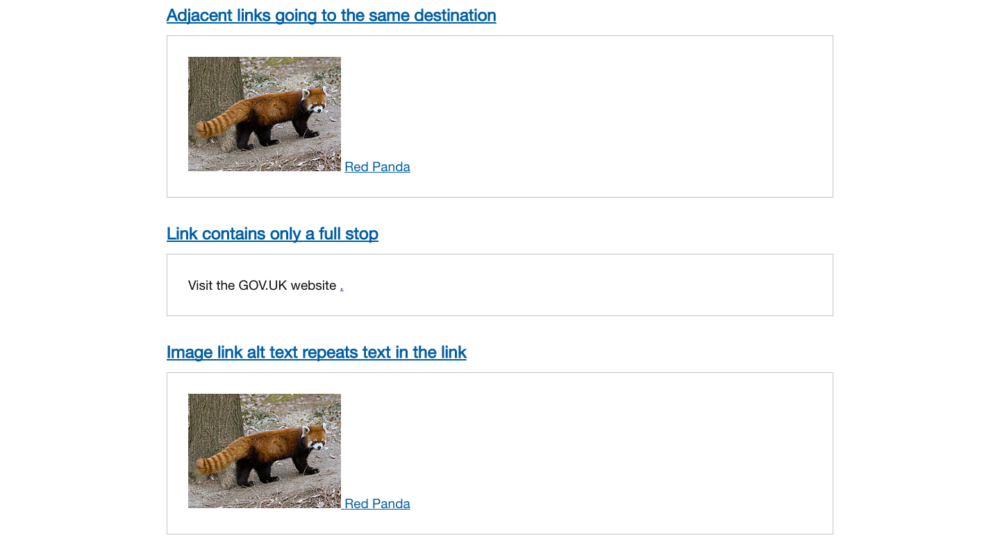

# 當我們在全球最不無障礙網頁上測試工具時我們發現了什麼

[原始文章連結](https://accessibility.blog.gov.uk/2017/02/24/what-we-found-when-we-tested-tools-on-the-worlds-least-accessible-webpage/)

最近，我們對自動化無障礙性測試工具進行了審查。我們建立了一個充滿障礙案例的網站，以便測試這些工具。這篇[部落格文章發布](https://alphagov.github.io/accessibility-tool-audit/)了我們的研究結果。

在這篇文章中，我們將討論我們的做法和發現。

## 目錄

 - [自動化工具的優點和缺點](#自動化工具的優點和缺點)
 - [選擇用於測試的工具](#選擇用於測試的工具)
 - [在全球最具障礙的網頁上進行測試](#在全球最具障礙的網頁上進行測試)
 - [許多障礙都未被任何工具發現](#許多障礙都未被任何工具發現)
 - [工具的有效性差異很大](#工具的有效性差異很大)
 - [工具的有效性只是團隊需要考慮的因素之一](#工具的有效性只是團隊需要考慮的因素之一)
 - [如何最好地使用自動化工具](#如何最好地使用自動化工具)

## 自動化工具的優點和缺點

自動化無障礙性測試工具可以用來識別網站上的無障礙性問題。正如名稱所示，它們是可以在網站上執行的自動化工具，可以識別多種問題。

有許多可用的工具，例如：Wave 和 Tenon。其中許多是免費的，可以線上存取。

自動化工具可以是幫助您使服務更具無障礙性的一種有用且便宜的方式。它們執行速度快，並提供即時回饋。它們可以執行在許多頁面上。有些可以整合到網頁建構的流程中，因此它們幾乎可以在問題出現時立即識別。

但儘管在服務上執行自動化測試工具肯定有助益，團隊不應過分依賴它們。沒有工具能夠識別網站上的每個無障礙性阻礙（accessibility barrier）。因此，僅因為工具未識別出網站上的無障礙性問題，並不意味著這些問題不存在。

即使它們檢測到障礙，有時結果可能是不確定的或需要進一步調查，甚至有可能是錯誤的。

一個很好的類比是將測試工具視為拼寫檢查工具。它確實可以幫助您發現問題，但不應獨立使用。自動化工具應與手動檢查和使用者研究結合使用，才能發會最大效用。

為了幫助人們了解自動化工具的用途和限制，並選擇合適的工具，我們對一些最常見的工具進行了審查。

## 選擇用於測試的工具

我們在進行審查時選擇了 10 種自動化測試工具。我們想要測試那些被開發人員和品質保證測試人員最常用的工具。我們也希望測試足夠多的工具，以獲得各種不同的結果。

我們選擇了我們知道的所有免費工具。我們還通過跨政府的 [Accessibility Google Group](https://groups.google.com/a/digital.cabinet-office.gov.uk/forum/?hl=en-GB#!forum/accessibility-community) 尋求了建議。以下是我們測試的工具：

- [Tenon](https://tenon.io/)
- [Wave](http://wave.webaim.org/extension/)
- [HTML Codesniffer](http://squizlabs.github.io/HTML_CodeSniffer/)
- [aXe](https://www.deque.com/products/axe/)
- [AChecker](http://achecker.ca/checker/index.php)
- [Sort Site](https://www.powermapper.com/products/sortsite/)
- [Google Accessibility Developer Tools](https://chrome.google.com/webstore/detail/accessibility-developer-t/fpkknkljclfencbdbgkenhalefipecmb?hl=en)
- [The European Internet Inclusion Initiative’s page checker](http://checkers.eiii.eu/)
- [Asqatasun](http://asqatasun.org/)
- [Nu HTML Checker](https://validator.w3.org/nu/)（這是一個 HTML 驗證器——我們對它可能能檢測到哪些無障礙性問題感興趣）

除了 Sort Site 有免費試用版本外，這些工具都是免費使用。如果您不想在您的瀏覽器中執行，Tenon 和 Wave 也有付費版本。

## 在全球最具障礙的網頁上進行測試

一旦我們決定要使用哪些工具，我們就需要一個網頁來進行測試。

我們需要一個充斥著無障礙性問題的網頁。一個違反所有無障礙性規則的網頁。一個擁有各種無障礙性阻礙（accessibility barrier）的網頁。

所以我們建了一個。

這是我們建立的「全球最具障礙網站」的螢幕截圖，我們用它來測試自動化工具。

我和我的同事 [Alistair](https://twitter.com/dugboticus?lang=en) 和 [Richard](https://twitter.com/accessibleweb) 在 GDS 無障礙性團隊一起合作，建立了[一個充滿無障礙性阻礙的網頁](https://alphagov.github.io/accessibility-tool-audit/test-cases.html)。我們稱它為全球最具障礙的網頁。

我們將它填滿了無障礙性阻礙（accessibility barrier），包含了 19 個類別共 143 個故障案例。

這些故障案例包括沒有替代文字屬性的圖片，或者使用了不正確的替代文字屬性，以及空白的連結文字。我們還加入了一些我們認為測試工具可能無法檢測到的無障礙性問題，例如沒有警告的閃爍內容，或者在內容中未使用平實語言 (plain language)。

我們知道我們無法列出每一種可能的無障礙性阻礙（accessibility barrier），但我們希望頁面上有足夠多的障礙，以便我們能夠充分測試這些工具的實用性。

然後，我們在這個網頁上執行這些工具進行測試，以找出它們能夠檢測到多少障礙案例，以及會漏掉多少障礙案例。

您可以在[此處詳細查看我們的研究結果](https://alphagov.github.io/accessibility-tool-audit/index.html)。以下是我們主要的發現：

## 許多障礙都未被任何工具發現

我們發現所建立的大部分障礙都未被我們測試的 10 種工具中的任何一種檢測到——實際上只有 29％ 被檢測到。

我們建立的 143 個障礙中，有 42 個被我們測試所有的工具都忽略了。被忽略的障礙包括長篇文字中使用斜體、帶有空白儲存格的表格和僅使用顏色標識的連結。

即使找到了障礙，錯誤報告流程也不總是明確。有時工具會顯示警告或要求手動檢查，但並沒有明確說明存在錯誤。

## 工具的有效性差異很大

我們還發現，有些工具比其他工具檢測到更多的錯誤。

如果只計算錯誤訊息和警告，那麼 Tenon 檢測到的障礙最多——它發現了 37％。如果把人工檢查提示也列入計算，那麼 Asqatasun 是最有效的——它發現了 41％ 的障礙。

在效能範圍的另一端，Google 開發者工具，這是相當流行的工具，只檢測到 17％ 的障礙。

我們發現，結合使用多種工具可以幫助您發現更多的障礙，但對團隊來說，這樣做可能更困難，並且不具成本效益。

## 工具的有效性只是團隊需要考慮的因素之一

我們發現工具的有效性有很大的差異。但除了效能之外，我們也知道，團隊在決定是否使用工具以及使用哪種工具時，還會考慮其他因素。

我們知道這些工具必須容易設定和執行。它們提供的結果必須清晰且易於操作。除了由開發人員使用，它們可能也會被團隊中的非技術人員使用。

還有其他技術因素需要考慮。例如，一些工具可能無法在受密碼保護的頁面上執行。而一些工具可能不支援對行動頁面的測試。

作為我們工作的一部分，[我們收集了關於這些工具的背景資訊](https://alphagov.github.io/accessibility-tool-audit/)，以幫助團隊決定哪些工具最適合他們。

## 如何最好地使用自動化工具

在審查之後，我們對自動化測試工具的看法與審查之前一樣。我們認為它們非常有用，團隊肯定應使用它們來發現問題。但同時，我們認為不能僅依賴它們來檢查網站的無障礙性。它們在與手動測試結合使用時，才能發揮最大成效。

我們的研究結果支持這一觀點。雖然這些工具檢測到我們所建立的大多數無障礙性阻礙（accessibility barrier）—— 71％，但還有相當多的障礙只能通過手動檢查來發現。

為實現最有效的無障礙性測試，我們建議團隊將自動化工具測試與手動測試、無障礙性稽核和使用者測試結合使用。

我們希望我們的研究結果頁面將有助於團隊選擇最符合他們需求的工具。同時，也鼓勵工具的建立者，能更好地記錄工具的功能和限制。
