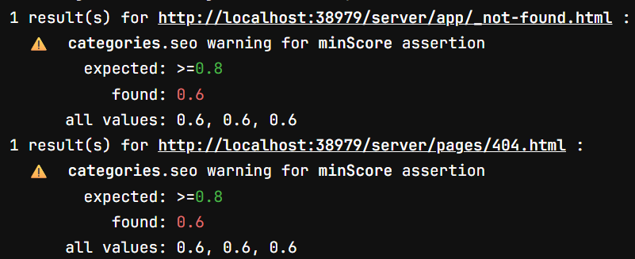
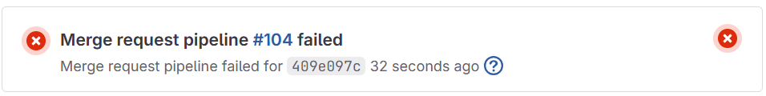
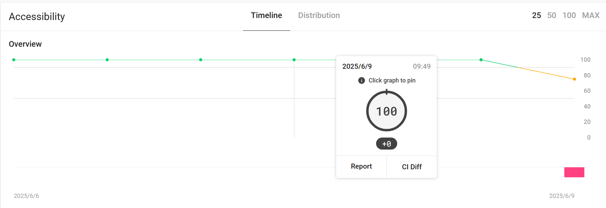
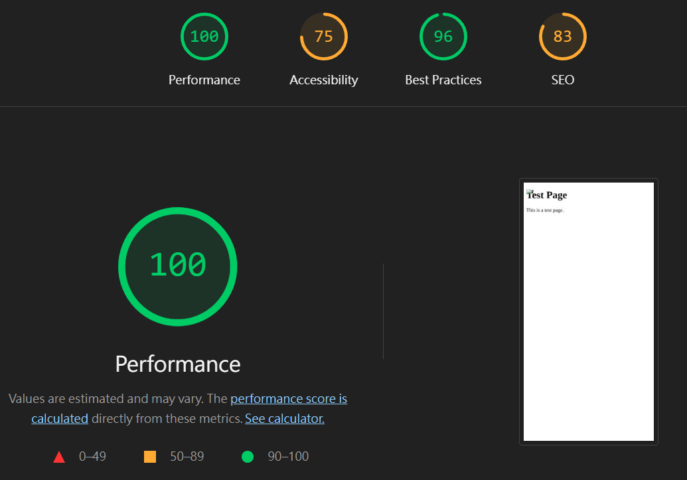
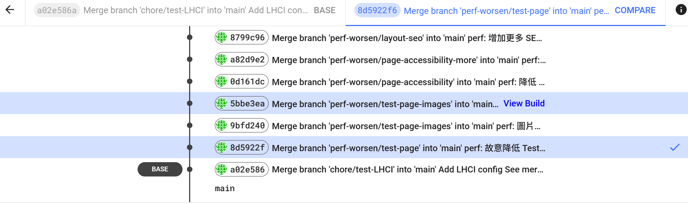
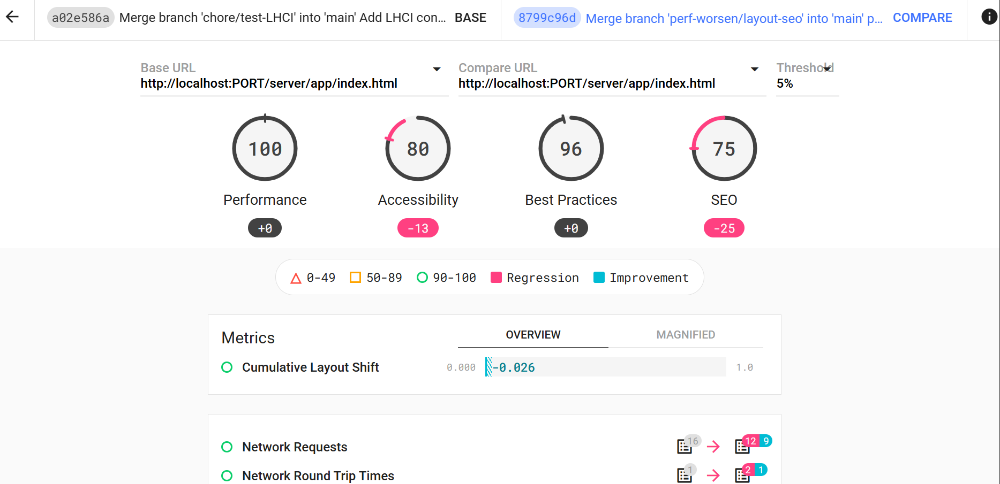
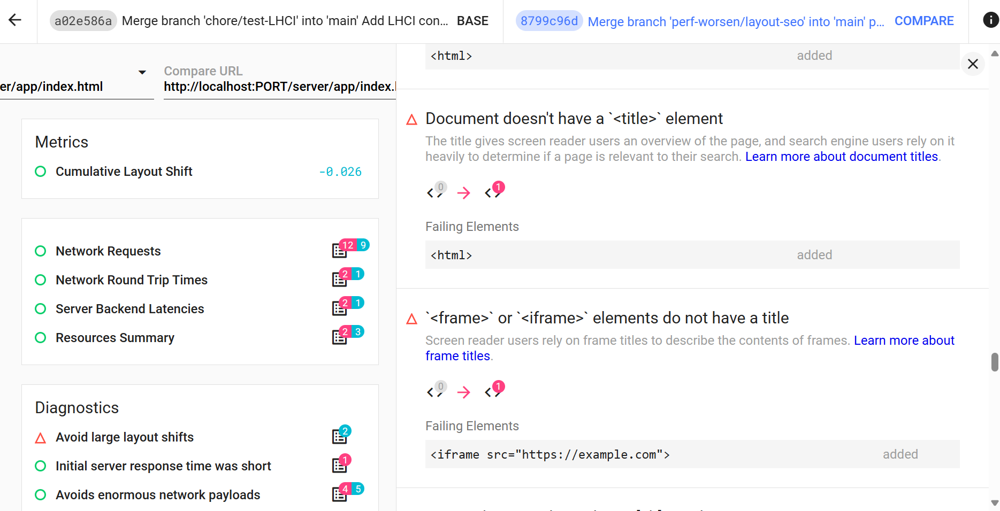

# 提升易用性：Lighthouse CI 讓效能變化一目了然

Lighthouse CI 是由 Google 官方推出的工具，幫助開發者能在 **CI/CD 流程中自動化執行 Lighthouse 分析**，追蹤網站效能是否因程式碼變更而退化，並及早發現問題。

此工具主要解決了 Lighthouse 手動執行繁瑣且無法追蹤歷史數據變化的問題。

## 範例

以下範例示範如何在 GitLab CI 中設定，於 Merge Request 事件觸發時自動執行 Lighthouse CI 掃描，並將報告上傳至 Google 官方提供的暫存儲存區。

```yaml
# .gitlab-ci.yml
image: cypress/browsers:node-22.16.0-chrome-136.0.7103.113-1-ff-138.0.4-edge-136.0.3240.76-1

stages:
  - test

lhci:
  stage: test
  script:
    - npm ci
    - npm run build
    - npm install -g @lhci/cli@0.14.x
    - lhci autorun
  rules:
    - if: '$CI_PIPELINE_SOURCE == "merge_request_event"' # Merge Request 事件觸發
      when: always
    - when: never
```

```javascript
module.exports = {
  ci: {
    collect: {
      staticDistDir: "<your-dist-folder>",
      settings: { chromeFlags: "--no-sandbox" },
    },
    upload: {
      target: "temporary-public-storage", // 官方暫存報告儲存區
    },
  },
};
```

## 設定通過指標

預設情況下，Lighthouse CI 不會因分數下降而使 CI 流程失敗。若希望自動檢查分數是否達到標準，則可透過設定 assert 區塊，明確定義通過門檻。

如:

```javascript
// lighthouserc.js
module.exports = {
  ci: {
    collect: {
      staticDistDir: ".next",
      settings: { chromeFlags: "--no-sandbox" },
    },
    assert: {
      assertions: {
        "categories:performance": ["error", { minScore: 0.8 }],
        "categories:accessibility": ["warn", { minScore: 0.8 }],
        "categories:best-practices": ["warn", { minScore: 0.8 }],
        "categories:seo": ["warn", { minScore: 0.8 }],
      },
    },
    upload: {
      target: "temporary-public-storage",
    },
  },
};
```

- 若設定為 warn，當分數未達標時，CI 流程會顯示警告，但不會失敗。
  

- 若設定為 error，當分數未達標時，CI 流程將直接失敗，阻擋合併或部署。
  

## Lighthouse CI server

除了自動化執行 Lighthouse 分析外，Lighthouse CI 也提供一個 **Lighthouse CI server**，用於儲存和管理每次掃描產生的報告，方便追蹤網站效能歷史變化。

這個 Server 是一個開源的 Node.js 服務，需要自行部署在 AWS、GCP、Heroku 或本地機器等環境。部署完成後，團隊就能集中管理報告、追蹤效能趨勢。

部署方式會因環境而異，官方提供詳細的[部署指南](https://github.com/GoogleChrome/lighthouse-ci/blob/main/docs/server.md#deployment)，建議依照自己的基礎設施選擇合適方案。

### 為什麼要用 Lighthouse CI server？

- **集中管理報告**：所有 Lighthouse 分析結果會集中存放，方便團隊檢視和回溯。
- **效能趨勢追蹤**：透過歷史報告，比對每次掃描的分數與詳細數據，掌握效能是否退化。
- **支援多分支**：能同時管理多個分支的效能報告，符合團隊需求。
- **CI 整合**：搭配 CI/CD 流程，自動上傳與更新報告。

### 快速整合 Lighthouse CI server

完成 server 部署後，確保能連線，再執行：

```bash
npm install -g @lhci/cli@0.14.x   # 安裝 CLI
lhci wizard   # 執行專案建立嚮導
```

建立後會取得兩組 Token：

Build Token：用於 CI 上傳報告，可分享給外部協作者，權限較低。

Admin Token：用於專案管理（修改、刪除），請妥善保管，避免外洩。

接著，在 CI 平台設定環境變數（如 LHCI_TOKEN 為 Build Token），並更新 lighthouserc.js：

```javascript
// lighthouserc.js
module.exports = {
  ci: {
    upload: {
      target: "lhci", // 由先前的 temporary-public-storage 調整成自行創建的 LHCI Server
      serverBaseUrl: process.env.LHCI_SERVER_URL,
      token: process.env.LHCI_TOKEN,
    },
  },
};
```


> 圖片來源: [官方文檔](https://github.com/GoogleChrome/lighthouse-ci/blob/main/docs/getting-started.md)

### 操作介面

裡面會像這樣列出你的各指標變化


點擊「Report」可查看當次掃描的詳細報告。


也可以點擊 "CI Diff" 觸發不同 commit 間的比較




### 安全性

Lighthouse CI Server 預設為公開狀態，任何能連上網址的使用者皆可瀏覽及上傳報告。若報告中含有尚未公開的功能、內部網址或敏感資料，建議採取以下安全措施加以保護：

- 開啟 Basic 認證（設定帳號密碼）
- 避免將 `adminToken` 放入 CI，僅授權信任的管理者使用
- 限制 IP 或僅允許內部網路存取
- 如需更進階保護，可加入自定驗證機制

> 詳細請見官方說明：[Lighthouse CI Server Security](https://github.com/GoogleChrome/lighthouse-ci/blob/main/docs/server.md#security)

## 參考資料

- https://github.com/GoogleChrome/lighthouse-ci/blob/main/docs/getting-started.md
