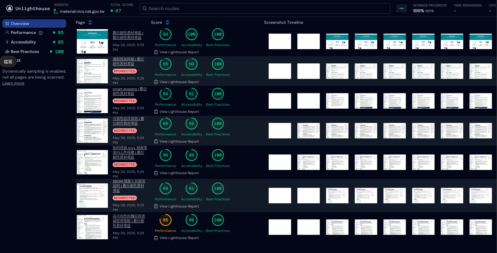
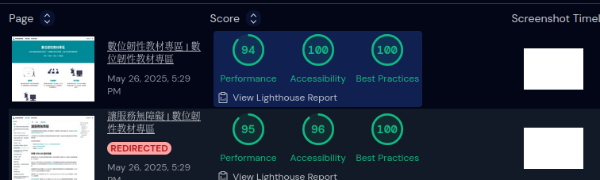
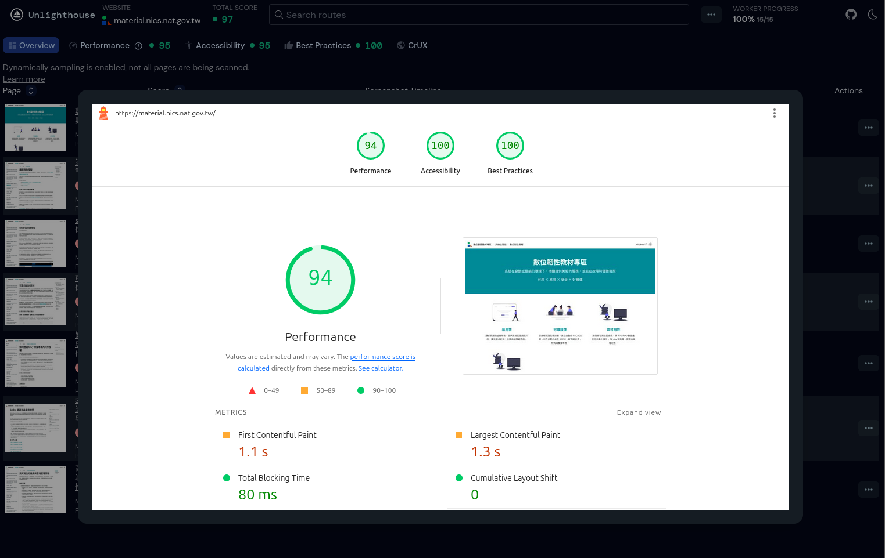

# 提升易用性： Unlighthouse 幫你掌握網站體驗的盲點

Unlighthouse 是一款基於 Google Lighthouse 的開源工具，提供可自訂的網站掃描報告。幫助開發者快速掃描多個頁面以方便監控及優化網站品質。

## 快速啟動

可透過以下指令快速掃描網站:

```shell
npx unlighthouse --site <your-site>
```

> 需要 Node.js v18.x 或以上版本

執行結果如下:



點擊中間分數的區塊，可查看詳細資訊




## 掃描機制

1. 手動設定指定路徑 (將禁用底下機制)
2. Unlighthouse 會查看 robots.txt 是否有提供 Sitemap 路徑，並遵守 disallow 規則避免不當抓取，接著透過 Sitemap 找出更多詳細頁面。
3. 若找不到 Sitemap 將啟用爬蟲模式。從 HTML 中擷取更多內部連結

## 建立設定檔

可透過命令列參數來輸入設定，例如：

```shell
npx unlighthouse --site <your-site> --device desktop
```

也可以透過 unlighthouse.config.ts 來做設定，如:

```javascript
export default {
    site: <your-site>,
    scanner: {
        device: 'mobile',
    }
}
```

在設定檔所在的資料夾中執行：

```shell
npx unlighthouse
```

## Unlighthouse 常用設定簡介

| 設定名稱                           | 類型       | 預設值                                                      | 說明                                                                                                                         |
| ---------------------------------- | ---------- | ----------------------------------------------------------- | ---------------------------------------------------------------------------------------------------------------------------- |
| `site`                             | `string`   | 無                                                          | 要掃描的網站網址。支援本機或遠端，例如 `http://localhost:3000` 或 `https://example.com`。                                    |
| `scanner.sitemaps`                 | `string[]` | 自動偵測                                                    | 手動指定 sitemap URL，可用來加快掃描速度或補足自動偵測不到的情況。                                                           |
| `scanner.robotsTxt`                | `boolean`  | `true`                                                      | 是否讀取並尊重 `robots.txt` 的規則。設為 `false` 可忽略限制。                                                                |
| `scanner.samples`                  | `number`   | `1`                                                         | 決定每個 URL 要執行幾次 Lighthouse 掃描，最後會平均這些結果。官網指出可多次掃描提高穩定度(如: 3 次)                          |
| `scanner.dynamicSampling`          | `boolean`  | `true`                                                      | 啟用後會根據 URL 結構自動分群（例如 `/blog/[slug]`），僅抽樣每群的部分頁面。適合頁面數量龐大的大型網站，可有效降低掃描時間。 |
| `scanner.exclude`                  | `string[]` | `[]`                                                        | 使用 glob pattern 排除特定 URL，例如 `['**/admin/**', '**/login']`。                                                         |
| `throttle`                         | `boolean`  | `true`                                                      | 是否啟用節流機制                                                                                                             |
| `lighthouseOptions.onlyCategories` | `string[]` | `['performance', 'accessibility', 'best-practices', 'seo']` | 限制只執行指定的 Lighthouse 分類檢查                                                                                         |

## 補充

### 需登入頁面

Unlighthouse 支援多種網站認證方式，方便對需登入才能訪問的頁面進行掃描。

可透過設定 Cookie 或 localStorage 進行登入驗證

```javascript
// 方法一：設定 Cookie
export default {
  cookies: [
    {
      name: "my-jwt-token",
      value: "<token>",
      // optional extras
      domain: "your-site.com",
      path: "/",
      httpOnly: false,
      secure: false,
      sameSite: "Lax",
    },
  ],
};
```

```javascript
// 方法二：設定 localStorage
export default {
  localStorage: {
    auth: "<token>",
  },
};
```

或是使用程式自動化登入

```javascript
export default {
  hooks: {
    async authenticate(page) {
      // login to the page
      await page.goto("https://example.com/login");
      const emailInput = await page.$('input[type="email"]');
      await emailInput.type("admin@example.com");
      const passwordInput = await page.$('input[type="password"]');
      await passwordInput.type("password");
      await Promise.all([
        page.$eval(".login-form", (form) => form.submit()),
        page.waitForNavigation(),
      ]);
    },
  },
};
```

> 更多設定可參考 [Unlighthouse Authentication](https://unlighthouse.dev/guide/guides/authentication)

### Unlighthouse 與 Lighthouse 分數差異與調整策略

使用 Unlighthouse v0.16.3 時，我們發現其在 Performance 分數上通常比原生 Lighthouse 略低。

這可能與 Lighthouse 的套件版本及執行設定有關。Unlighthouse 目前使用的是 Lighthouse v12.5.1，而我們本地使用的 Lighthouse 則為 v12.6.0。

以下是我們使用的設定，能夠產出與原生 Lighthouse 較為接近的分數結果：

```javascript
// unlighthouse.config.ts
export default {
  site: <your-site>,

  scanner: {
    device: 'desktop',
    throttle: true,
    samples: 3,
  },

  lighthouseOptions: {
    formFactor: 'desktop',
    screenEmulation: {
      mobile: false,
      width: 1350,
      height: 940,
      deviceScaleFactor: 1,
    },
    throttlingMethod: 'simulate',
    throttling: {
      rttMs: 40,
      throughputKbps: 10240,
      cpuSlowdownMultiplier: 1,
    },
  },

  puppeteerClusterOptions: { maxConcurrency: 1 },
};
```

## 參考資料

- https://unlighthouse.dev/
