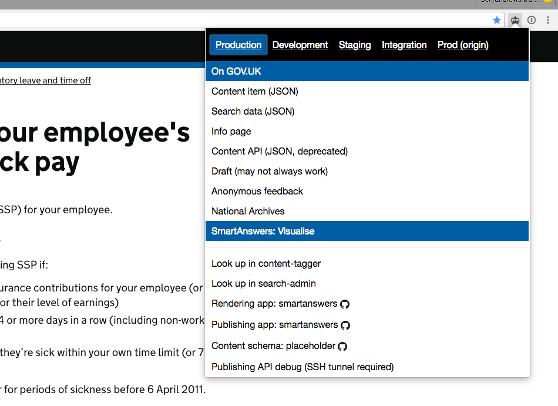
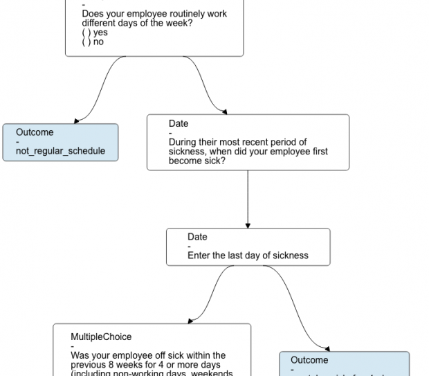

# 讓 smart answers 的邏輯更容易理解

內容工具團隊的使命是幫助政府數位服務 (Government Digital Service, GDS) 內的內容設計者能更有效地完成工作，以在多個領域獲得微小的進步，這些微小的進步總與起來會產生巨大的效益。以下部落格文章說明我們為此所做的事情。

我們在 GOV.UK 上提供的一個名為「smart answers」的「產品」。smart answers 是我們用來讓複雜政策轉換成為更簡單、更個人化答案的格式。透過轉換成為一系列問題與答案，允許使用者深入了解有時相當複雜的政策，僅提供使用者情況與需求相關的資訊，且不使用專家術語。

更新 smart answers 需要部門領域專家、GDS 內容設計者與 GDS 開發人員之間的密切合作。這是為確保內容的準確性、清晰度與 smart answers 採用技術限制之間的平衡。

這既是內容層面與程式碼邏輯的挑戰，有時需要花費相當多的時間才能做正確。對於外部利害關係人，可能很難理解這些限制並建立一個在幕後運作的「決策邏輯」心智圖。

目前三位人員之間的來回過程是透過 Google 文件進行的，並有一種經過協議的方式來標記與傳達更改。這有一些優點，但缺點是在翻譯過程中可能會失去理解與細節之處。

為了讓事情變得更容易，我們製作一個瀏覽器擴充功能，將邏輯視覺化增加到瀏覽器中的即時 smart answers 頁面，並且為了便於使用，我們將其包含在「GOV.UK 工具組擴充功能」。

要查看邏輯視覺化，內容設計者或領域專家所需要做的就是點選瀏覽器擴充功能中的「SmartAnswers：Visualise」，同時點選相關的 smart answers 內容。

這會將「[/visualise](https://www.gov.uk/calculate-statutory-sick-pay/visualise)」新增到任何 smart answer URL，惟後在同一瀏覽器分頁中載入邏輯視覺化的解釋。因此，如果無法使用該擴充功能，仍然可以透過在任何 smart answer URL 的末尾增加「/visualise」來存取相同的視覺化效果。

這是一個很小的變化，但我們希望有助於逐步降低更新 smart answer 所需的複雜性與時間。它在大多數情況下效果很好，但對於更大、更複雜的 smart answer (例如「在[國外結婚](https://www.gov.uk/marriage-abroad)」網頁)，該頁面可能會有點擁擠。這是我們在下回合的改進中需要考慮的問題。

這只是我們為幫助 GOV.UK 內容設計者所做工作的範例之一。內容工具團隊還有很多工作要做。

[原始資料連結](https://insidegovuk.blog.gov.uk/2016/10/27/making-it-easier-to-understand-smart-answer-logic)
