# CDN 上使用政府的憑證

## 說明

透過使用 CDN 能提升性能與安全性，並搭配使用政府自己的憑證增加信任、合規與自主掌控，適合敏感數據與法律要求等情境。

以下使用 [資安院監控系統](https://hc.nics.nat.gov.tw) 作為示範展示。系統部署於 GCP 的虛擬機（VM），並透過 Cloud Load Balancing 將後端指向該 VM 進行流量分發。

若要搭配 Cloud CDN 使用外部原站，建議參考文件 [External backends specified by using internet NEGs](https://cloud.google.com/cdn/docs/external-backends-internet-neg-overview) 進行設置

## 注意事項

- GCP 掛載憑證方式是在 Cloud Load Balancing 服務上關聯 Load Balancer ，並且可以於 Load Balancer 上前端設定 HTTP/2 及 HTTP/3。

- AWS Certificate Manager（ACM）僅允許 ACM 本身或其他信任的 certificate authority (CA) 單位，其支援如 [Mozilla 信認之 CA](https://wiki.mozilla.org/CA/Included_Certificates)，目前政府憑證入口網尚未於列於 Mozilla 信任 CA 清單，需要匯入完整 TLS 憑證串鍊（根憑證及中繼憑證）才能使用。

參考資料：

[AWS Certificate Manager (ACM) 匯入ACM憑證的先決條件](https://docs.aws.amazon.com/zh_tw/acm/latest/userguide/import-certificate-prerequisites.html)

## 以 GCP 為例

### 設定步驟

1. 於[政府憑證入口網](https://gtlscaweb.nat.gov.tw/GCP/views/SAPSSL/SSL01.html)申請憑證。取得私鑰（含私鑰密碼）及憑證，憑證更新可以於政府憑證入口網檢視下載。

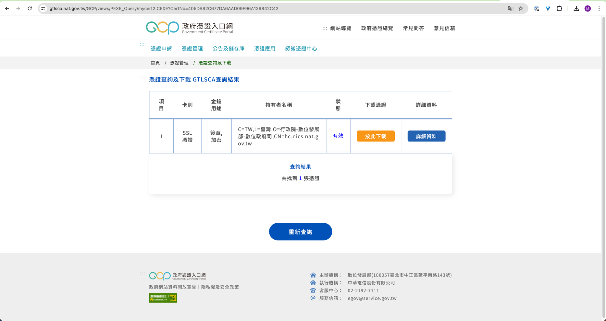

2. 將憑證使用以下 openssl 命令轉換為 pem 格式。

```
$ openssl x509 -inform der -in 405DB92C677DA6AAD09F96A139842C42.cer -out hc-cert-2024.pem
```

3. GCP Certificate Manager 須使用已解密私鑰，使用以下 openssl 命令將加密私鑰解密並匯出。

指令：

```
$ openssl rsa -in ./hc.nics.nat.gov.tw_server.key -out ./hc.nics.nat.gov.tw_server-without-password.key
```

輸出結果：

```
Enter pass phrase for ./hc.nics.nat.gov.tw_server.key:
writing RSA key
```

4. 至[政府憑證入口網下載 GTLSCA 憑證串鍊](https://gcp.nat.gov.tw/views/AnnDownload/download_3-1.html)，解壓縮後取得三個檔案
    - 根憑證 ROOTeCA_64.crt 
    - 中繼憑證 eCA1_to_eCA2-New.crt
    - GTLSCA.crt

5. 將憑證內文、根憑證及中繼憑證，依序合併至同一個檔案。注意：憑證內文必須為全檔案第一個排序。

```
$ cat hc-cert-2024.pem > hc-cert-2024-full.pem
$ cat ./GTLSCA_All/*.crt >> hc-cert-2024-full.pem
```

6. 於 GCP Certificate Manager 建立新的憑證

    - Name：命名您的新的憑證於 GCP Certificate Manager
    - Create mode：選擇「Upload my certificate」
    - Certificate：複製步驟 5 所產生包含根憑證、中繼憑證、憑證內文 pem 檔案內文
    - Private key：複製步驟 3 所產生已解密私 key 檔案內文

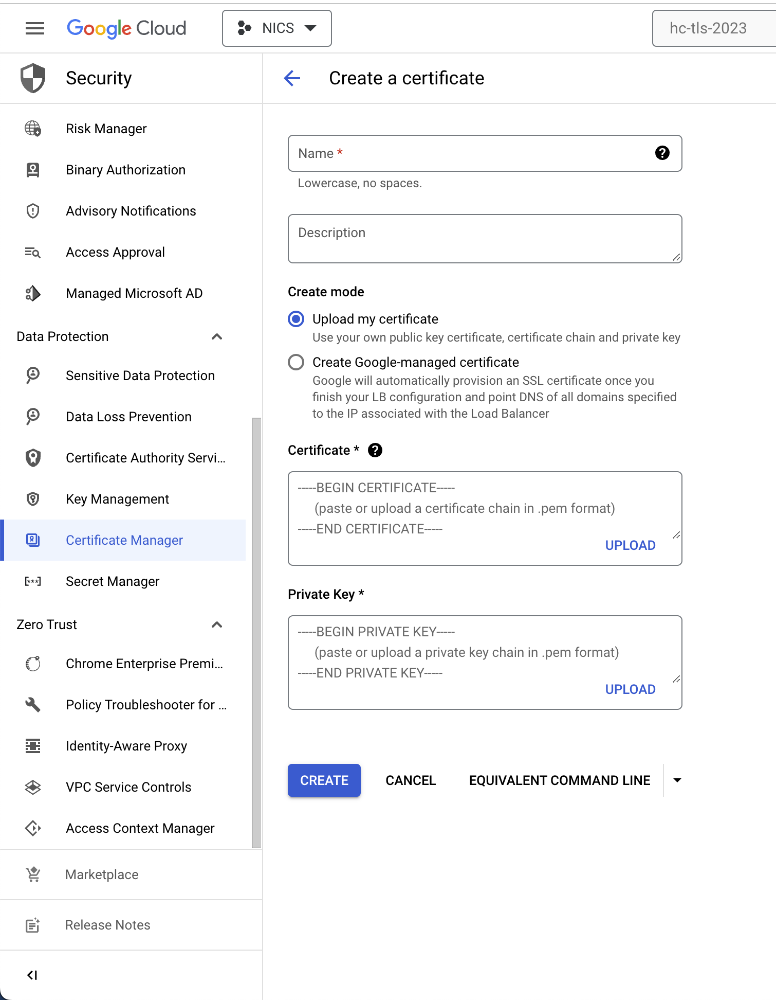

7. 選定 GCP Cloud Load Balancing 服務合適 Load Balancer 並建立。
   
   請參考 [Set up a classic Application Load Balancer with a managed instance group backend](https://cloud.google.com/load-balancing/docs/https/ext-https-lb-simple)。

8. 監測工具使用 Application Load Balancer，以下於 Application Load Balancer 更新 Frontend configuration 頁面，選擇步驟 4 新建立之憑證。

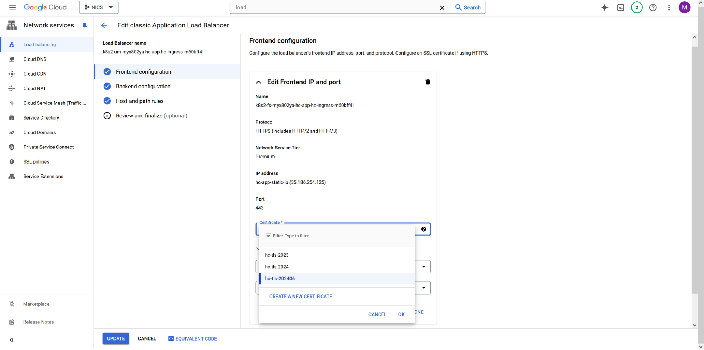

9. Application Load Balancer 更新 Backend configuration 頁面，選擇勾選「Enable Cloud CDN」並設定對應 Cache mode。

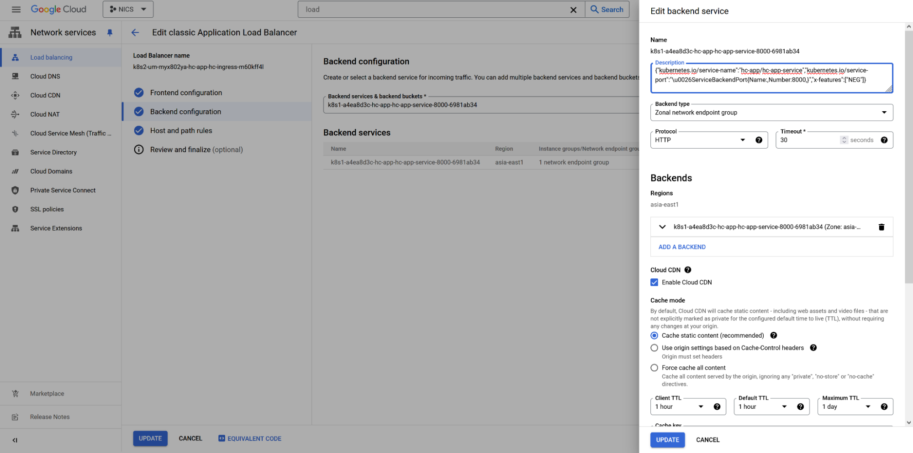

### 檢視步驟

1. 使用 Firefox 瀏覽器確認使用 HTTP/2 協議。

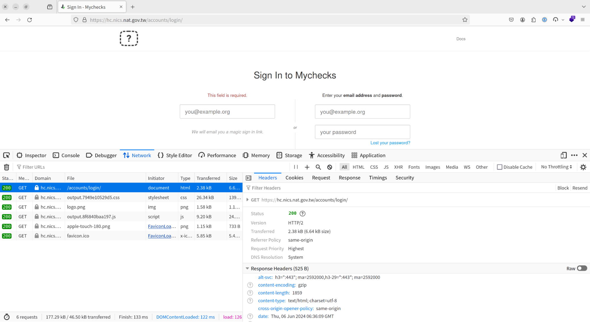

2. 確認憑證為「政府伺服器數位憑證管理中心」所發放。

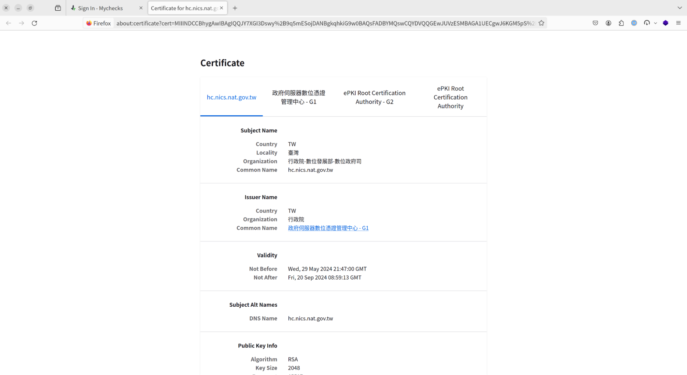

## 以 AWS 為例

### 設定步驟

1. 開啟 AWS Certificate Manager 服務於 us-east-1 地區。因 AWS CloudFront 屬於 Global 服務，若需要掛載憑證需要於 us-east-1 建立 Certificate。

2. 將憑證使用以下 openssl 命令轉換為 pem 格式。

```
$ openssl x509 -inform der -in 405DB92C677DA6AAD09F96A139842C42.cer -out hc-cert-2024.pem
```

3. 使用以下 openssl 命令將加密私鑰解密並匯出。

指令：

```
$ openssl rsa -in ./hc.nics.nat.gov.tw_server.key -out ./hc.nics.nat.gov.tw_server-without-password.key
```

輸出結果：

```
Enter pass phrase for ./hc.nics.nat.gov.tw_server.key:
writing RSA key
```

4. 於 AWS Certificate Manager  控制台點選「Import」
    - Certificate body：複製步驟 2 所產生 pem 檔案內文
    - Certificate Private key：複製步驟 3 所產生已解密私 key 檔案內文
    - Certificate chain：至政府憑證入口網下載 GTLSCA 憑證串鍊，並三個檔案（根憑證ROOTeCA_64.crt 及中繼憑證 eCA1_to_eCA2-New.crt、GTLSCA.crt）內文複製至欄位內。

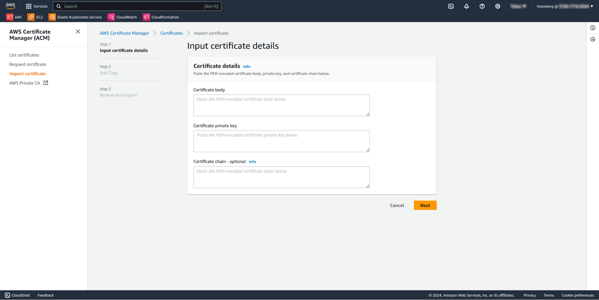

5. 增加 tag （選用）

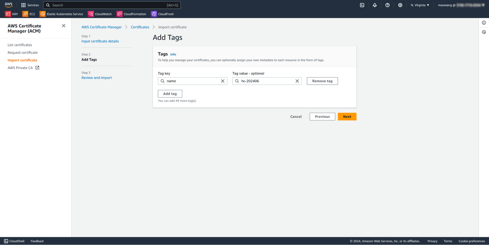

6. 匯入

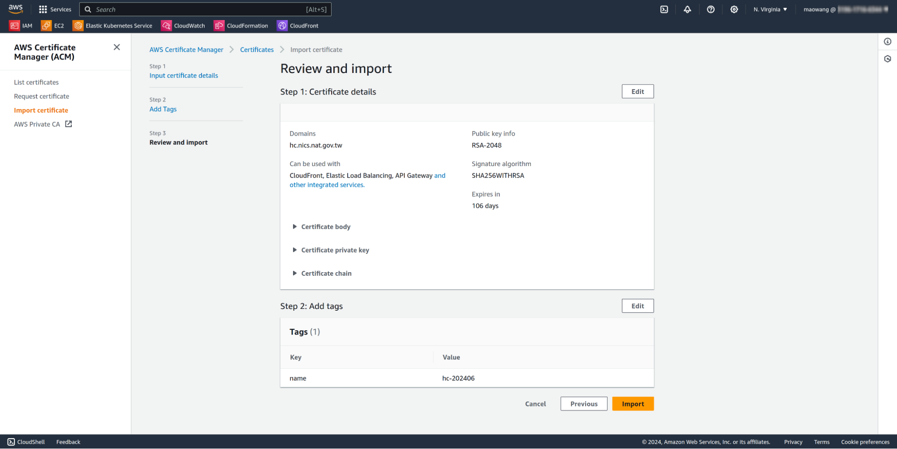

7. 至 AWS CloudFront 控制台，點選「Create distribution」

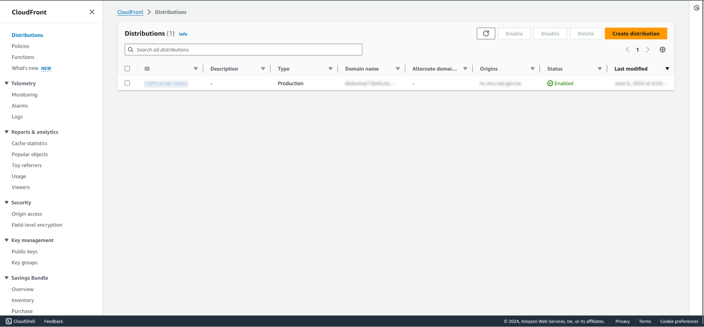

8. AWS CloudFront 有諸多設定，以下擷圖主要以 TLS 憑證及 HTTP/2（或 HTTP/3）設定展示為主。
    - Origin 設定您的原站域名
        - 在此為示範測試，僅作為驗證使用 hc.nics.nat.gov.tw。一般來說，建議設定原站域名 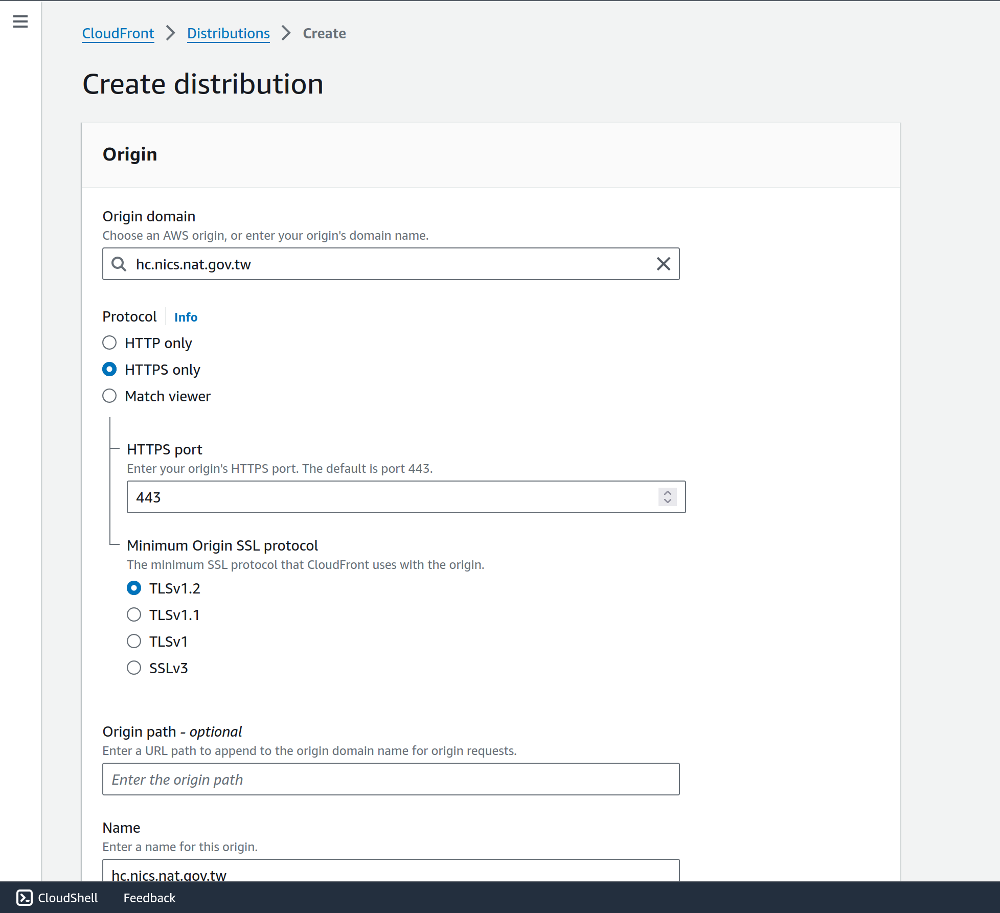
    - 於 Settings 段落選擇
        - Custom SSL certificate 選擇步驟 4-6 建立憑證
        - Alternate domain name（CNAME）：新增 CNAME，因此範例為 hc.nics.nat.gov.tw 網站，故新增 hc.nics.nat.gov.tw 
        - Supported HTTP versions：勾選啟用「HTTP/2」 及 「HTTP/3」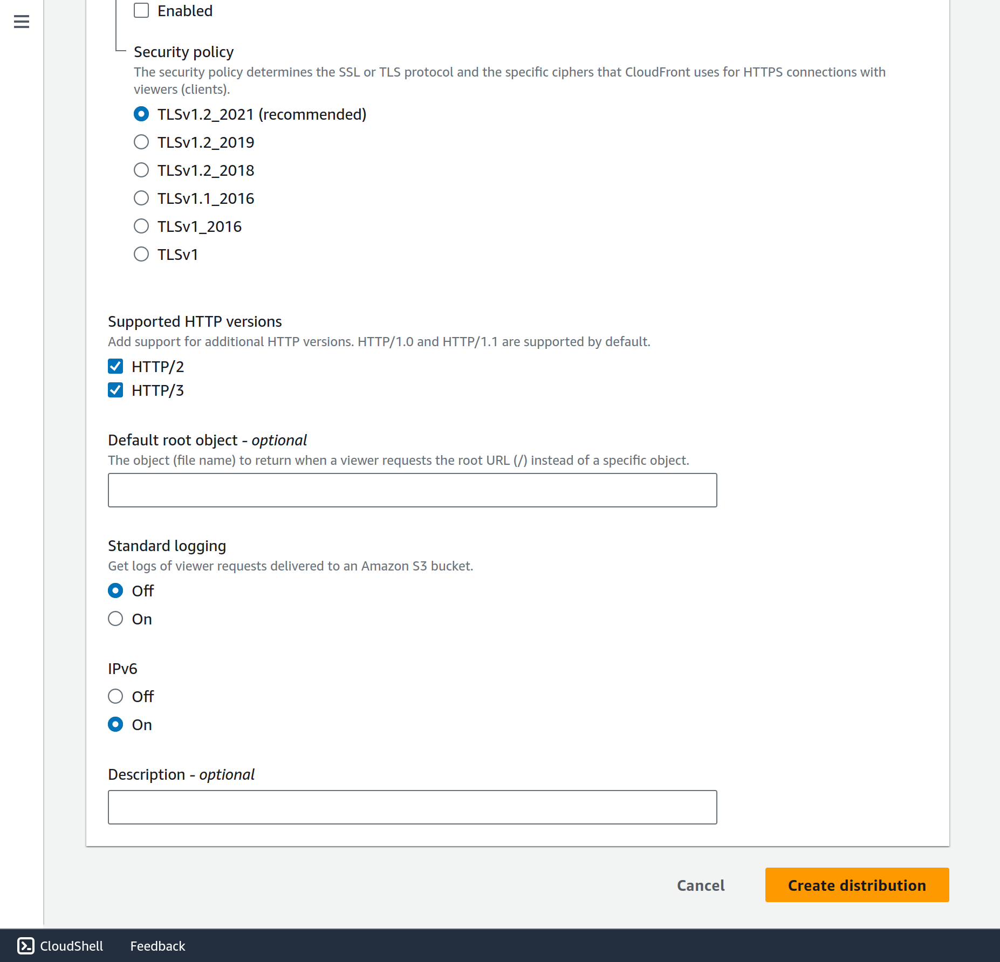

### 檢視步驟

因 hc.nics.nat.gov.tw 建制於 GCP 上，並未將 CNAME 指向於 CloudFront 所產生的 domain，以下使用 openssl 命令檢視 CloudFront 關聯 TLS 憑證是否正確。

指令：

```
$ openssl s_client -showcerts -connect divxxxxxxjm0.cloudfront.net:443 -servername hc.nics.nat.gov.tw </dev/null
```
輸出結果：

```
CONNECTED(00000003)
depth=3 C = TW, O = "Chunghwa Telecom Co., Ltd.", OU = ePKI Root Certification Authority
verify return:1
depth=2 C = TW, O = "Chunghwa Telecom Co., Ltd.", CN = ePKI Root Certification Authority - G2
verify return:1
depth=1 C = TW, O = \E8\A1\8C\E6\94\BF\E9\99\A2, CN = \E6\94\BF\E5\BA\9C\E4\BC\BA\E6\9C\8D\E5\99\A8\E6\95\B8\E4\BD\8D\E6\86\91\E8\AD\89\E7\AE\A1\E7\90\86\E4\B8\AD\E5\BF\83 - G1
verify return:1
depth=0 C = TW, L = \E8\87\BA\E7\81\A3, O = \E8\A1\8C\E6\94\BF\E9\99\A2-\E6\95\B8\E4\BD\8D\E7\99\BC\E5\B1\95\E9\83\A8-\E6\95\B8\E4\BD\8D\E6\94\BF\E5\BA\9C\E5\8F\B8, CN = hc.nics.nat.gov.tw
verify return:1
---
Certificate chain

...
-----END CERTIFICATE-----
 1 s:C = TW, O = "Chunghwa Telecom Co., Ltd.", CN = ePKI Root Certification Authority - G2
   i:C = TW, O = "Chunghwa Telecom Co., Ltd.", OU = ePKI Root Certification Authority
   a:PKEY: rsaEncryption, 4096 (bit); sigalg: RSA-SHA256
   v:NotBefore: Nov 17 08:51:35 2015 GMT; NotAfter: Dec 20 02:31:27 2034 GMT
-----BEGIN CERTIFICATE-----

...
-----END CERTIFICATE-----
 2 s:C = TW, O = \E8\A1\8C\E6\94\BF\E9\99\A2, CN = \E6\94\BF\E5\BA\9C\E4\BC\BA\E6\9C\8D\E5\99\A8\E6\95\B8\E4\BD\8D\E6\86\91\E8\AD\89\E7\AE\A1\E7\90\86\E4\B8\AD\E5\BF\83 - G1
   i:C = TW, O = "Chunghwa Telecom Co., Ltd.", CN = ePKI Root Certification Authority - G2
   a:PKEY: rsaEncryption, 4096 (bit); sigalg: RSA-SHA256
   v:NotBefore: Jul 19 06:46:45 2019 GMT; NotAfter: Aug 19 06:46:45 2031 GMT
-----BEGIN CERTIFICATE-----

...
-----END CERTIFICATE-----
 3 s:C = TW, O = "Chunghwa Telecom Co., Ltd.", OU = ePKI Root Certification Authority
   i:C = TW, O = "Chunghwa Telecom Co., Ltd.", OU = ePKI Root Certification Authority
   a:PKEY: rsaEncryption, 4096 (bit); sigalg: RSA-SHA1
   v:NotBefore: Dec 20 02:31:27 2004 GMT; NotAfter: Dec 20 02:31:27 2034 GMT
-----BEGIN CERTIFICATE-----

...
---
Server certificate
subject=C = TW, L = \E8\87\BA\E7\81\A3, O = \E8\A1\8C\E6\94\BF\E9\99\A2-\E6\95\B8\E4\BD\8D\E7\99\BC\E5\B1\95\E9\83\A8-\E6\95\B8\E4\BD\8D\E6\94\BF\E5\BA\9C\E5\8F\B8, CN = hc.nics.nat.gov.tw
issuer=C = TW, O = \E8\A1\8C\E6\94\BF\E9\99\A2, CN = \E6\94\BF\E5\BA\9C\E4\BC\BA\E6\9C\8D\E5\99\A8\E6\95\B8\E4\BD\8D\E6\86\91\E8\AD\89\E7\AE\A1\E7\90\86\E4\B8\AD\E5\BF\83 - G1
---
No client certificate CA names sent
Peer signing digest: SHA256
Peer signature type: RSA-PSS
Server Temp Key: X25519, 253 bits
---
SSL handshake has read 7741 bytes and written 386 bytes
Verification: OK
---

```