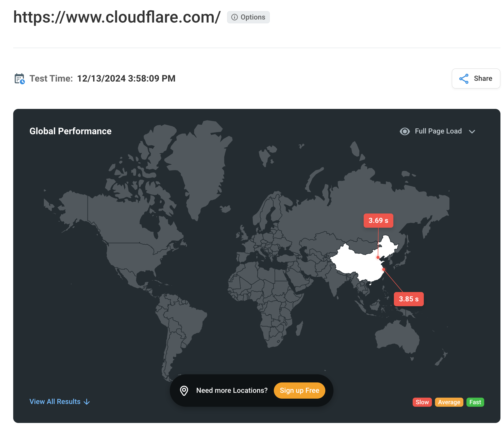

# 檢測所屬網站或網域使用CDN服務後於中港澳區域內連線狀態

## 目錄

  - [文件用途](#文件用途)
  - [使用對象](#使用對象)
  - [使用時機與限制](#使用時機與限制)
  - [使用 Traceroute 功能網站工具檢測經過的節點，以 Global Traceroute 為例](#使用-traceroute-功能網站工具檢測經過的節點以-global-traceroute-為例)
  - [使用 Get 功能工具檢測 HTTP 回應標頭資訊由哪個區域機房回應，以 dotcom-tools 為例](#使用-get-功能工具檢測-http-回應標頭資訊由哪個區域機房回應以-dotcom-tools-為例)

## 文件用途

此文件用於檢測與釐清在使用內容傳遞網路（CDN）服務後，於中國大陸、香港及澳門（以下簡稱「中港澳區域」）的網站或網域連線狀態。透過此檢測，可確保服務的連線路徑及性能符合業務需求與法規合規性要求。並尋找 traceroute 或是有 get 功能網站工具來說明驗證，不需要額外安裝任何軟體服務。

## 使用對象

針對已使用CDN服務的政府網站或網域

## 使用時機與限制

- **CDN 節點驗證**：在部署或調整 CDN 配置後，檢測不同國家/地區的節點狀態，以確認流量是否正確導向至合適的節點，加強網站於各地區的存取速度。
- **業務需求評估**：當業務要求某些敏感資料不經過特定區域（如政策或法規限制），進行測試以確認資料傳輸路徑符合要求。
- **地理位置的判定**：CDN 節點的分配依據地理位置判定，但由於 IP 資料庫可能不夠準確，或用戶使用 VPN、代理伺服器，可能影響檢測結果。
- **網路環境差異**：不同國家的網路基礎設施差異可能影響檢測結果，例如頻寬限制、封包丟失、路徑延遲等。

## 使用 Traceroute 功能網站工具檢測經過的節點，以 [Global Traceroute](https://www.globaltraceroute.com/) 為例

- 由於 Traceroute 能顯示封包從源到目的地經過的所有路由節點，因此檢測過程中，可以清楚地觀察請求的實際網路路徑，確認是否經過中港澳的節點。這有助於驗證流量是否按照預期避開敏感區域，並選擇其他地區的路徑（如新加坡或美國）處理請求。
- 此外，Traceroute 能提供每一跳的延遲資訊，幫助定位網路瓶頸或高延遲的節點位置。在測試過程中，若發現延遲異常或路徑變化，可進一步分析可能的網路問題，確保連線穩定性與效能符合需求。
- 以下藉將由線上網站工具分別從臺灣與中港澳執行 Traceroute 測試經過的路由節點。

1. 藉由線上網站工具，從臺灣執行 Traceroute 測試
 - 1.1. Measurement Type：選擇 “Traceroute”
 - 1.2. IP Version：選擇 “IPv4”
 - 1.3. Country / Select Probe：選擇“TW”臺灣
 - 1.4. Select Probe：選擇“Probe 60763: Data Communication B (AS3462): New Taipei City, New Taipei City, TW”臺灣的測試點
 - 1.5. Target Address 欄位中輸入測試的網站網址 ( 例如 www.cloudflare.com )
 - 1.6. 點擊 “Submit”，開始 Traceroute 測試

 - 1.7. 線上網站工具回傳 Traceroute 結果與分析  
使用 [TWNIC Whois](https://www.twnic.tw/whois_n.php) 的服務，可以查詢每一個 Traceroute 的節點 IP 對應的國家與單位。本次測試可以看到台灣節點到 Cloudflare 走的節點路徑是走中華電信的節點到 Cloudflare  

10.120.84.1 (10.120.84.1)  
h254.s98.ts.hinet.net (168.95.98.254) [AS3462] 中華電信節點  
168-95-75-214.pcpc-3332.hinet.net (168.95.75.214) [AS3462] 中華電信節點  
220-128-4-10.tpdt-3032.hinet.net (220.128.4.10) 中華電信節點  
220-128-1-125.tpdb-4211.hinet.net (220.128.1.125) 中華電信節點  
203-75-230-125.hinet-ip.hinet.net (203.75.230.125) [AS3462] 中華電信節點  
104.16.124.96 (104.16.124.96) [AS13335] Cloudflare  

2. 藉由線上工具，從中港澳執行 Traceroute 測試
 - 2.1. Measurement Type：選擇 “Traceroute”
 - 2.2. IP Version：選擇 “IPv4”
 - 2.3. Country：選擇中港澳的測試點，範例選擇 “HK”香港
 - 2.4. Select Probe：選擇 “Probe 7030: Misaka Network&amp;comma (AS23961): None, None, HK”香港的測試節點
 - 2.5. Target Address 欄位中輸入測試的網站網址  
( 例如 www.cloudflare.com )  
 - 2.6. 點擊 “Submit”，開始 Traceroute 測試

 - 2.7. 線上網站工具回傳 Traceroute 結果與分析  
使用 TWNIC Whois 的服務，可以查詢每一個 Traceroute 的節點國家與單位，本次測試可以看到香港節點到 Cloudflare 走的節點路徑是走香港區域的節點到 Cloudflare  

po30.0103.hkg12.hk.misaka.io (45.11.104.9) [AS23961] 香港 Misaka Network  
spine1.hkg12.hk.misaka.io (156.0.200.34) [AS23961] 香港 Misaka Network  
e35-10.cr1a.eqhk2.hkg12.hk.917.as (199.119.64.158) [AS969] 香港 Misaka Network  
p77-6.cr1a.eqhk2.hkg12.hk.917.as (185.229.189.198) [AS60068] GB CDN77-peerlinks  
cloudflare-hkg.cdn77.com (45.134.215.9) GB CDN77-peerlinks  
103.22.203.75 (103.22.203.75) [AS13335] Cloudflare  
104.16.124.96 (104.16.124.96) [AS13335] Cloudflare  

## 使用 Get 功能工具檢測 HTTP 回應標頭資訊由哪個區域機房回應，以 [dotcom-tools](https://www.dotcom-tools.com/) 為例

- 由於 CDN 節點通常會選擇距離最近的機房，因此可以使用有 Get 功能的線上工具，透過 Get 線上工具所管理的中港澳主機進行 HTTP 請求回應要求。
- 測試過程中，通過檢查 HTTP 回應（HTTP Header），驗證流量是否避開中港澳的節點，並選擇其他區域的節點（如新加坡或美國）來處理請求。

1. 要查詢 Cloudflare 服務節點 HTTP 請求，先點選 “Website Speed Test” 後，中間 “Starting URL” 空白欄位處填寫要測試的網址    “https://www.cloudflare.com ” 。  
如果要限定區域可以點選網址填寫處旁邊的 “From Locations” 可以挑選測試的區域。  
欄位填寫完，即可按下 “Run Test” 按鈕。  

2. 此次測試以中港澳為挑選測試地區，選擇了 “Beijing” (北京)作為測試區域，並按下“Run Test”按鈕

3. 跳轉進 “Websire Speed Test Summary Report”，往下捲動至 “First Vist Results”。點選紅色方匡處 “Details”

4. 進入到 Report 並點選紅匡處 Response，可以看到相關 Get 得到的回傳內容。滑鼠游標移動到 HTML 檔案欄位 OK 旁會出現  “Details”

5. 可以看 “CF-Ray: 8f1468834937f208-LAX” 這一段結尾區域代號 LAX，LAX 是洛杉磯區域在美國的節點。可判讀沒有使用中港澳的節點伺服器

6. 以下是有經過香港的節點截圖 CF-RAY: 8f14b66feb975dea-HKG，結尾的區域代號為 HKG。HKG 是香港的區域代號簡寫，可判讀為使用到中港澳範圍的 Cloudflare 節點。

>
> 備註：
>  1. **CF-RAY** 是 Cloudflare 用於追蹤和標識每個 HTTP 請求的識別碼。它由一組字符串與國家代碼或是區域碼組成，通常會包含在 HTTP 響應標頭中，用來協助 Cloudflare 客服和技術支援人員快速定位與該請求相關的日誌和數據。
>  2. 不同 CDN 廠商，Header 所含的 CDN ID 都會不同。此次選用 Cloudflare 為目前較主流的 CDN 服務提供商，因此範例以 Cloudflare 作為說明。
>
