# 彙整主要公有雲服務平台資料存放地理位置限制機制
---

## 1. 研究背景與目的

隨著政府機關對雲端服務需求日益增加，資料存放位置已成為資訊安全政策之核心議題。依據行政院 113 年 12 月 31 日院授數資安字第 1131000727 號函之規定，為避免公務及機敏資料遭不當竊取，導致機關機敏公務資訊外洩或造成國家資通安全危害風險，雲端服務禁止使用及採購其所屬一切資料存取、備份及備援之實體所在地位於大陸地區 (含香港及澳門)，且相關資料傳輸亦不得跨境或途經該等地區。因此，各機關在導入與運用雲端服務時，務必嚴格遵循此地理位置限制規範，以確保國家資通安全。

然而，現有公有雲服務供應商所提供之地理位置管控機制複雜且多樣，政府機關普遍缺乏相關技術知識與操作經驗，在選擇與部署雲端服務時，時常難以準確判斷各項服務是否符合資安要求。此外，由於不熟悉各公有雲服務的地理位置設定操作，機關人員往往需耗費大量時間研析各式技術文件，除影響雲端服務的導入效率外，若設定有誤，更會使機關暴露於不必要的資安風險之中。

緣此，建立完整的公有雲服務供應商之地理位置管控指引實屬必要，能夠協助政府機關依據業務需求與資安要求，選擇適當的雲端服務方案、正確設定地理位置限制機制，確保政府數位服務運作之安全性與可信度，有效防範潛在的資安風險。

為協助政府機關正確選擇與設定雲端服務，第二章「依據與指引說明」將先闡述相關限制的影響，並界定本文的分析範圍與服務選定標準，作為後續操作的基礎。第三章「主要雲端服務設定重點」將針對 Amazon 的 Amazon Web Services  (以下稱AWS)、Microsoft 的 Azure、Google 的 Google Cloud Platform (以下稱GCP) 及 Cloudflare 等主要公有雲服務，提供與地理位置設定概論與物件儲存、虛擬機器及內容傳遞網路服務相關的管控要點，協助機關人員了解相關設定重點。若機關僅需了解各公有雲服務在地理位置管控上的關鍵要點，可直接參閱第三章各小節開頭的「服務設定指引」段落。

---

## 2. 依據與指引說明

### 2.1 雲端服務資料存放地理位置限制依據

根據行政院的院授數資安字第 1121000202 號示規定，政府機關使用雲端時，其資料的存放與傳輸必須遵循四大核心要求：資料存取管控、資料備份機制、災難備援規劃及資料傳輸路徑，皆不得設置或途經限制地區 (大陸、香港及澳門)。為將上述原則轉化為可執行的技術指引，本文必須識別出在雲端環境中，最容易因設定不當而違反這些要求的服務類型與平台。這些資安要求的本質，涵蓋了資料靜態儲存 (at-rest) 與動態傳輸 (in-transit) 的全生命週期。基於此，我們識別出三類與資料地理位置最為相關的關鍵服務，作為本文的研究核心：

- **物件儲存服務 (Object Storage)**：直接對應資料靜態存放與備份的地理位置要求。
- **虛擬機器服務 (Virtual Machine)**：其運算資源與掛載磁碟的所在區域，直接影響資料處理與儲存的部屬地點。
- **內容傳遞網路 (Content Delivery Network)**：其遍布全球的快取節點，直接關係到資料傳輸路徑與暫存的資安要求。

然而，僅滿足地理位置要求尚不足以構成完整的安全策略，為進一步強化資料保護與自主性，建議同時針對資料加密採用適當的安全設定，確保機關對其敏感資料保有完整的存取權限與生命週期掌控，從而大幅提升整體安全性。

### 2.2 具有存放地理位置風險之公有雲服務

本文之所以選定 AWS、Azure、GCP 與 Cloudflare 作為主要分析對象，是因其服務具備「全球性、自助式」的特性，使用者透過管理主控台即可直接存取數十個海外區域，其地理位置設定選項複雜，若設定不當，極易因人為疏失而違反資安要求。

相較之下，國內雲端服務商的情境則大相逕庭：
- **台智雲**：是基於我國的國家高速網路與計算中心所提供的雲服務，已符合本指引的要求。
- **中華電信**：海外機房則需透過專案形式申請，而非標準化自助式服務，此專案申請模式已降低誤選風險，然若確有需求，仍建議應排除位於香港的東華電信機房。

綜上所述，本文為發揮最大實用價值，聚焦於解決主流雲平台因其全球性、自助式服務所帶來的複雜設定挑戰，以協助政府機關應對最常見的資安風險情境。

### 2.3 影響範圍與服務選定標準

綜合前述，本文的研究範疇將聚焦於四大公有雲平台上的三類高風險服務。此範疇的具體服務涵蓋範圍如下：

- **物件儲存服務**：
    包含 AWS S3、Azure Blob Storage、Google Cloud Storage 等服務，可用於文件存放、資料備份、靜態網站託管等用途，管控重點在於靜態資料儲存的實際地理位置。
- **虛擬機器服務**：
    包含 AWS EC2、Azure Virtual Machines、Google Compute Engine 等服務，主要應用於應用系統運行、資料處理、業務服務託管等領域，管控重點為運算資源所在區域及資料處理位置。
- **內容傳遞網路服務**：
    包含 AWS CloudFront、Azure Front Door、Google Cloud CDN、Cloudflare CDN 等服務，用於網站加速、內容分發、使用者體驗優化等目的，管控重點為快取資料分布位置與邊緣節點地理區域。

---

## 3. 主要雲端服務設定重點

### 3.1 AWS 雲端服務操作指引

#### 服務簡介

AWS 的服務涵蓋物件儲存服務、虛擬機器服務、內容傳遞網路服務與其他服務詳見圖1。其中 EC2 與 S3 等資源在建立時需指定區域，資料與應用程式會駐留於所選位置。若未啟用跨區複寫，資料不會離開該區域，因此政府機關可透過限制可使用的區域，來確保資料駐留符合資安要求。相較之下，CloudFront 屬於全球性內容傳遞網路服務，節點遍及多個國家與地區，故涉及跨境傳輸的議題；其他服務如 VPC、EKS 等則屬於區域資源也需注意區域限制，而 IAM 等全球性管理服務則不牽涉資料駐留問題。

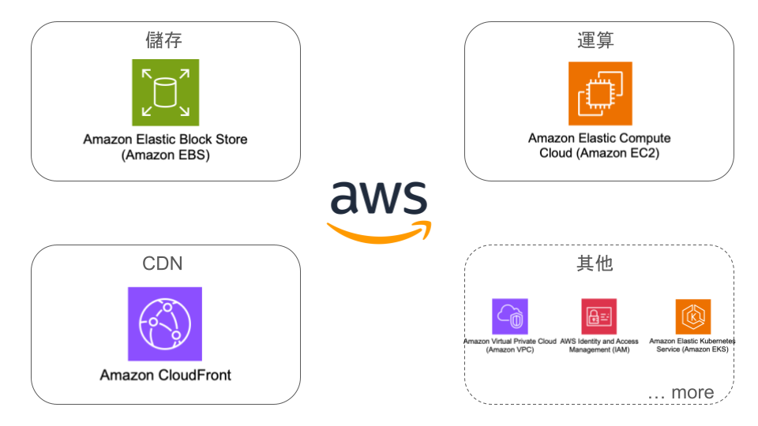
> 圖 1: AWS 服務簡介

#### 服務設定指引

為確保 AWS 服務符合地理位置限制要求，機關應注意以下關鍵要點：

1. **中國大陸區域的獨立性**：AWS 在中國大陸採用隔離營運模式，需透過專屬的「中國區帳號」存取服務，此帳號體系與全球 AWS 帳號完全分離。
2. **香港區域的識別與排除**：香港區域在系統中的代碼為 `ap-east-1`，顯示名稱為亞太地區(香港)，進行任何資源部署時，應絕對避免選用此區域。各區域的詳細地理位置資訊，請參閱本文件[附表1](#附表1-aws-區域代碼對照表)。
3. **內容傳遞網路 (CDN) 的地理限制**：若需使用 AWS CloudFront 服務，應運用以下兩項功能以符合規範：
    - **價格級距 (Price Class)**：設定為「僅使用北美和歐洲」或更嚴格的選項，以限制邊緣節點的地理分佈範圍。
    - **地理限制 (Geographic Restriction)**：建立規則，明確封鎖來自大陸地區、香港及澳門的存取請求。
4. **強化資料安全 (建議)**：為進一步強化資料保護與自主性，建議採用「客戶受管金鑰」機制進行靜態資料加密，並透過 AWS Key Management Service (KMS) 進行金鑰管理，以提升整體安全性。

:::tip 
各公有雲平台對客戶金鑰管理服務之命名分別為：
- Amazon Web Services 的「客戶受管金鑰」(Customer Managed Key, CMK)，資料來源：https://docs.aws.amazon.com/zh_tw/bedrock/latest/userguide/import-model-using-cmk.html
- Microsoft Azure 的「客戶自控金鑰」 (Customer-managed keys, CMK)，資料來源：https://learn.microsoft.com/zh-tw/azure/security/fundamentals/key-management
- Google Cloud Platform 的「客戶自行管理的加密金鑰」 (Customer-managed encryption keys, CMEK)，資料來源：https://cloud.google.com/kms/docs/cmek?hl=zh-tw
:::

#### Simple Storage Service (S3)

S3 是 AWS 提供之物件儲存服務，具備高可用性與可擴展性，可透過網路以 API、管理介面或標準網路協定存取、管理大量資料，並能依需求彈性擴充儲存容量。S3 適用於備份、資料分析、靜態網站託管等場景，支援版本控制、存取控制與加密功能，可以滿足多種業務需求。

**基礎設定重點**

在 S3 物件儲存服務的地理位置管控上，最基礎的設定即是在建立儲存貯體 (Bucket) 時，必須正確選擇部署區域，並主動排除香港 (`ap-east-1`) 地區。此外，為進一步強化資料保護與自主性，建議同時採用「客戶受管金鑰」機制進行加密。透過 AWS KMS 服務管理金鑰，可確保機關對其敏感資料保有完整的存取權限與生命週期掌控，從而大幅提升整體安全性。緣此，以下針對兩項核心設定進行說明。

- **地理區域設定─部署區域**：建立儲存貯體時，機關應避免選擇香港 `(ap-east-1)` 地區。於區域選擇介面中挑選適當的區域後，儲存貯體會建立在指定的區域環境中。設定介面詳見圖2。

    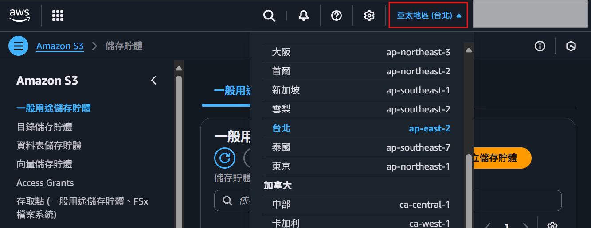
    > 圖 2: AWS S3 區域選擇

- **安全性設定─資料加密**：儲存貯體預設會對所有新上傳的物件自動應用伺服器端加密 (SSE)，可選擇使用 AWS 管理的金鑰 (SSE-S3) 或 AWS KMS 管理的金鑰 (SSE-KMS) 來保護資料安全。建議機關自行產製金鑰並上傳至 KMS，以維持對金鑰的完整管理權。該設定可在建立儲存貯體的「預設加密」區塊中進行設定，設定介面詳見圖3。

    
    > 圖 3: AWS S3 加密類型

**備份設定重點**

Amazon S3 於同一區域內已具備多副本儲存，確保資料的高耐久性。若機關需進一步強化備份，可啟用物件版本控制，保存所有歷史版本以避免誤刪或誤覆蓋。此外，亦可使用跨區域複寫或同區域複寫功能，自動將物件複製至其他儲存貯體或跨帳號環境。機關應確保目標儲存貯體位於符合地理位置限制的區域，**避免複製至香港 (`ap-east-1`) 地區**。

該設定需在已建立的儲存貯體中，進入「管理」頁籤後，於「複寫規則」選項中新增設定，即可指定來源與目標儲存貯體，選擇複寫方式。設定介面詳見圖4及圖5。

    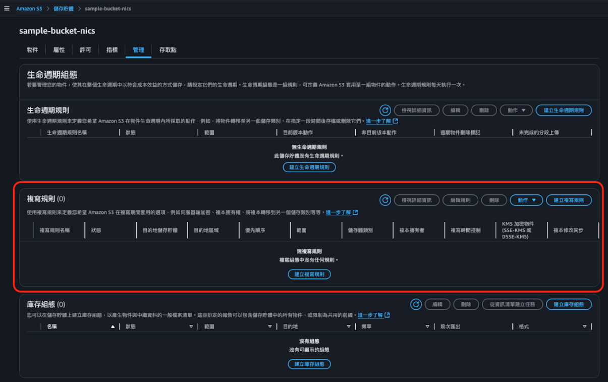
    > 圖 4: AWS S3 建立複寫規則 (一)

    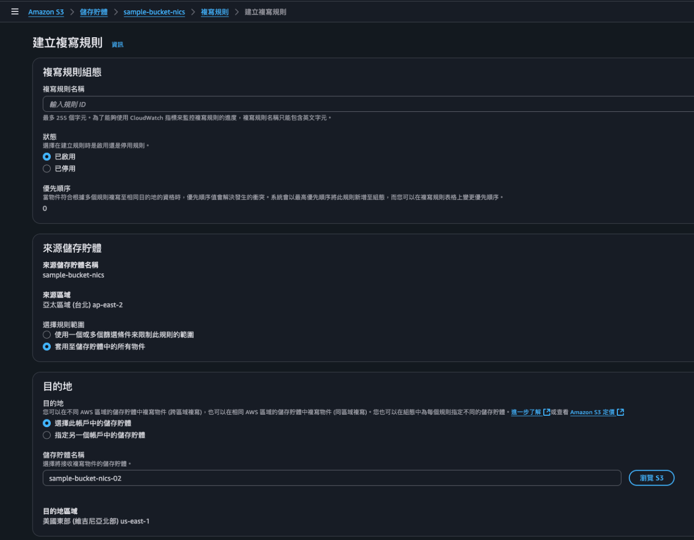
    > 圖 5: AWS S3 建立複寫規則 (二)

#### Elastic Compute Cloud (EC2)

EC2 是 AWS 的雲端運算服務，具備高可用性與可擴展性，提供多種執行個體類型 (Instance Type)，可依需求調整虛擬機器 (Virtual Machine) 的運算、記憶體與網路資源，適用於網站託管、資料處理及應用系統運行等場景。

**基礎設定重點**

EC2 虛擬機器服務的地理位置管控與 S3 相同，在建立執行個體時，必須正確選擇部署區域，並主動排除香港 (`ap-east-1`) 地區。同時建議針對 EBS 磁碟儲存採用「客戶受管金鑰」機制進行加密。緣此，以下針對兩項核心設定進行說明：

-   **地理區域設定─部署區域**：建立執行個體時，機關應依據前述的設定重點來選擇合適的地區。於區域選擇介面中挑選適當的區域後，執行個體會建立在指定區域內的可用區域 (AZ) 與子網路 (Subnet) 中。設定介面詳見圖6。

    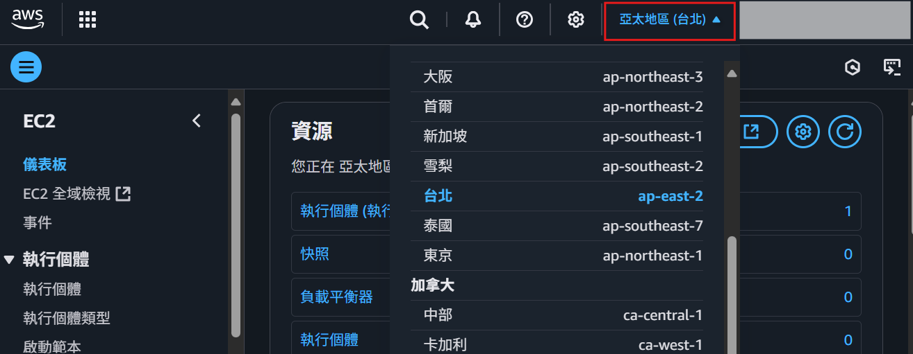
    > 圖 6: AWS EC2 區域選擇

-   **安全性設定─磁碟加密**：建議啟用 Encrypted 功能以確保磁碟資料安全，可選擇使用 AWS 管理的金鑰或 AWS KMS 管理的金鑰來保護資料。建議機關自行產製金鑰並上傳至 KMS，以維持對金鑰的完整管理權。該設定可在建立執行個體的「儲存(磁碟區) 進階」區塊中進行設定，設定介面詳見圖7。

    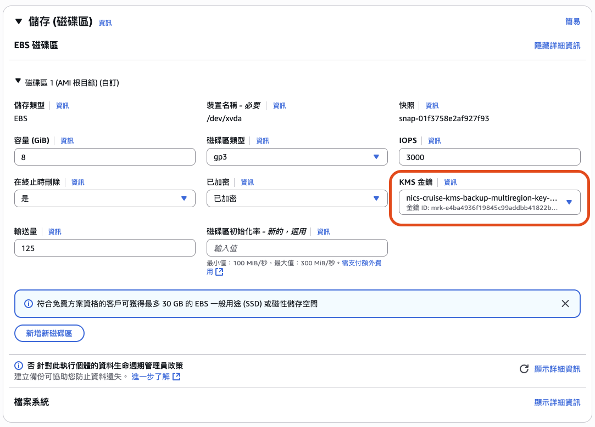
    > 圖 7: AWS EC2 選擇 KMS 金鑰

**備份與備援設定重點**

EC2 的備份設定，其地理位置管控的重點在於快照備份的存放位置與跨區域複製的設定。機關應審慎評估各項設定選項，以確保既能滿足資料保護需求，又能符合地理位置限制規範。緣此，以下針對相關設定進行說明：

-   **備份設定─集中備份管理**：EC2 的執行個體與 EBS 磁碟備份可透過 AWS Backup 統一進行自動化管理。使用者可建立備份計畫，指定要備份的 EC2 執行個體或 EBS 磁碟，並設定排程週期、保存期限與到期刪除規則，以減少人工操作並確保規則一致性。若機關有跨區域備援需求，AWS Backup 亦支援設定將備份複製至其他區域，但必須確認目標區域符合地理位置限制，**避免誤將備份複製至香港 (`ap-east-1`) 等限制地區**。整體設定可在 AWS Backup 主控台建立或修改備份計畫，並搭配KMS 加密機制確保備份資料的安全性。設定介面詳見圖8。

    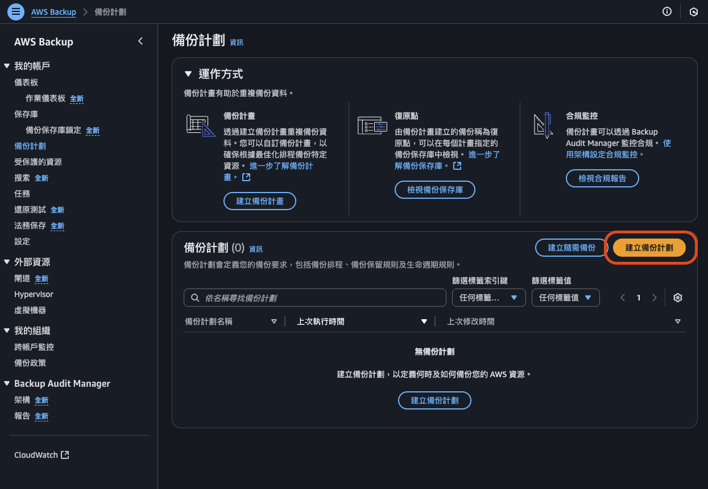
    > 圖 8: AWS Backup 建立備份計畫

-   **備份設定─自動化快照管理**：EC2 提供生命週期管理員 (Lifecycle Manager) 功能，用於自動化建立與管理 EBS 磁碟的快照備份。該功能透過排程化政策定期進行增量備份，並可依需求設定保留週期與到期刪除規則，以減少人工操作並確保備份一致性。機關若需進行跨區域備份保存，可搭配快照跨區複製功能，惟應確保目標區域符合地理位置限制要求，避免將快照複製至香港 (`ap-east-1`) 地區。在 EC2 管理主控台的生命週期管理員頁面建立快照政策時，需指定欲應用的 EBS 磁碟或透過標籤選取資源，並設定排程週期、保留時間與刪除規則。必要時可啟用跨區複製以完成備份規劃。建立介面詳見圖9。

    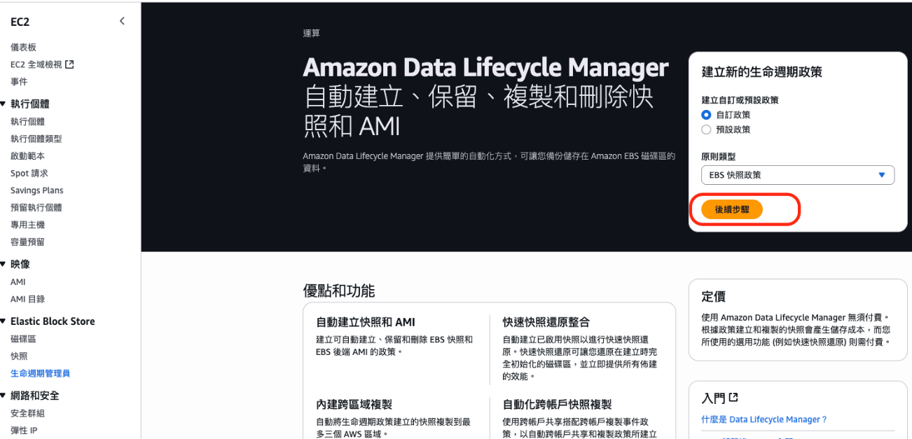
    > 圖 9: AWS EC2 生命周期管理員

#### CloudFront

CloudFront 為 AWS 提供的全球性內容傳遞服務 (Content Delivery Network, CDN)，透過全球分散的邊緣節點 (Edge Locations) 就近為使用者提供內容，達成高效能且低延遲的內容存取。該服務整合 AWS Shield 與 AWS WAF 提供 DDoS 攻擊防護及應用層安全控制，並透過地理限制  (Geographic Restriction) 功能，讓機關能夠控制特定地區的內容存取權限，確保敏感內容的資料安全。

**基礎設定重點**

在 CloudFront 內容傳遞網路服務的地理位置管控上，機關應避免在大陸地區 (含香港、澳門) 建立快取節點。為達成此目標，建議透過 Price Class 功能限制邊緣節點區域群組，並透過 Geographic Restriction 功能限制特定地區的存取請求。緣此，以下針對兩項核心設定進行說明。

-   **地理區域限制設定─邊緣節點**：設定邊緣節點區域群組後，CloudFront 僅會在指定的區域群組 (例如：北美與歐洲) 啟用邊緣節點。該設定可透過編輯 CloudFront 分佈規則進行設定。於「一般」頁籤的「Price Class」選項中進行設定，設定介面詳見圖10及圖11。

    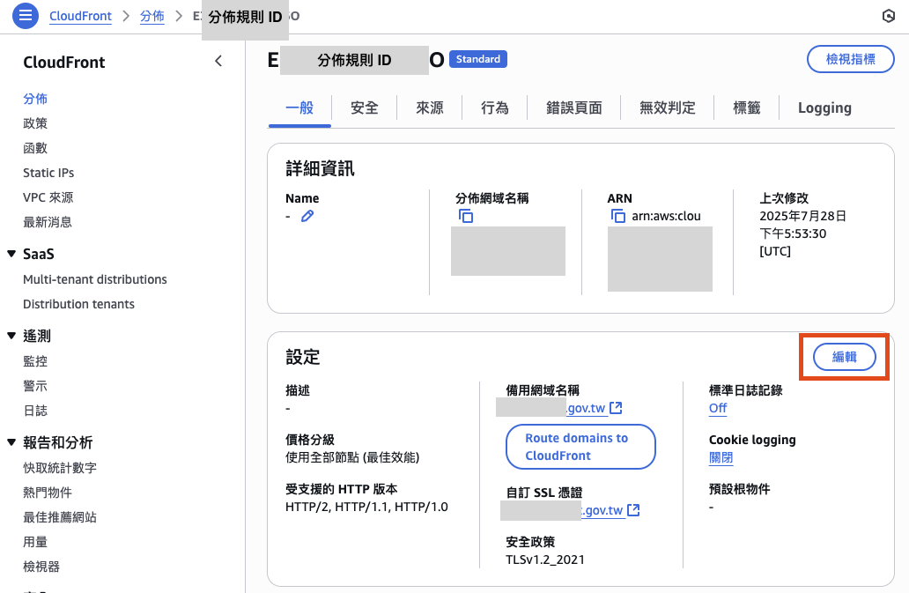
    > 圖 10: AWS CloudFront 選定區域群組啟用節點 (一)

    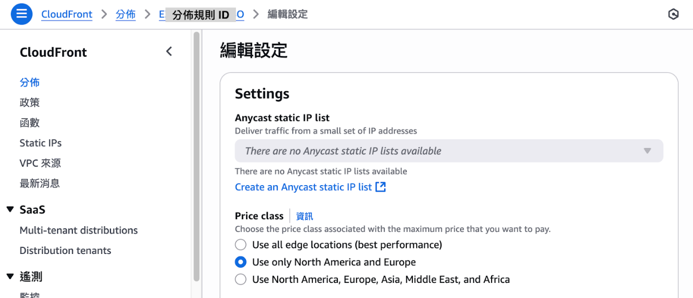
    > 圖 11: AWS CloudFront 選定區域群組啟用節點 (二)

-   **地理區域限制設定─存取限制**：透過 Geographic Restriction 功能設定白名單或黑名單，可限制特定國家的連線存取。該設定需在 CloudFront 分佈面板中，點開已建立的規則 ID，於「安全」頁籤的「CloudFront geographic restrictions」面板中的「國家/地區」進行編輯設定，設定介面詳見圖12。

    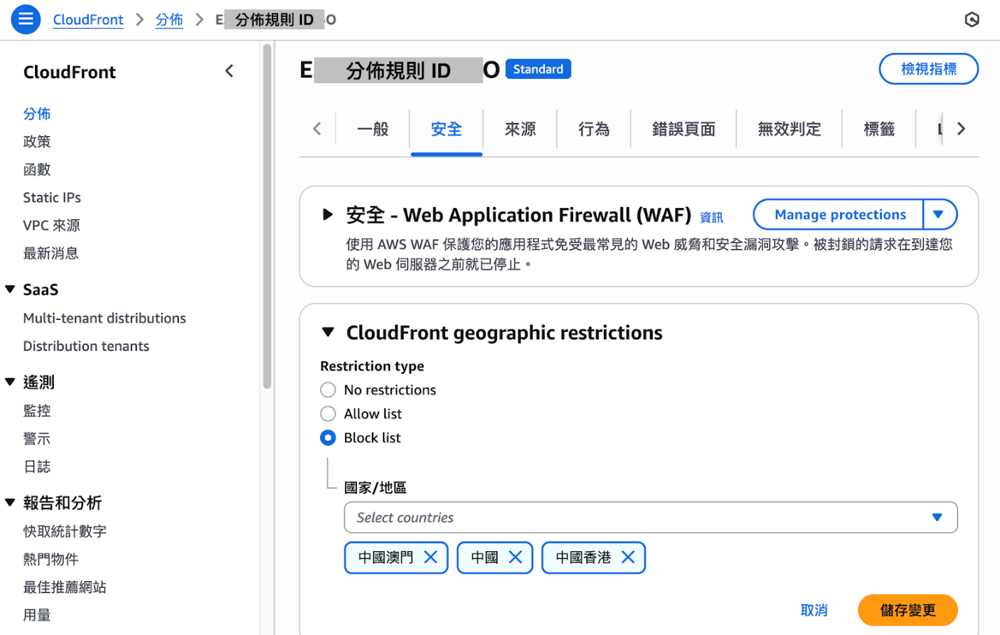
    > 圖 12: AWS CloudFront 地理限制存取設定

### 3.2 Azure 雲端服務操作指引

#### 服務簡介

Azure 的服務涵蓋物件儲存服務、虛擬機器服務、內容傳遞網路服務與其他服務詳見圖13。其中 Blob Storage 與 Virtual Machine 在建立時需指定區域，資料與運算資源會駐留於所選位置。若未啟用跨區複寫 (如 GRS、GZRS)，資料不會離開該區域，因此可透過限制可用區域來確保資料駐留符合資安要求。相較之下，Front Door 為全球性 CDN，節點分布於多國，涉及跨境傳輸議題。其他如 Application Gateway、Kubernetes Service 等區域性服務也需注意區域限制，而 Azure AD 等全球性管理服務則不牽涉業務資料駐留。

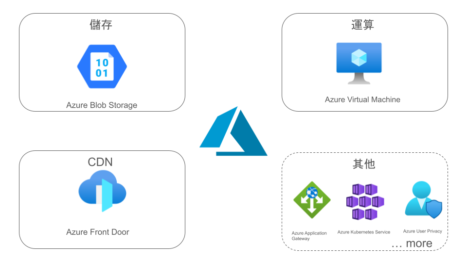
> 圖 13: Azure 服務簡介

#### 服務設定指引

為確保 Azure 服務符合地理位置限制要求，機關應注意以下關鍵要點：

1. **中國大陸區域的獨立性**：Azure 在中國大陸採用隔離營運模式，由 21Vianet 獨立營運，需透過專屬的「中國區帳號」存取服務，此帳號體系與全球 Azure 帳號完全分離。
2. **香港區域的識別與排除**：香港區域在系統中的代碼為 `eastasia`，顯示名稱為 East Asia，進行任何資源部署時，應絕對避免選用此區域。各區域的詳細地理位置資訊，請參閱本文件[附表2](#附表2-azure-區域代碼對照表)。
3. **異地備援風險識別**：當啟用異地備援功能 (如 GRS 和 GZRS ) 時，Southeast Asia (新加坡) 與 East Asia (香港) 為配對區域，因此會有資料自動複製至香港區域的風險，需要特別注意。
4. **內容傳遞網路 (CDN) 服務限制**：Azure Front Door 目前尚未提供避免在特定地區建立快取節點的功能，雖可拒絕特定地區的存取請求，但仍存在於大陸地區 (含香港及澳門) 產生快取資料的風險。機關如有使用 CDN 服務的需求，應優先考量 AWS CloudFront 或 Cloudflare 等具備完整地理位置控制能力的服務。
5. **強化資料安全 (建議)**：為進一步強化資料保護與自主性，建議採用客戶自控金鑰機制進行靜態資料加密，並透過金鑰保存庫 (Azure Key Vault) 進行金鑰管理，以提升整體安全性。

#### Blob Storage

Blob Storage 為 Azure 所提供的雲端物件儲存服務，主要用於儲存非結構化資料，如文件、影像、影音、備份與封存檔案。該服務支援多種存取層級，機關可根據資料存取頻率選擇適當的儲存方案。服務提供企業級安全性與全球存取能力，適用於文件儲存、媒體串流、備份封存及網站內容託管等應用場景。

**基礎設定重點**

在 Blob Storage 物件儲存服務的地理位置管控上，機關應在建立儲存體帳戶時正確選擇部署區域，並主動排除 East Asia (香港) 以及考慮排除 Southeast Asia (新加坡) 等地區。同時建議採用「客戶自控金鑰」機制進行加密，並透過金鑰保存庫管理金鑰。緣此，以下針對兩項核心設定進行說明。

- **地理區域設定─部署區域**：建立儲存體帳戶時，機關應依據前述說明避免選擇 East Asia，以及考慮排除 Southeast Asia。該設定可在建立儲存體帳戶的「基本」頁籤中，於「區域」選項進行設定，設定介面詳見圖14。

    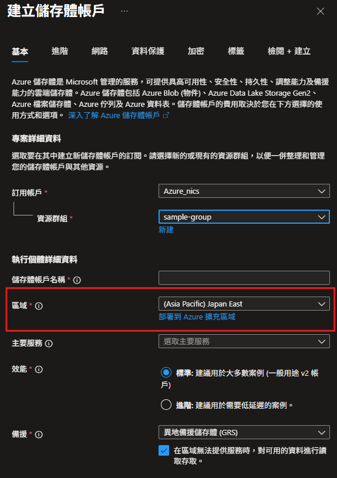
    > 圖 14: Azure Blob Storage 部署區域

- **安全性設定─資料加密**：Blob Storage 採用伺服器端加密機制，以保護儲存資料的安全性。建議選擇「客戶自控金鑰 (CMK)」，確保金鑰的存取權限與管理操作均由機關自行掌控。該設定可在建立儲存體帳戶的「加密」頁籤中，於「加密類型」選項進行設定。設定介面詳見圖15。

    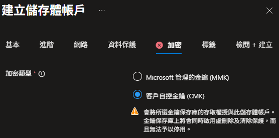
    > 圖 15: Azure Blob Storage 加密類型

**備份與備援設定重點**

Blob Storage 物件儲存服務的備份與備援設定，其地理位置管控涉及多個層面的考量。由於備援機制的選擇，將直接影響資料複製的目標區域，而備份保存庫 (Backup vault) 的設置，則關係到備份資料的存放位置，機關應審慎評估各項設定選項，以確保既能滿足業務連續性需求，又能符合地理位置限制規範。緣此，以下針對兩項核心設定進行說明。

-   **備援設定─選擇備援機制**：機關應依據系統重要性、資料敏感性及預算考量，選擇適當的備援機制。一般而言，關鍵業務系統建議採用 ZRS 或 GRS 以確保高可用性，測試或開發環境可考慮使用 LRS 以降低成本。若有資料不得跨境限制，應優先選擇 LRS 或 ZRS 選項。應注意若選擇新加坡區域並啟用異地備援功能 (如 GRS 和 GZRS) 可能導致資料自動複製至香港地區的風險。該設定可在建立儲存體帳戶的「基本」頁籤中，於「備援」選項進行設定，設定介面詳見圖16及圖17。

    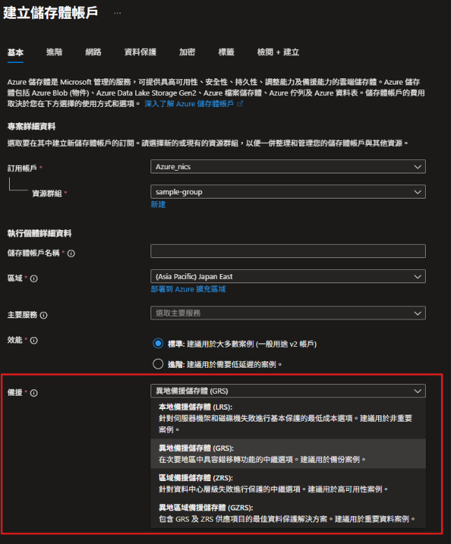
    > 圖 16: Azure Blob Storage 備援設定 (一)

    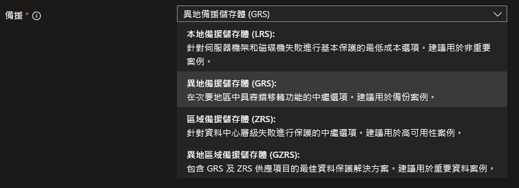
    > 圖 17: Azure Blob Storage 備援設定 (二)

:::tip 
Azure 備援機制分為本地備援儲存體 (LRS)、區域備援儲存體 (ZRS)、異地備援儲存體 (GRS) 及異地區域備援儲存體 (GZRS) 等選項，資料來源: https://learn.microsoft.com/zh-tw/azure/storage/common/storage-redundancy#locally-redundant-storage。
:::

-   **備份設定─備份保存庫**：備份保存庫用於集中管理與儲存各種 Azure 資源的備份資料，其建立位置與備援機制直接影響備份資料的存放區域。在建立備份保存庫時，機關應依據前述說明選擇適當的區域與備援選項，避免資料存放或複製至限制地區。該設定可在建立備份保存庫的「基本」頁籤中，於「區域」及「備份儲存體備援」選項進行設定，設定介面詳見圖18~圖20。

    
    > 圖 18: Azure 建立備份保存庫 (一)

    
    > 圖 19: Azure 建立備份保存庫 (二)

    
    > 圖 20: Azure 建立備份保存庫 (三)

-   **備份設定─備份保存庫安全性**：此外，為進一步強化備份資料的安全性，建議選擇「使用客戶自控金鑰」來進行加密，確保機關對備份資料的加密金鑰保有完整掌控權。該設定可在建立備份保存庫的「Vault properties」頁籤中，於「加密類型」選項進行設定，設定介面詳見圖21。

    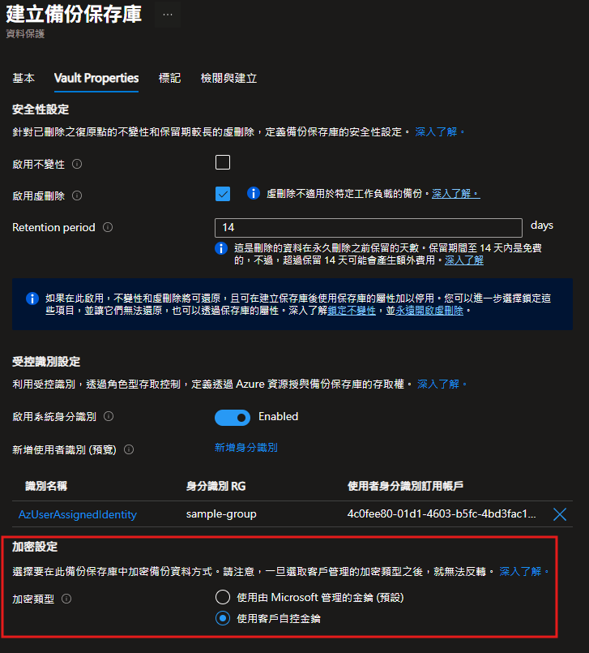
    > 圖 21: Azure 備份保存庫加密設定

#### Virtual Machines

Virtual Machines 是Azure提供彈性設定的雲端虛擬伺服器，支援 Windows、Linux 與自訂映像，並可透過 VM Scale Sets、Reserved Instances 與 Spot VM 等機制，在確保高可用與自動擴展的同時優化長期與臨時運算成本。

**基礎設定重點**

Virtual Machines 虛擬機器服務的地理位置管控與 Blob Storage 相同，在建立虛擬機器時，必須正確選擇部署區域，並主動排除 East Asia (香港) 以及考慮排除 Southeast Asia (新加坡) 地區。同時建議針對磁碟儲存採用「客戶自控金鑰」機制進行加密。緣此，以下針對兩項核心設定進行說明。

- **地理區域設定─部署區域**：建立虛擬機器時，機關應依據前述的設定重點來選擇合適的地區。該設定可在建立虛擬機器的「基本」頁籤中，於「區域」選項進行設定，設定介面詳見圖22。

    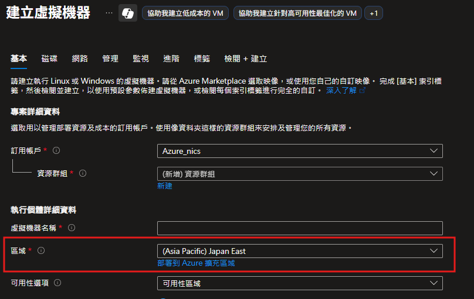
    > 圖 22: Azure Virtual Machines部屬區域

- **安全性設定─磁碟加密**：磁碟加密可使用由 Azure 管理的金鑰 (平台代控金鑰)，或由使用者自行建立並管理的金鑰 (客戶自控金鑰)。建議預設採用「客戶自控金鑰」，以確保金鑰的存取權限與生命週期均由機關自行掌控。該設定可在建立儲存體帳戶的「磁碟」頁籤中，於「金鑰管理」選項進行設定，設定介面詳見圖23及圖24。

    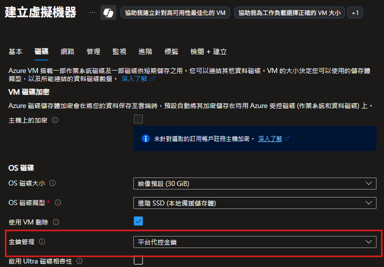
    > 圖 23: Azure Virtual Machines金鑰管理 (一)

    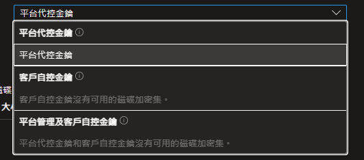
    > 圖 24: Azure Virtual Machines金鑰管理 (二)

**備份與備援設定重點**

Virtual Machines 的備份與備援設定，其地理位置管控的重點在於備份服務的設定與磁碟備援機制的選擇。由於備份保存庫的建立位置與磁碟備援類型會影響資料存放的地理分布，機關應審慎評估各項設定選項，以確保既能滿足業務連續性，又能符合地理位置限制規範。緣此，以下針對兩項核心設定進行說明。

- **備援設定─磁碟備援**：設定磁碟類型時，可選擇本地備援或區域備援等選項。機關可依據系統重要性與可用性需求進行選擇，本地備援適用於一般業務需求，區域備援則適用於對可用性要求較高的關鍵系統。該設定可在建立虛擬機器的「磁碟」頁籤中，於「OS 磁碟類型」進行設定，設定介面詳見圖25及圖26。

    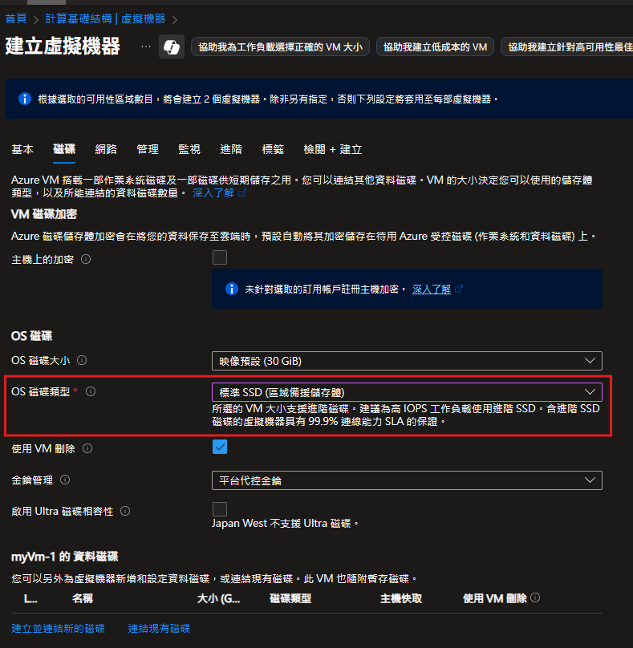
    > 圖 25: Azure Virtual Machines磁碟備援 (一)

    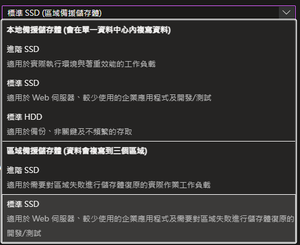
    > 圖 26: Azure Virtual Machines磁碟備援 (二)

- **備份設定─備份服務**：備份可透過備份保存庫對虛擬機器進行完整系統備份或個別磁碟備份，機關應確保備份保存庫建立於符合地理位置限制要求的區域。備份保存庫的建立與設定方式，可參閱前述 Blob Storage 備份與備援設定重點章節，設定介面詳見圖27~圖29。

    
    > 圖 27: Azure 建立備份保存庫 (一)

    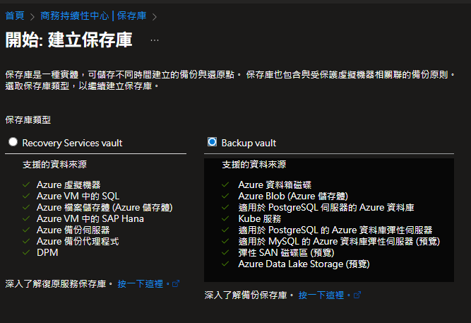
    > 圖 28: Azure 建立備份保存庫 (二)

    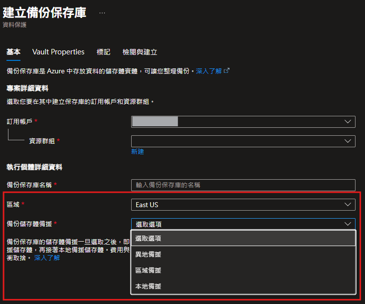
    > 圖 29: Azure 建立備份保存庫 (三)

#### Front Door

Front Door 是Azure 提供的全球應用程式傳遞網路服務，整合了負載平衡器、內容傳遞網路 (CDN) 及Web應用程式防火牆 (WAF) 功能，透過 Azure 遍布全球的邊緣節點網路，就近為使用者提供內容，達成高效能且低延遲的內容存取。

**基礎設定重點**

考量 Front Door 目前尚未提供邊緣節點地理位置限制功能，機關僅能透過 WAF 政策限制來自大陸地區 (含香港及澳門) 的存取請求，但仍存在於該地區產生快取資料的風險。該設定需在「Web 應用程式防火牆」介面中，選擇「自訂規則」頁籤後，設定地理位置限制規則，設定介面詳見圖30及圖31。

    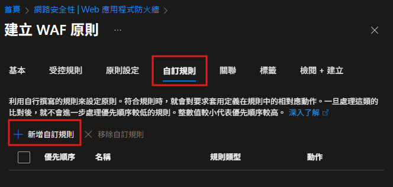
    > 圖 30: Azure WAF設定 (一)

    
    > 圖 31: Azure WAF設定 (二)

---

### 3.3 GCP 雲端服務操作指引

#### 服務簡介

Google Cloud Platform (GCP) 作為完整的公有雲服務平台，提供涵蓋物件儲存服務、虛擬機器服務、內容傳遞網路服務與其他服務詳見圖32。其核心服務如 Compute Engine 與 Cloud Storage 採用區域化設計，使用者需在建立資源時指定特定區域，若未啟用多區域或跨區複寫功能，資料將駐留於所選位置，可透過限制區域選擇來確保資料駐留符合資安要求。然而，GCP 的 Cloud CDN 服務具有全球性特質，節點分布於多國，必然涉及跨境資料傳輸議題。其他如 Kubernetes Engine 等區域性服務需注意區域限制，而 Cloud IAM 等全球性管理服務則不牽涉資料駐留問題。

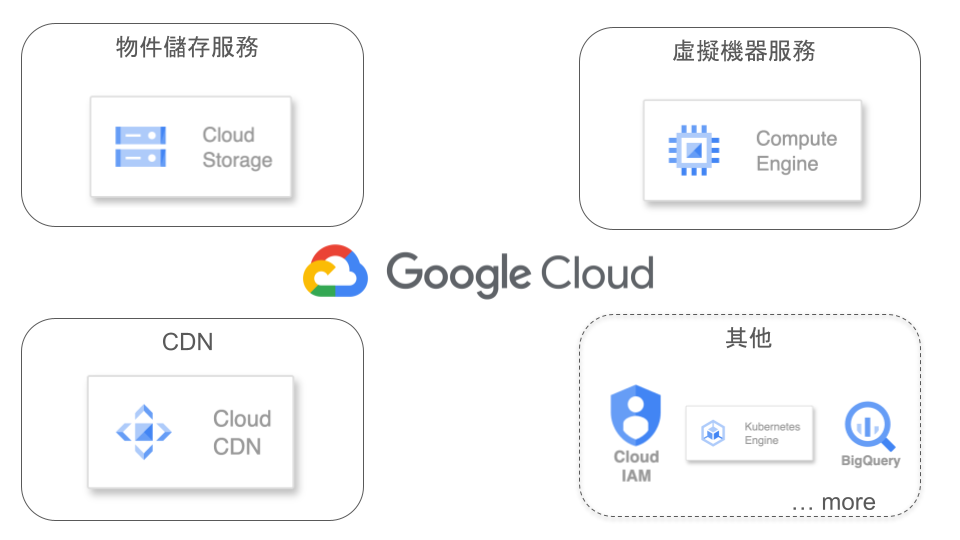
> 圖 32: GCP服務簡介

#### 服務設定指引

為確保 GCP 服務符合地理位置限制要求，應注意以下關鍵要點：

1. **中國大陸區域的營運狀況**：GCP 並未在中國大陸設立自營資料中心，因此無中國大陸相關地理位置風險。
2. **香港區域的識別與排除**：香港區域在系統中的代碼為 `asia-east2`，顯示名稱為 `asia-east2 (香港)`，機關使用 GCP 服務時，仍需注意避免將資料存放至該區域，以符合相關規範要求。各區域的詳細地理位置資訊，請參閱本文件[附表 3](#附表3-gcp-區域代碼對照表)。
3. **組織政策的系統性管控**：GCP 若要系統性地排除特定區域 (如香港)，需透過**組織政策 (Organization Policy)** 在組織層級進行設定，以防範因操作疏失導致資源意外部署至限制區域。此機制與 AWS、Azure 的全域設定或個別使用者權限管控方式不同。機關應優先設定組織政策，以確保全組織的資源部署與設定方式一致，並降低設定錯誤的風險。
4. **內容傳遞網路 (CDN) 服務限制**：Google Cloud CDN 目前尚未提供排除特定地區建立快取節點的功能，雖可拒絕特定地區的存取請求，但仍存在於大陸地區 (含香港及澳門) 產生快取資料的風險。機關如有使用 CDN 服務的需求，應優先考量 AWS CloudFront 或 Cloudflare 等具備完整地理位置控制能力的服務。
5. **強化資料安全 (建議)**：為進一步強化資料保護與自主性，建議採用由客戶自行管理的加密金鑰機制進行靜態資料加密，並透過 Cloud Key Management Service (Cloud KMS) 進行金鑰管理，以提升整體安全性。

#### 組織政策 (Organization Policy)

GCP 提供組織層級之地理位置管控機制，透過組織政策的設定，於資源建立時，自動檢查並阻擋風險區域選項。此機制無需依賴人工審核程序，有效防範因操作疏失所導致的設定問題。針對進階管理需求，管理者可搭配資源標籤功能，設定更精細的條件式政策控制，提升資料存放位置管控的彈性與精確度。

服務設定的步驟如下：

1. **進入組織政策設定頁面**：可透過搜尋「組織政策」進入設定頁面。設定介面詳見圖33。

    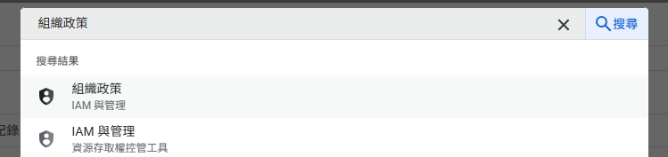
    > 圖 33: GCP搜尋頁面

2. **填寫該政策詳細資料**：設定錯誤時顯示的名稱、規則ID及錯誤提示說明。本範例以 Google Cloud Storage 為例，透過標籤限制來確保所有值區 (Bucket) 都必須包含指定標籤。設定介面詳見圖34。

    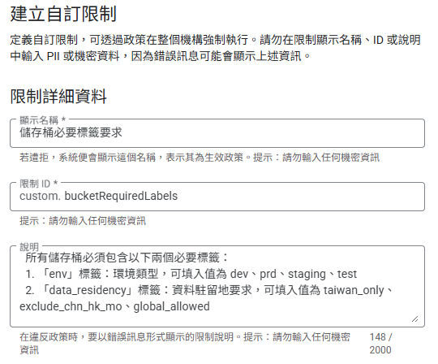
    > 圖 34: GCP政策詳細資料

3. **填寫該政策執行規則**：選擇要限制的資源類型後，依據所需填寫相應規則。設定介面詳見圖35。

    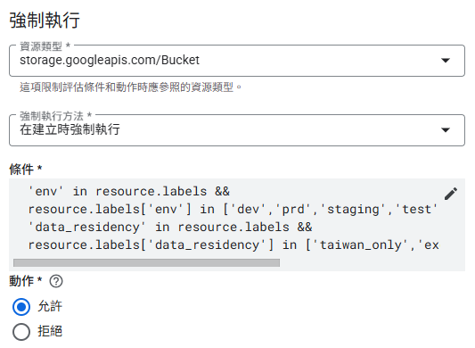
    > 圖 35: GCP政策執行規則

:::tip
GCP組織政策功能支援對多種雲端服務進行自訂限制設定，包含Compute Engine、Cloud Storage、BigQuery、Cloud Functions等服務，完整支援服務清單詳見：https://cloud.google.com/resource-manager/docs/organization-policy/custom-constraint-supported-services?hl=zh-tw。
:::

:::tip
GCP官方針對 Cloud Storage 服務提供完整的自訂限制管理設定，詳細資料可參考：https://cloud.google.com/storage/docs/custom-constraints?hl=zh-tw。
:::

4. **多重政策規則設定**：圖34及圖35展示如何設定政策規則，要求值區必須新增指定標籤，後續可透過建立額外規則來限定特定標籤的地區限制。分別建立多項規則具有維護便利的優勢，修改單一規則時不會影響其他限制條件。當政策違規時，也能提供更明確的錯誤訊息內容。設定介面詳見圖36。

    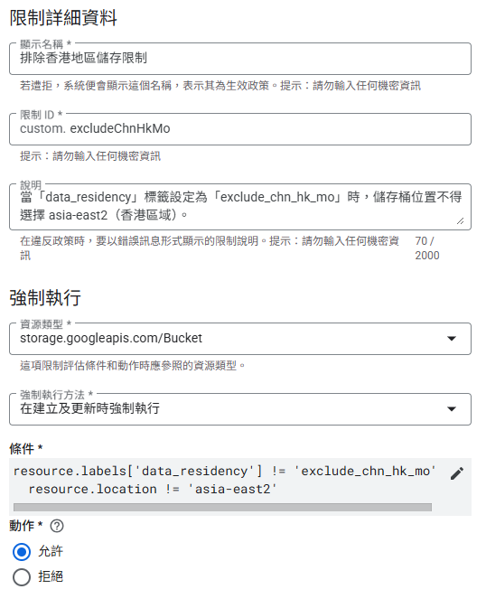
    > 圖 36: GCP更多政策設定

#### Google Cloud Storage－GCS

GCS 是 GCP 提供的雲端物件儲存服務，提供高度可擴展的分散式儲存解決方案。適用於靜態資源託管、備份歸檔、資料分析等應用場景，支援多種存取控制與加密機制。

**基礎設定重點**

在 GCS 物件儲存服務的地理位置管控上，機關應在建立值區 (Bucket) 時正確選擇儲存位置類型，並主動排除包含 `asia-east2` (香港) 的地區選項。同時建議採用「客戶自行管理的加密金鑰」機制進行加密，並透過 Cloud KMS 管理金鑰。緣此，以下針對兩項核心設定進行說明。

- **地理區域設定─部署區域**：建立值區時，機關應避免選擇包含 asia-east2 (香港) 的選項。該設定可在建立值區的「選擇資料的儲存位置」步驟中進行設定，設定介面詳見圖37。

    
    > 圖 37: Google Cloud Storage部署區域

- **安全性設定─資料加密**：GCP 預設會加密所有靜態儲存的資料，提供兩種加密金鑰管理選項。可選擇使用「Google 代管的加密金鑰」由 Google 自動管理，或選擇「Cloud KMS 金鑰」使用機關預先上傳至 Cloud KMS 的自訂金鑰進行加密。建議選擇「Cloud KMS 金鑰」選項，以確保金鑰的存取權限與生命週期均由機關自行掌控，從而提升資料安全性。該設定可在建立值區的「選擇保護物件資料的方式」頁籤中，於「資料加密」區塊進行設定，設定介面詳見圖38及圖39。

    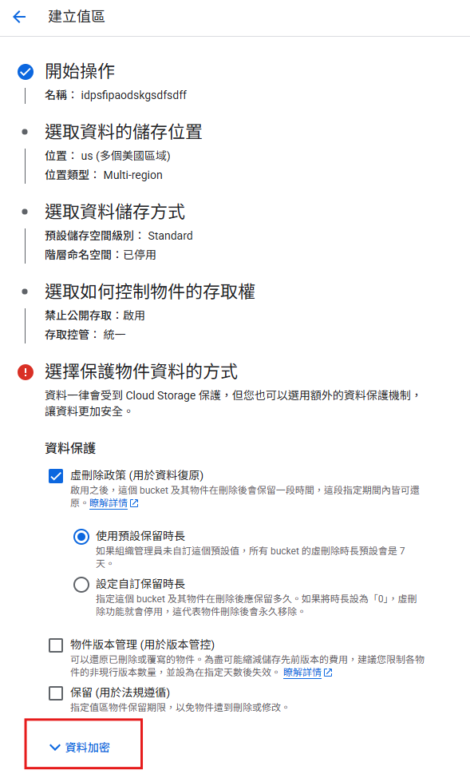
    > 圖 38: Google Cloud Storage 資料加密 (一)

    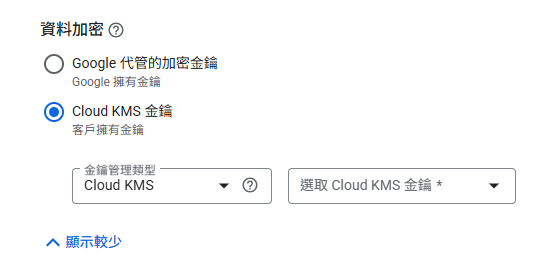
    > 圖 39: Google Cloud Storage 資料加密 (二)

**備份設定重點**

GCS 物件儲存服務的備份設定，其地理位置管控同樣涉及多層面的考量。由於複寫機制與區域選擇會直接影響資料保存位置，且跨區或多區的設定涉及資料存放風險，機關應依據系統重要性、資料敏感性及預算需求，選擇適當的位置類型。一般而言，關鍵業務系統可採用 Dual-region 或 Multi-region 儲存，以確保資料於不同區域間具備高可用性。若有資料不得跨境的限制，應優先選擇 Regional 儲存，將資料限定於單一區域內保存。使用 Multi-region (如亞洲多區域) 時需特別注意，若未設定組織政策，複製範圍可能包含香港而產生不符合限制的風險。該設定可於建立儲存貯體的「位置」頁籤中進行選擇。詳見圖40。

    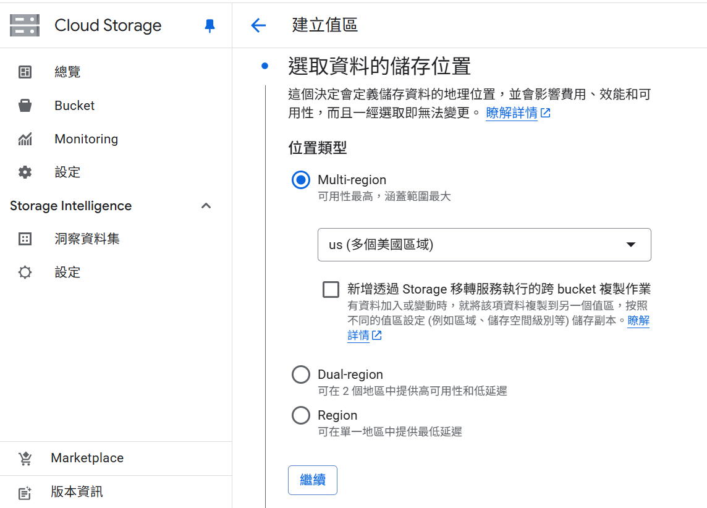
    > 圖 40: Google Cloud Storage 位置類型設定

#### Google Compute Engine－GCE

GCE 為 GCP 核心運算服務，提供可擴展之虛擬機器執行個體 (instance)，使用者可於 GCE 基礎架構上運行各種應用程式。該服務支援多種機器類型與作業系統，自輕量級執行個體 (micro instance) 至高效能 GPU 加速執行個體，可滿足不同應用需求。服務提供彈性計費模式，包含隨用隨付、預留執行個體及搶占式執行個體 (Spot VMs) 等選項。同時，可與 VPC 網路、GCS、Load Balancer 等 GCP 服務無縫整合，適用於網站應用部署、大量資料處理、機器學習訓練等各種企業級應用場景。

**基礎設定重點**

GCE 虛擬機器服務的地理位置管控與 GCS 相同，在建立執行個體時，必須正確選擇部署區域，並主動排除 `asia-east2` (香港) 地區。同時建議針對磁碟儲存採用「客戶自行管理的加密金鑰」機制進行加密。緣此，以下針對兩項核心設定進行說明。

- **地理區域設定─部署區域**：建立執行個體時，機關應依據前述的設定重點來選擇合適的地區。該設定可在建立執行個體的「機器設定」頁籤中，於「區域」選項中進行設定，設定介面詳見圖41。

    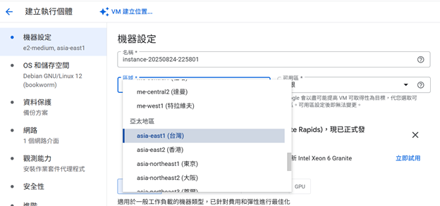
    > 圖 41: Google Compute Engine部署區域

- **安全性設定─資料加密**：GCE 預設會對所有磁碟進行靜態資料加密保護，可選擇使用 GCP 管理的加密金鑰或 Cloud KMS 金鑰來保護資料安全。建議選擇「Cloud KMS 金鑰」選項，以確保金鑰的存取權限與生命週期均由機關自行掌控。該設定可在建立執行個體的「進階」頁籤中，於「資料加密」區塊中進行設定，設定介面詳見圖42及圖43。

    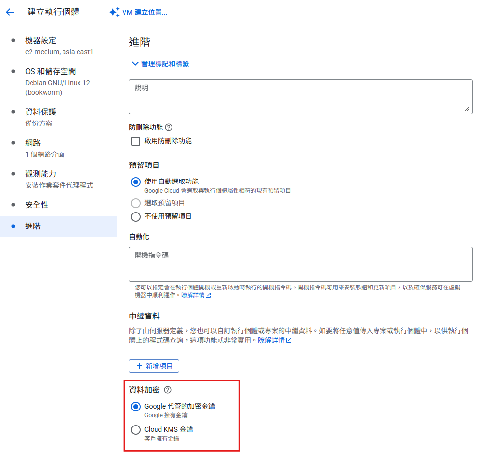
    > 圖 42: Google Compute Engine 資料加密 (一)

    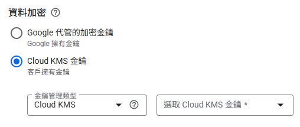
    > 圖 43: Google Compute Engine 資料加密 (二)

**備份與備援設定重點**

GCE 的備份與備援設定，地理位置管控的重點在於備份與備援資料的存放區域。由於備份方案與快照排程的設定，將影響備份資料的存放區域，而磁碟備援機制則決定備援資料的地理分布，機關應審慎評估各項設定，以確保既能滿足業務連續性，又能符合地理位置限制規範。緣此，以下針對兩項核心設定進行說明。

- **備份設定─備份方案與快照排程**：機關可依據系統重要性與成本考量，選擇適當的備份方式。「備份方案」提供虛擬機器的完整系統備份，適合關鍵業務系統；「快照排程」僅備份磁碟，成本較低，適合一般業務需求。在設定備份及快照計畫時，應避免選擇 asia-east2 (香港) 地區，確保備份資料的地理位置符合資安要求。該設定可在建立執行個體的「資料保護」頁籤中，於「備份資料」區塊中進行設定，設定介面詳見圖44及圖45。

    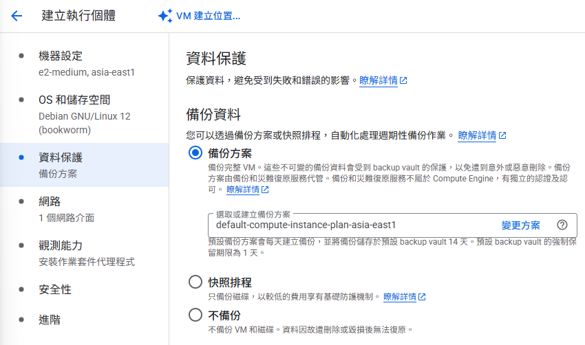
    > 圖 44: Google Cloud Engine 備份方案

    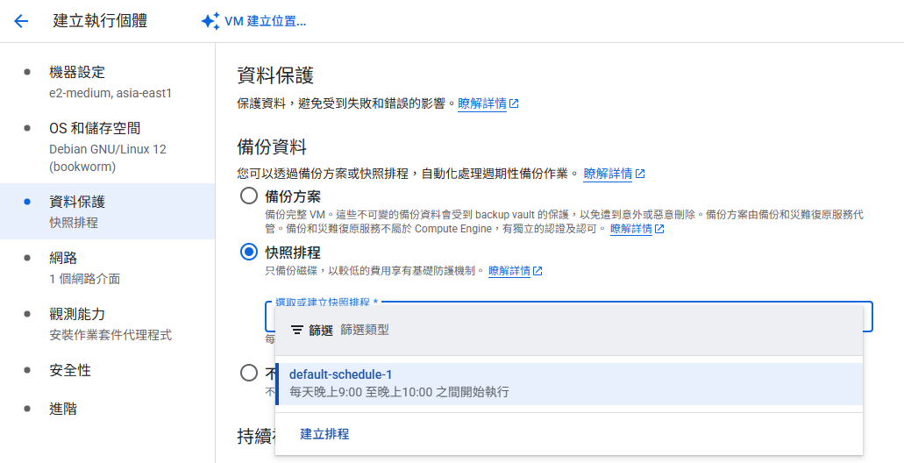
    > 圖 45: Google Cloud Engine 快照排程

- **備援設定─磁碟持續資料複製**：GCE 提供磁碟層級的資料複製功能，包含跨可用區同步複製與跨區域非同步複製。跨可用區同步複製可在同一區域內的不同可用區間進行磁碟資料同步複製，實現接近零資料遺失 (RPO 接近 0)，當單一可用區故障時可快速切換。由於複製範圍僅限於同一區域內，此設定不涉及跨境資料傳輸。跨區域非同步複製則提供跨區域災難復原能力，機關應確保目標區域符合地理位置限制要求，避免選擇 asia-east2 (香港) 地區。該設定可在建立執行個體的「資料保護」頁籤中，於「跨可用區同步複製」及「跨區域非同步複製」區塊中進行設定，設定介面詳見圖46。

    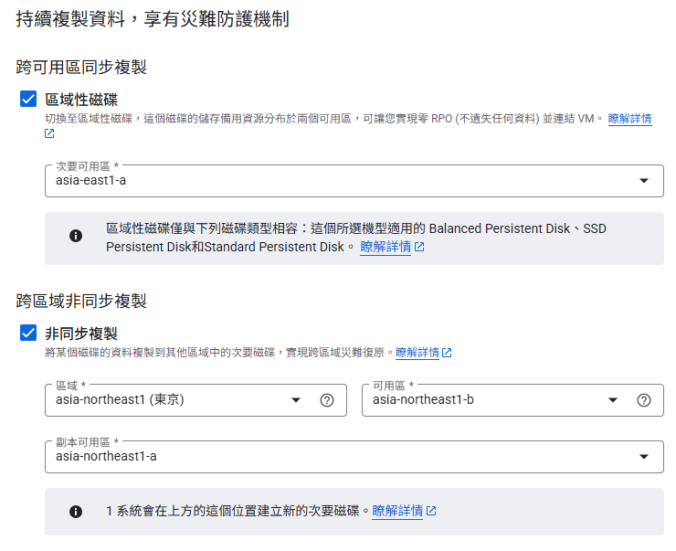
    > 圖 46: Google Cloud Engine跨可用區同步複製及跨區域非同步複製

#### Cloud CDN

Cloud CDN 為全球內容傳遞網路服務，透過 Google 全球邊緣節點基礎設施，將內容快取至最接近使用者的位置，有效降低延遲並提升網站效能。該服務適用於靜態內容加速、動態內容優化及媒體串流等應用場景，可與 GCS、GCE 等服務深度整合，提供完整的內容分發解決方案。

**基礎設定重點**

在 Cloud CDN 內容傳遞網路服務的地理位置管控上，考量 Cloud CDN 目前尚未提供邊緣節點地理位置限制功能，機關僅能透過 Cloud Armor 政策限制來自大陸地區 (含香港及澳門) 的存取請求，但仍存在於該等地區產生快取資料的風險。該設定需在 Cloud Armor 介面中建立安全政策，並將其應用至已建立的 CDN 服務，設定介面詳見圖47~圖49。

    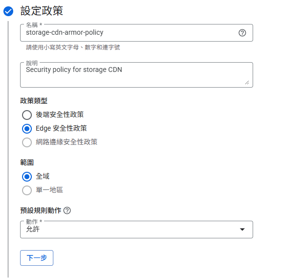
    > 圖 47: Google Cloud Armor 設定 (一)

    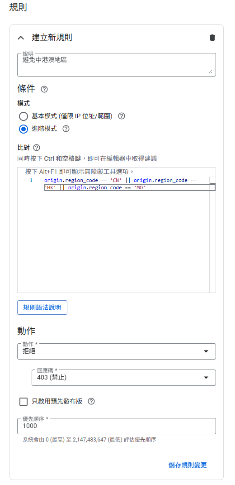
    > 圖 48: Google Cloud Armor 設定 (二)
    
    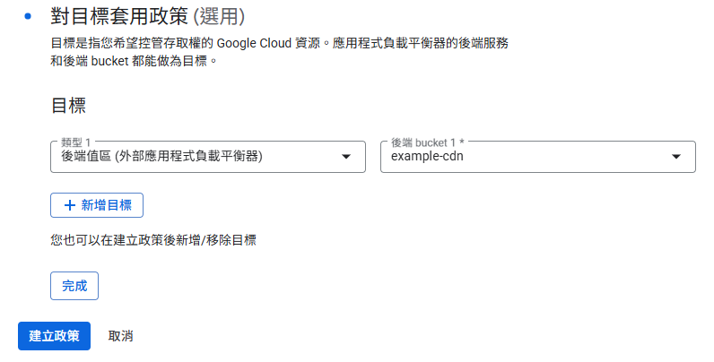
    > 圖 49: Google Cloud Armor 設定 (二)

---

### 3.4 Cloudflare CDN 服務操作指引

#### 服務簡介

Cloudflare 除了核心的 CDN 服務外，還提供多元的雲端解決方案，包括用於邊緣運算的 Workers、物件儲存服務 R2，以及 Log Explorer、Secure APIs 等輔助功能詳見圖50。然而，相較於 AWS、Azure 或 GCP 等公有雲平台，Cloudflare 並非以完整 IaaS 或 PaaS 為核心設計，其運算與儲存多屬輔助性質。本文件將聚焦於 Cloudflare 的 CDN 服務，主要考量其節點遍布全球且市場採用度極高，在內容傳遞與加速領域具有指標性地位，且服務特性涉及內容落地與跨境資料傳輸等關鍵議題。

#### 服務設定指引

為確保 Cloudflare 服務符合地理位置限制要求，機關應注意以下關鍵要點：

1. 若需排除特定國家或地區的節點 (如中國大陸、香港、澳門)，必須升級至 Enterprise 方案。
2. 標準方案雖可限制特定來源地區的存取請求，但仍無法阻止於該等地區建立或使用快取節點，存在於大陸地區 (含香港及澳門) 產生快取資料之風險。

#### Cloudflare CDN 設定

Cloudflare 提供全球分布的內容傳遞網路 (CDN) 與安全防護服務，其邊緣節點涵蓋多數國家及地區。該服務可透過防火牆規則或地理位置存取控制機制來限制特定來源地區的存取請求，但須升級至 Enterprise 方案，才能使用地理位置節點排除功能。

**基礎設定重點**

在 Cloudflare CDN 內容傳遞網路服務的地理位置管控上，機關需透過 Enterprise 方案才能完全排除大陸地區 (含香港及澳門) 的邊緣節點。Standard 方案雖可限制特定來源地區的存取請求，但無法阻止於該等地區建立快取節點，仍存在快取資料落地於限制地區的風險。緣此，以下針對兩項核心設定進行說明。

- **地理區域限制設定─存取限制**：在設定防火牆規則時，可依連線來源國家來決定是否要封鎖。在「條件」選項中指定排除大陸地區 (含香港及澳門) 的來源 IP，並將動作設定為封鎖或挑戰，即可避免來自指定地區的連線請求。設定介面詳見圖51。

    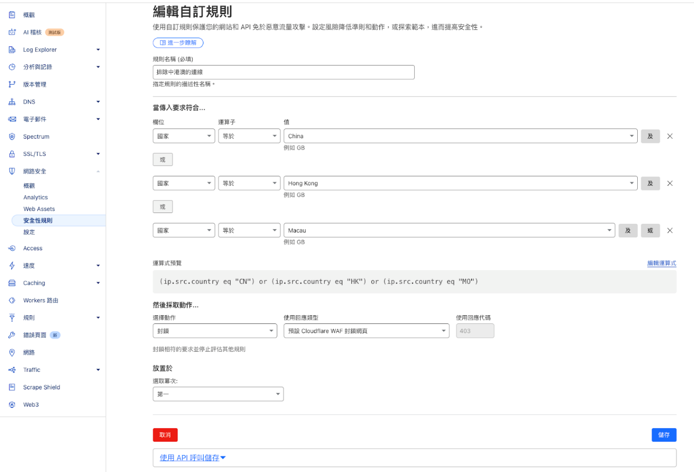
    > 圖 51: Cloudflare CDN DNS 代理與地區排除設定

- **地理區域限制設定─邊緣節點**：設定 DNS 記錄時，需開啟「通過 Proxy 處理」功能。在「區域」設定中選擇排除大陸地區 (含香港及澳門) 的規則，即可使用排除指定地區的 CDN 節點。

    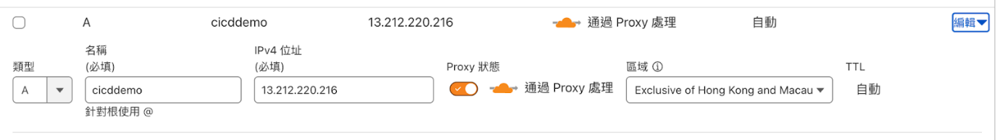
    > 圖 52: Cloudflare CDN DNS 邊緣節點設定

---

## 4. 結論

本文依據行政院第 1131000727 號函示之地理位置限制規範，系統性分析 AWS、Azure、GCP 與 Cloudflare 四個主流公有雲服務平台。針對政府機關最常使用且具資料存放性質之物件儲存服務、虛擬機器服務及內容傳遞網路服務(CDN)等三類服務，其研究成果與共通原則歸納如下：

### 四個平台三種服務研究結果彙整

針對 AWS、Azure、GCP 與 Cloudflare 四個公有雲服務平台於符合我國資通安全要求方面，依照技術方面為：

1. **物件儲存服務與虛擬機器服務方面**：
    - AWS (S3/EC2)、Azure (Blob Storage/Virtual Machines) 及 GCP (Cloud Storage/Compute Engine) 均提供明確的區域選擇機制，讓機關可在建立資源時直接控制資料存放與運算位置。
    - Azure 的異地備援功能 (GRS/GZRS) 存在特定風險，例如選擇新加坡 (Southeast Asia) 區域時，資料會自動複製至其配對區域香港 (East Asia) ，機關應審慎評估並避免使用此類組合。
    - GCP 的「組織政策 (Organization Policy)」提供最全域管控，能強制限制整個組織所有專案的資源部署區域，有效防範人為設定疏失。
2. **內容傳遞網路服務(CDN)方面**：
    - 各平台的地理位置管控能力差異極大。AWS CloudFront 與 Cloudflare (Enterprise 方案) 提供最完整的控制能力，可透過「Price Class」或地理節點排除功能，完全避免在大陸地區 (含香港及澳門) 建立快取節點。
    - Azure Front Door 與 GCP Cloud CDN 目前雖可限制來自特定地區的存取請求，但無法保證不在大陸地區 (含香港及澳門) 建立快取節點，因此仍存在快取資料落地於限制地區的風險。

### 主要注意事項與共通性原則

綜合分析四個平台主要服務的設定操作，可歸納出以下主要注意事項與共通性原則：

#### 主要注意事項

1. **區域命名規則**：各平台對香港區域的標示方式不同 (如 AWS 的 `ap-east-1`、Azure 的 `East Asia`)，機關應熟悉各平台的命名規則，避免混淆。
2. **異地備援風險**：應特別警覺可能導致資料自動跨區複製的備援功能，使用前務必審慎評估其潛在的風險。
3. **善用組織層級政策**：如 GCP 的「組織政策」或 AWS 的「服務控制政策 (SCP)」，這類全域管控機制能提供更全面的防護，應優先導入以降低人為疏失。
4. **內容傳傳網路服務(CDN) 功能差異**：各平台的內容傳遞網路服務(CDN) 地理限制功能存在差異，機關應依據自身對資料落地風險的承受度，選擇具備完整管控能力的服務。

#### 共通性原則

1. **事前確認區域**：在建立任何雲端資源前，務必優先確認所選「區域 (Region)」的實體地理位置，避免誤選大陸地區 (含香港及澳門)。
2. **審慎啟用備援**：啟用任何跨區域的備份或備援功能時，必須仔細檢視備份目的地與配對區域的設定，確保備援資料不會自動複製至限制地區。
3. **驗證傳輸路徑**：在設定 CDN 等網路相關服務時，應確認資料傳輸路徑不會經過限制地區。

隨著政府數位轉型持續推進，雲端服務已成為提升行政效率與服務品質之重要工具。期透過本文地理位置管控之實務操作指引，能協助各機關充分發揮雲端服務之效益的同時，兼顧國家資通安全之維護，為我國數位政府建設貢獻力量。

---

## 附件、公有雲服務區域資訊表

### 附表1. AWS區域代碼對照表

| 地理位置 | 編號 | 名稱 |
| :--- | :--- | :--- |
| **大洋洲地區** | ap-southeast-2 | 亞太地區 (雪梨) |
| | ap-southeast-4 | 亞太地區 (墨爾本) |
| **亞洲地區** | ap-east-2 | 亞太地區 (台北) |
| | ap-northeast-1 | 亞太地區 (東京) |
| | ap-northeast-2 | 亞太地區 (首爾) |
| | ap-northeast-3 | 亞太地區 (大阪) |
| | ap-south-1 | 亞太地區 (孟買) |
| **東南亞地區** | ap-south-2 | 亞太地區 (海得拉巴) |
| | ap-southeast-1 | 亞太地區 (新加坡) |
| | ap-southeast-3 | 亞太地區 (雅加達) |
| | ap-southeast-5 | 亞太地區 (馬來西亞) |
| | ap-southeast-7 | 亞太地區 (泰國) |
| **大陸地區 (含香港及澳門)** | **ap-east-1** | **亞太地區 (香港)** |
| **中東地區** | il-central-1 | 以色列 (特拉維夫) |
| | me-central-1 | 中東 (阿聯酋) |
| | me-south-1 | 中東 (巴林) |
| **北美地區** | ca-central-1 | 加拿大 (中部) |
| | ca-west-1 | 加拿大西部 (卡加利) |
| | us-east-1 | 美國東部 (維吉尼亞北部) |
| | us-east-2 | 美國東部 (俄亥俄州) |
| | us-west-1 | 美國西部 (加州北部) |
| | us-west-2 | 美國西部 (俄勒岡州) |
| **中南美地區** | mx-central-1 | 墨西哥 (中) |
| | sa-east-1 | 南美洲 (聖保羅) |
| **歐洲地區** | eu-central-1 | 歐洲 (法蘭克福) |
| | eu-central-2 | 歐洲 (蘇黎世) |
| | eu-north-1 | 歐洲 (斯德哥爾摩) |
| | eu-south-1 | 歐洲 (米蘭) |
| | eu-south-2 | 歐洲 (西班牙) |
| | eu-west-1 | 歐洲 (愛爾蘭) |
| | eu-west-2 | 歐洲 (倫敦) |
| | eu-west-3 | 歐洲 (巴黎) |
| **非洲地區** | af-south-1 | 非洲 (開普敦) |

### 附表2. Azure區域代碼對照表

| 地理位置 | 編號 | 名稱 |
| :--- | :--- | :--- |
| **大洋洲地區** | Australia Central | 澳洲 (坎培拉) |
| | Australia East | 澳洲 (新南威爾斯州) |
| | Australia Southeast | 澳洲 (維多利亞) |
| | New Zealand North | 紐西蘭 (奧克蘭) |
| **亞洲地區** | Central India | 印度 (浦那) |
| | Japan East | 日本 (東京、埼玉) |
| | Japan West | 日本 (大阪) |
| | Korea Central | 韓國 (首爾) |
| | Korea South | 韓國 (釜山) |
| | Malaysia West | 馬來西亞 |
| | South India | 印度 (清奈) |
| | West India | 印度 (孟買) |
| **東南亞地區** | Indonesia Central | 印尼 (雅加達) |
| | Southeast Asia | 亞太地區 (新加坡) |
| **大陸地區 (含香港及澳門)** | **eastasia** | **亞太地區 (香港特別行政區)** |
| **中東地區** | Israel Central | 以色列 (以色列) |
| | Qatar Central | 卡達 (多哈) |
| | UAE North | 阿聯酋 (杜拜) |
| **北美地區** | Canada Central | 加拿大 (多倫多) |
| | Canada East | 加拿大 (魁北克) |
| | Central US | 美國 (愛荷華州) |
| | Chile Central | 智利 (聖地牙哥) |
| | East US | 美國 (維吉尼亞州) |
| | East US 2 | 美國 (維吉尼亞州) |
| | North Central US | 美國 (伊利諾州) |
| | South Central US | 美國 (德州) |
| | West Central US | 美國 (懷俄明州) |
| | West US | 美國 (加州) |
| | West US 2 | 美國 (華盛頓) |
| | West US 3 | 美國 (鳳凰城) |
| **中南美地區** | Brazil South | 巴西 (聖保羅州) |
| | Mexico Central | 墨西哥 (克雷塔羅州) |
|  **歐洲地區** | France Central | 法國 (巴黎) |
| | Germany West Central | 德國 (法蘭克福) |
| | Italy North | 義大利 (米蘭) |
| | North Europe | 歐洲 (愛爾蘭) |
| | Norway East | 挪威 (挪威) |
| | Poland Central | 波蘭 (華沙) |
| | Spain Central | 西班牙 (馬德里) |
| | Sweden Central | 瑞典 (耶夫勒) |
| | Switzerland North | 瑞士 (蘇黎世) |
| | UK South | 英國 (倫敦) |
| | UK West | 英國 (卡迪夫) |
| | West Europe | 荷蘭 |
| **非洲地區** | South Africa North | 南非 (約翰尼斯堡) |

### 附表3. GCP區域代碼對照表

| 地理位置 | 編號 | 名稱 |
| :--- | :--- | :--- |
| **大洋洲地區** | australia-southeast1 | 澳洲 (雪梨) |
| | australia-southeast2 | 澳洲 (墨爾本) |
| **亞洲地區** | asia-east1 | 台灣 |
| | asia-northeast1 | 日本 (東京) |
| | asia-northeast2 | 日本 (大阪) |
| | asia-northeast3 | 韓國 (首爾) |
| | asia-south1 | 印度 (孟買) |
| | asia-south2 | 印度 (德里) |
| **東南亞地區** | asia-southeast1 | 新加坡 (裕廊西) |
| | asia-southeast2 | 印尼 (雅加達) |
| **大陸地區 (含香港及澳門)** | **asia-east2** | **香港** |
| **中東地區** | me-central1 | 卡達 (杜哈) |
| | me-central2 | 沙烏地阿拉伯 (達曼) |
| | me-west1 | 以色列 (特拉維夫) |
| **北美地區** | northamerica-northeast1 | 加拿大 (蒙特婁、魁北克) |
| | northamerica-northeast2 | 加拿大 (多倫多) |
| | us-central1 | 美國 (愛荷華州康索布魯夫) |
| | us-east1 | 美國 (南卡羅來納州蒙克斯科納) |
| | us-east4 | 美國 (維吉尼亞州阿什本) |
| | us-east5 | 美國 (俄亥俄州哥倫布) |
| | us-south1 | 美國 (德州達拉斯) |
| | us-west1 | 美國 (奧勒岡州達勒斯) |
| | us-west2 | 美國 (加州洛杉磯) |
| | us-west3 | 美國 (猶他州鹽湖城) |
| | us-west4 | 美國 (內華達州拉斯維加斯) |
| **中南美地區** | northamerica-south1 | 墨西哥 (克雷塔羅) |
| | southamerica-east1 | 巴西 (聖保羅奧薩斯庫) |
| | southamerica-west1 | 智利 (聖地牙哥) |
| **歐洲地區** | europe-central2 | 波蘭 (華沙) |
| | europe-north1 | 芬蘭 (哈米納) |
| | europe-north2 | 瑞典 (斯德哥爾摩) |
| | europe-southwest1 | 西班牙 (馬德里) |
| | europe-west1 | 比利時 (聖吉斯蘭) |
| | europe-west10 | 德國 (柏林) |
| | europe-west12 | 義大利 (杜林) |
| | europe-west2 | 英國 (倫敦) |
| | europe-west3 | 德國 (法蘭克福) |
| | europe-west4 | 荷蘭 (埃姆斯港) |
| | europe-west6 | 瑞士 (蘇黎世) |
| | europe-west8 | 義大利 (米蘭) |
| | europe-west9 | 法國 (巴黎) |
| **非洲地區** | africa-south1 | 南非 (約翰尼斯堡) |
