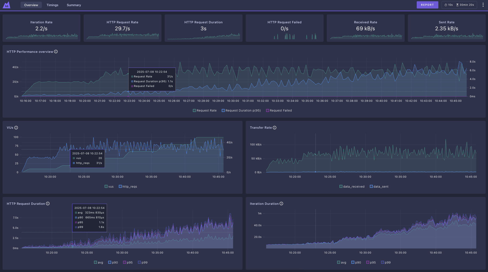

# 提升高可用性：k6 負載測試

k6 是一款負載測試工具，它能幫助開發人員模擬真實的使用者行為，並測試系統在這些行為下的表現。使用 k6 撰寫測試可以讓您在程式部署到正式環境前，找出潛在問題，例如回應時間過長或系統故障等。

它使用 JavaScript 或 TypeScript 撰寫腳本，除了開發人員容易上手外，也方便整合到現有的程式碼庫與專案中。k6 的測試涵蓋多種面向，可以是檢查效能、可靠性或可擴展性。根據不同的目標，您的腳本需要做不同的設定，例如模擬大量使用者或長時間執行測試。

## 負載測試的種類

負載測試的種類分為：冒煙測試(Smoke Test)、平均負載測試(Average-load Test)、壓力測試(Stress Test)、浸泡測試(Soak Test)、峰值測試(Spike Test)、斷點測試(Breakpoint Test)，簡單的說明如下表，我們可以根據不同的系統類型、系統面對到的狀況來決定要執行哪一種測試。

| 測試類型 | 使用者數/吞吐量 | 持續時間 | 適用時機 |
|----------|----------------|---------|---------|
| 冒煙測試 | 低 | 短（秒或分鐘） | 系統版更時，用來檢查功能邏輯、基準指標和偏差 |
| 平均負載測試 | 平均生產環境負載 | 中（5-60分鐘） | 用於檢查系統在平均使用情況下的效能 |
| 壓力測試 | 高（高於平均） | 中（5-60分鐘） | 用於檢查系統在高於平均負載時的效能及狀況 |
| 浸泡測試 | 平均 | 長（數小時） | 檢查系統在長時間持續使用下的狀況 |
| 峰值測試 | 非常高 | 短（幾分鐘） | 測試瞬間高流量下的系統狀況 |
| 斷點測試 | 增加直到崩潰 | 視需要而定 | 用於找出系統的上限 |


> 圖片來源：k6 [load-test-types](https://grafana.com/load-testing/types-of-load-testing/)

## k6 負載測試

我們先看一個簡單的範例：

``` javascript
import http from 'k6/http';
import { sleep } from 'k6';

export const options = {
  iterations: 10,
};

// 預設函數會被 k6 當作測試腳本的進入點。依照 iterations 設定，它會在整個測試期間重複執行 10 次。
export default function () {
  http.get('https://quickpizza.grafana.com');

  // Sleep 1 秒，模擬真實使用情形
  sleep(1);
}
```

k6 會執行預設函數(default function)的程式碼：對 https://quickpizza.grafana.com 發出 get 請求。根據 `options` 的設定，重複執行預設函數 10 次，執行結果如下：

``` console
$ k6 run ./test/load-test.js

         /\      Grafana   /‾‾/  
    /\  /  \     |\  __   /  /   
   /  \/    \    | |/ /  /   ‾‾\ 
  /          \   |   (  |  (‾)  |
 / __________ \  |_|\_\  \_____/ 
     execution: local
        script: ./test/load-test.js
        output: -
     scenarios: (100.00%) 1 scenario, 1 max VUs, 10m30s max duration (incl. graceful stop):
              * default: 10 iterations shared among 1 VUs (maxDuration: 10m0s, gracefulStop: 30s)
running (00m01.0s), 1/1 VUs, 0 complete and 0 interrupted iterations
default   [   0% ] 1 VUs  00m01.0s/10m0s  00/10 shared iters
...
running (00m12.0s), 1/1 VUs, 9 complete and 0 interrupted iterations
default   [  90% ] 1 VUs  00m12.0s/10m0s  09/10 shared iters
  █ TOTAL RESULTS 
    HTTP
    http_req_duration.............: avg=218.27ms min=217.21ms med=217.44ms max=222.07ms p(90)=221.52ms p(95)=221.79ms
      { expected_response:true }..: avg=218.27ms min=217.21ms med=217.44ms max=222.07ms p(90)=221.52ms p(95)=221.79ms
    http_req_failed...............: 0.00%  0 out of 10
    http_reqs.....................: 10     0.792022/s
    EXECUTION
    iteration_duration............: avg=1.26s    min=1.21s    med=1.21s    max=1.65s    p(90)=1.26s    p(95)=1.45s   
    iterations....................: 10     0.792022/s
    vus...........................: 1      min=1       max=1
    vus_max.......................: 1      min=1       max=1
    NETWORK
    data_received.................: 33 kB  2.6 kB/s
    data_sent.....................: 1.0 kB 82 B/s
running (00m12.6s), 0/1 VUs, 10 complete and 0 interrupted iterations
default ✓ [ 100% ] 1 VUs  00m12.6s/10m0s  10/10 shared iters
```

### 輸出結果說明

``` unset
execution: 在本地端運行
script: 執行的腳本是 ./test/load-test.js
scenarios: 設定 1 個(預設)情境, 最多 1 為虛擬使用者在同一時間執行測試, 測試時間最長為 10 分鐘 30 秒 (超過就會停止測試)
              * default: 重複執行 10 次，只允許最多 1 位虛擬使用者在同一時間執行

測試結果指標
`http_req_duration` 平均回應時間為 218.27 毫秒，95% 的回應在 221.79 毫秒以下
`http_req_failed` 執行 10 次，0 次失敗
`http_reqs` 總共發送出 10 個 http 請求，大約每秒發出 0.79 個請求
`iteration_duration` 平均執行一次時間約為 1.26 秒，95% 的測試在 1.45 秒內完成
`iterations` 執行 10 次，大約每秒完成 0.79 次測試
`vus` 目前的執行的虛擬使用者為 1 位
`vus_max` 最多允許 1 位虛擬使用者在同一時間執行
`data_received` 總共收到約 33 kB 的資料，每秒收到 2.6 kB
`data_sent` 總共送出約 1 Kb 的資料，每秒送出 82 B
```

其他指標說明，可以查看[k6 內建指標](https://grafana.com/docs/k6/latest/using-k6/metrics/reference/)

### 視覺化分析結果

#### k6 web dashboard

除了在終端機顯示即時統計資料外，k6 也提供了 [web dashboard](https://grafana.com/docs/k6/latest/results-output/web-dashboard/) 功能，可以將這些效能指標視覺化成圖表，讓您更直觀地監控測試過程中的系統表現。

Web dashboard 的主要功能包括：

- **即時監控**：測試執行期間可以即時查看效能指標變化
- **視覺化圖表**：將數據以圖表形式呈現，便於理解趨勢
- **匯出報告**：可以將最終結果匯出成 HTML 報告檔案

#### k6 web dashboard 功能限制

k6 web dashboard 在分析的深度方面有些不足的地方：

- **分析功能相對簡單**：主要呈現整體統計資料，無法深入分析特定時間點或個別 API 端點的表現
- **無法比較歷史資料**：無法將本次測試結果與之前的測試進行比較
- **缺乏趨勢分析**：難以識別系統效能隨時間變化的長期趨勢

#### 進階分析

如果需要詳細分析每一支 API 的失敗次數、回應時間分布，或進行更深入的效能分析，建議將 k6 測試結果存到資料庫（如 PostgreSQL、InfluxDB），然後匯入到 Grafana 進行視覺化分析。在 Grafana 中，您可以：

- **API 層級分析**：查看每一支 API 的詳細效能指標
- **時間區段分析**：根據特定時間區段檢視詳細資料
- **效能排序**：依據 API 回應時間進行排序，快速找出效能瓶頸
- **錯誤篩選**：篩選出有問題的回應，分析失敗原因
- **歷史比較**：將不同測試階段的結果進行比較
- **趨勢監控**：建立長期的效能趨勢圖表

您也可以直接使用 [k6 cloud](https://grafana.com/products/cloud/k6/)。因篇幅關係，本文不對進階分析部分多著墨。


> 圖片來源：k6 cloud

## 參數設定

可以設定平均回應時間的閾值，如 95% 的回應須在 500 毫秒以下，大於 500 毫秒就會失敗。

``` javascript
export const options = {
  iterations: 10,
  thresholds: {
    http_req_duration: ['p(95)<500'], // 95% 的回應時間必須低於 500 毫秒
  },
};
```

設定執行測試的持續時間與同時執行的虛擬使用者數量，透過設定這些參數來達成不同種類的負載測試

``` javascript
export const options = {
  duration: '1m',
  vus: 50,
};
```

> 更多參數設定，可以參考[如何使用 options](https://grafana.com/docs/k6/latest/using-k6/k6-options/how-to/)

## 情境測試

這一小節將介紹如何模擬測試系統一段期間內的使用狀況。

### 整體流程概述

情境測試的完整流程包含以下三個主要階段：

1. **錄製使用者行為**：使用瀏覽器開發者工具的[網路(Network)面板](https://developer.chrome.com/docs/devtools/network/overview?hl=zh-tw)錄製真實的使用者操作流程，並將 HAR 檔案轉換為 k6 測試腳本
2. **設定負載情境**：透過 k6 的 [Scenarios](https://grafana.com/docs/k6/latest/using-k6/scenarios/) 功能設定不同的負載模式，模擬真實世界中使用者數量的變化
3. **執行測試與分析結果**：執行負載測試並使用 k6 web dashboard 即時監控效能指標，分析系統在不同虛擬使用者數量下的請求速率與回應時間

透過這套流程，可以系統性地評估應用程式在各種負載條件下的效能表現，及早發現潛在的效能瓶頸。

### 錄製使用者行為

使用瀏覽器的開發者工具，錄製一段已登入使用者的操作，把它轉成 k6 測試腳本：

1. 開啟瀏覽器開發人員工具 (F12)
2. 切換到 Network 面板
3. 瀏覽網站(模擬使用者操作一段流程)
4. 回到 Network 面板點擊下載按鈕 "Export HAR (with sensitive data)..."
    > Chrome 130 版後 HAR 匯出內容會[預設排除敏感資訊](https://developer.chrome.com/blog/new-in-devtools-130?hl=zh-tw#har)，最新使用方式可參考：[Chrome DevTools Network Reference](https://developer.chrome.com/docs/devtools/network/reference?hl=zh-tw#save-as-har)
5. 將 har [轉換](https://grafana.com/docs/k6/latest/using-k6/test-authoring/create-tests-from-recordings/using-the-har-converter/)成 k6 測試程式碼

轉換後的程式碼，建議把 http headers 的 authorization 替換成變數，每次執行測試之前重新取得 authToken，就不會因為 authToken 過期而無法重複執行測試，如下範例：

``` javascript
let authToken = 'eyJhbGciOiJIU...HQ'
export default function main() {
  let response
  group('drc daily usages test', function () {
    response = http.get('https://drc.api/system/menu', {
      headers: {
        accept: 'application/json, text/plain, */*',
        'accept-encoding': 'gzip, deflate, br, zstd',
        'accept-language': 'zh-TW,zh;q=0.9,en-US;q=0.8,en;q=0.7',
        authorization:
          `Bearer ${authToken}`,
        'cache-control': 'no-cache',
      },
    })

    sleep(1.5)

    response = http.get('https://drc.api/surveys/menu', {
      // ...
    })

    response = http.get('https://drc.api/departments/menu', {
      // ...
    })

    response = http.get('https://drc.api/cruise-projects/menu', {
      // ...
    })
    sleep(1)
  })
}
```

> sleep 函數是用來模擬使用者實際操作時對 API 的請求速率。在真實情況下，使用者不會連續不斷地發送請求，而是會有滑鼠移動、點擊延遲、閱讀內容的時間等。透過適當的 sleep 設定，可以讓測試更接近真實的使用情境。

### 設定負載情境

使用 [ramping-vus](https://grafana.com/docs/k6/latest/using-k6/scenarios/executors/ramping-vus/) 執行器模擬真實的使用情境，透過設定不同的 stages 來逐步增加或減少負載，每個階段代表一個時間區間和目標使用者數量。
> 建議在執行長時間測試之前，先將每個階段的時間縮短為 10-30 秒來驗證腳本正確性，以及確認伺服器回傳結果，不然可能會執行完好幾個小時的測試後，才發現程式寫錯或參數設定錯誤。

``` javascript
export const options = {
  scenarios: {
    daily_usages: {
      executor: 'ramping-vus',
      startVUs: 0,
      stages: [
        { duration: '1m', target: 10 },   // 1分鐘內增加到10個使用者
        { duration: '4m', target: 10 },   // 維持10個使用者4分鐘
        { duration: '1m', target: 20 },   // 1分鐘內增加到20個使用者
        { duration: '4m', target: 20 },   // 維持20個使用者4分鐘
        { duration: '1m', target: 40 },   // 1分鐘內增加到40個使用者
        { duration: '4m', target: 40 },   // 維持40個使用者4分鐘
        { duration: '1m', target: 60 },   // 1分鐘內增加到60個使用者
        { duration: '4m', target: 60 },   // 維持60個使用者4分鐘
        { duration: '1m', target: 80 },   // 1分鐘內增加到80個使用者
        { duration: '4m', target: 80 },   // 維持80個使用者4分鐘
        { duration: '1m', target: 100 },  // 1分鐘內增加到100個使用者
        { duration: '4m', target: 100 },  // 維持100個使用者4分鐘
        { duration: '10s', target: 0 },   // 10秒內降到0個使用者
      ],
      gracefulRampDown: '10s',
    },
  },
}
```

### 測試結果分析

使用 k6 web dashboard 簡單分析結果，執行指令如下：

```shell
K6_WEB_DASHBOARD=true K6_WEB_DASHBOARD_EXPORT=html-report.html k6 run test/load-test-drc.js
```

- K6_WEB_DASHBOARD=true 表示會啟用一個 dashboard server
- K6_WEB_DASHBOARD_EXPORT=html-report.html 表示會把最後的 dashboard 結果儲存成 html 檔

#### 關鍵效能指標解讀

從測試結果可以觀察到以下重要指標：

- **HTTP Request Rate (29.7/s)**：系統每秒處理的 HTTP 請求數量，這個數值會受到 sleep 設定和 Virtual Users (VUs) 數量的雙重影響
- **HTTP Request Duration (3s)**：平均 HTTP 請求回應時間為 3 秒，當 VUs 達到 100 時，使用者最長等待時間會到 8 秒，顯示高負載下系統回應時間明顯增加
- **HTTP Request Failed (0/s)**：無失敗請求，表示系統在測試負載下運作穩定
- **Transfer Rate**：資料傳輸速率，包含接收 (69 kB/s) 和發送 (2.35 kB/s) 的資料量

#### 效能趨勢分析

透過圖表可以觀察到：

1. **HTTP Performance Overview**：請求速率、持續時間和失敗率的時間變化趨勢
2. **VUs 變化曲線**：虛擬使用者數量的增減模式，對應 ramping-vus 中的設定階段
3. **Request Duration 分布**：不同百分位數 (p50, p95, p99) 的回應時間分布，有助於了解效能的一致性

#### 效能瓶頸識別

當系統承受較高負載時，應特別關注：

- 回應時間是否超出可接受範圍 (如 >5秒)
- 是否出現請求失敗的情況
- 資源使用率是否達到上限



## 整合進 CI

k6 可以很輕易地整合進 CI，以 GitLab 為例，將前面展示的範例存到 `./test/load-test.js`，然後在 `.gitlab-ci.yml` 設定如下，即可在每次 commit 時執行負載測試。

``` yaml
stages:
  - build-and-deploy-test
  - k6-test

image:
  name: ubuntu:latest

build-and-deploy-test:
  stage: build-and-deploy-test
  script:
    - echo "build and deploy to test environment..."
    # ... 其他的建置部署設定

k6-test:
  image:
    name: grafana/k6:latest # k6 官方提供的 Docker image
    entrypoint: [""]
  stage: k6-test
  script: 
    - k6 run ./test/load-test.js # 和範例一模一樣的執行指令
  interruptible: true  # 如果有 push 新的 commit，這個 job 可以被自動取消

```

在實際操作中，我們通常會先將測試目標部署到 CI 的測試環境，再進行負載測試。因此在上面的設定中，我們先執行 `build-and-deploy-test` 階段來模擬測試環境的部署，然後再執行 `k6-test` 階段進行負載測試。

資料夾結構如下：

``` unset
|-- .gitlab-ci.yml      # GitLab CI/CD 設定檔
|
|---/test               # 測試資料夾
|    |--load-test.js    # 測試腳本
```

## 負載測試的幾點注意事項

- 簡單的測試比沒有測試好，可以先從關鍵使用路徑開始撰寫測試
- 關於閾值的訂定，可以參考 [Jakob Nielsen](https://www.nngroup.com/articles/website-response-times/) 的研究：將回應時間分成三階段 0.1 秒、1 秒以及 10 秒，或是參考[PageSpeed Insights](https://developers.google.com/speed/docs/insights/v5/about?hl=zh-tw)的標準
- 負載測試應該在預生產環境(pre-production)進行，因為
  - 它可能會造成系統中斷
  - 每次執行負載測試可能都需要自動繞過一些防機器人的驗證，您應該要特別寫一些判斷（如：在測試環境且執行負載測試時，關閉機器人驗證），而不是關閉驗證直接在生產環境中測試。

## 參考資料

- https://grafana.com/docs/k6/latest/using-k6/
- https://docs.gitlab.com/ci/testing/load_performance_testing/
- https://developers.google.com/speed/docs/insights/v5/about?hl=zh-tw
- https://www.nngroup.com/articles/website-response-times/
- https://k6.io/our-beliefs/#load-test-in-a-pre-production-environment
- https://gitlab.com/gitlab-org/quality/performance
