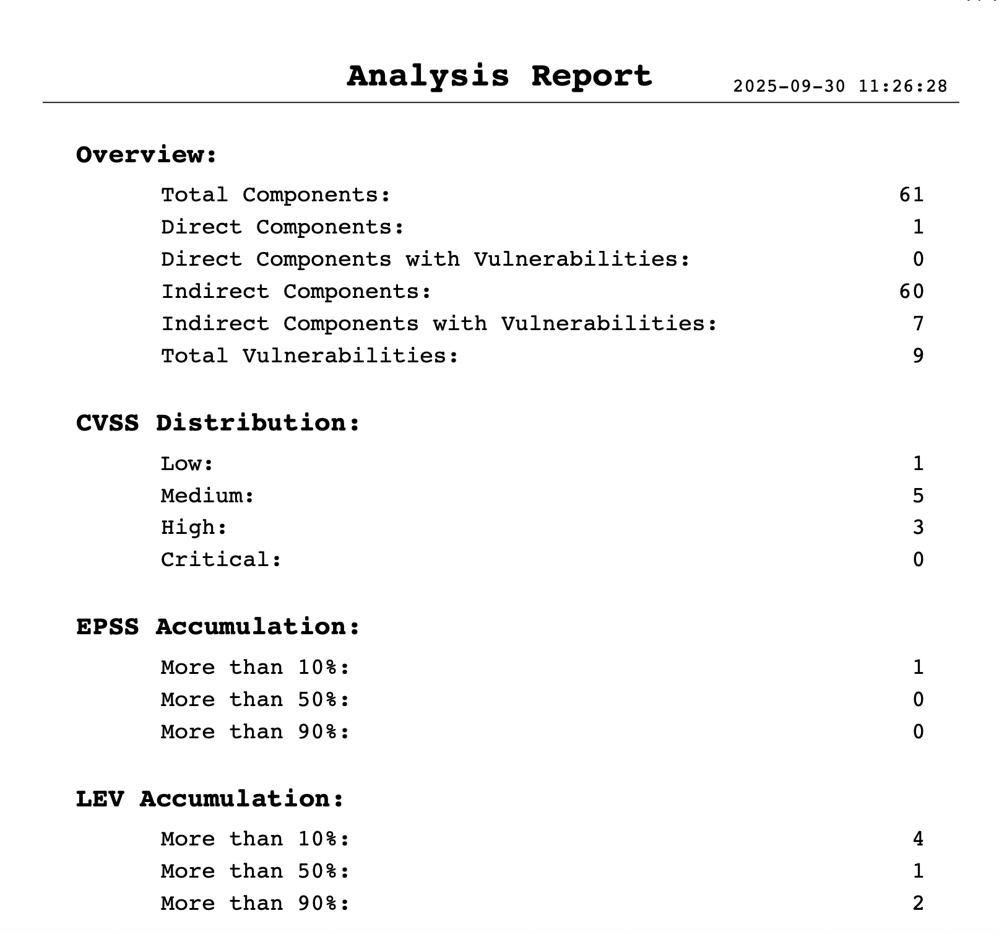
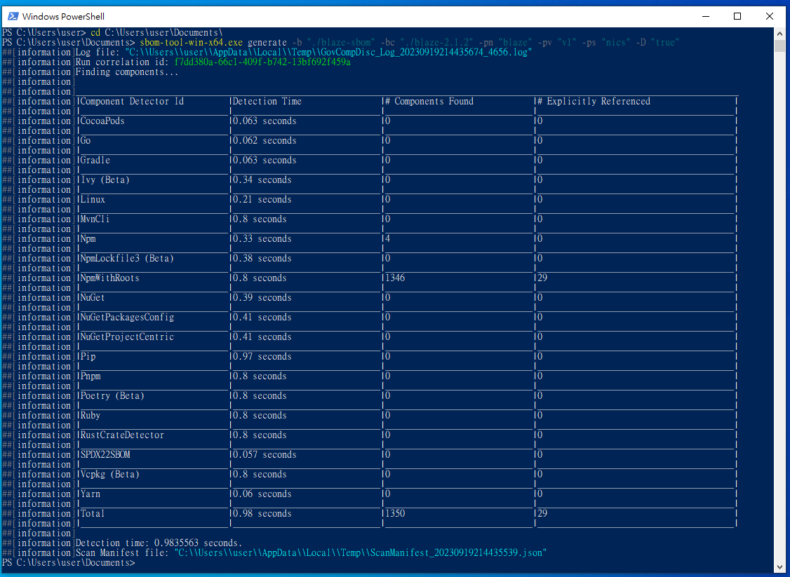

# SBOM 開源工具使用說明

SBOM (Software Bill of Materials): SBOM提供軟體中包含的所有函式庫與元件的清單，還會列出版本號、原始碼來源和關聯資訊。SBOM的目的是讓使用者或開發者瞭解軟體的組成，這樣在發生安全事件或需要更新時，能夠快速識別和應對。

OSV (Open Source Vulnerability): 是一種公開的軟體漏洞資料庫。透過產生的SBOM資訊搭配OSV漏洞資料庫，開發人員可以快速查詢其軟體元件是否存在已知的安全問題。

以下是使用 SBOM 與 OSV 的基本流程：

1. 建立 SBOM: 於系統維運時，定期利用 SBOM 工具建立一份 SBOM 文件，將所有的元件、函式庫和依賴性記錄下來。
2. 使用 OSV 查詢: 定期將產生的 SBOM 資訊，利用 OSV 資料庫查詢，確認元件是否有已知的安全漏洞。一旦發現，可以迅速決策，例如進行更新或替換該元件。
3. 應對漏洞策略: 如果在 OSV 中發現了任何漏洞，應該立即進行修補或緩解措施。這可能包括更新軟體元件、應用修補程式，或在使用中考慮其他安全措施。

> 備註：因為各個 SBOM 掃描工具支援的語言、能解析的二進位檔 (Binary) 以及元件管理工具 (package manager) 有所不同，能掃描出的依賴元件亦不盡相同，故本文件提供 Syft 及 Trivy 兩套工具的使用說明，
> 建議第一次掃瞄專案 SBOM 時，可以兩個工具都使用，之後再選擇能掃描出最多依賴元件的工具，做為主要建立專案 SBOM 文件的工具。

## 1. 使用 Syft 掃描專案產生 SBOM 檔案

### 安裝

> 備註：本文件使用 Syft v1.8.0 做說明，其使用方式及產出結果，可能因您使用的版本不同而有些微差異

Windows 環境可以下載可執行檔 [https://github.com/anchore/syft/releases](https://github.com/anchore/syft/releases)  
（移動至 Assets 段落，點選 Show all assets，找到 Windows 壓縮檔或執行檔下載）

Linux 環境或可執行

```
curl -sSfL https://raw.githubusercontent.com/anchore/syft/main/install.sh | sudo sh -s -- -b /usr/local/bin
```

### 產生 SBOM

輸出格式  
[https://github.com/anchore/syft/wiki/Output-Formats](https://github.com/anchore/syft/wiki/Output-Formats)

輸出 SPDX 格式，為了使工具辨識該檔案為 SPDX SBOM，副檔名最好為 \*.spdx.json，Syft 預設會最小化輸出檔案，加上 `SYFT_FORMAT_PRETTY=true` 會讓輸出的檔案比較易讀。

Linux

```
SYFT_FORMAT_PRETTY=true syft ./path/to/repo_dir -o spdx-json=./output_dir/syft.spdx.json
```

Windows CMD

```
set "SYFT_FORMAT_PRETTY=true" && syft ./path/to/repo_dir -o spdx-json=./output_dir/syft.spdx.json
```

Windows PowerShell

```
$env:SYFT_FORMAT_PRETTY="true"; syft ./rumors-line-bot-master -o spdx-json=./output_dir/syft.spdx.json
```

`註：`  
`"./path/to/repo_dir": 為來源資料夾路徑，若路徑來源包含中文或空白，建議用雙引號(" ")包裹路徑名稱，如 ”./中文路徑/to/repo_dir”。`  
`"./output_dir/syft.spdx.json": 為輸出檔案路徑，若路徑來源包含中文或空白，建議用雙引號(" ")包裹路徑名稱，如 ”C:/輸出/syft.spdx.json”。`

輸出 CycloneDX 格式，為了使工具辨識該檔案為 CycloneDX SBOM，副檔名最好為 \*.cdx.json，Syft 預設會最小化輸出檔案，加上 `SYFT_FORMAT_PRETTY=true` 會讓輸出的檔案比較易讀。

```
SYFT_FORMAT_PRETTY=true syft ./path/to/repo_dir -o cyclonedx-json@1.5=./output_dir/syft.cdx.json
```

Windows CMD

```
set "SYFT_FORMAT_PRETTY=true" && syft ./path/to/repo_dir -o cyclonedx-json@1.5=./output_dir/syft.cdx.json
```

Windows PowerShell

```
$env:SYFT_FORMAT_PRETTY="true"; syft ./path/to/repo_dir -o cyclonedx-json@1.5=./output_dir/syft.cdx.json
```

## 2. 使用 Trivy 掃描專案產生 SBOM 檔案

### 安裝

> 備註：本文件使用 Trivy v0.5.3 做說明，其使用方式及產出結果，可能因您使用的版本不同而有些微差異

Trivy 安裝文件 [https://trivy.dev/docs/latest/getting-started/installation/](https://trivy.dev/docs/latest/getting-started/installation/)

Windows 環境可以下載可執行檔 [https://github.com/aquasecurity/trivy/releases](https://github.com/aquasecurity/trivy/releases)  
（移動至 Assets 段落，點選 Show all assets，找到 Windows 壓縮檔或執行檔下載）

Linux 環境或可執行

```
curl -sfL https://raw.githubusercontent.com/aquasecurity/trivy/main/contrib/install.sh | sudo sh -s -- -b /usr/local/bin v0.53.0
```

### 產生 SBOM

輸出格式  
[https://google.github.io/osv-scanner/output/\#output](https://google.github.io/osv-scanner/output/#output)

輸出 SPDX 格式，為了使工具辨識該檔案為 SPDX SBOM，副檔名最好為 \*.spdx.json。

```
trivy repo --format spdx-json --output ./sbom/trivy.spdx.json ./path/to/repo
```

`註：`  
`"./path/to/repo": 為來源資料夾路徑，若路徑來源包含中文或空白，建議用雙引號(" ")包裹路徑名稱，如 ”./中文路徑/to/repo”。`  
`"./sbom/trivy.spdx.json": 為輸出檔案路徑，若路徑來源包含中文或空白，建議用雙引號(" ")包裹路徑名稱，如 ”C:/輸出sbom/trivy.spdx.json”。`

輸出 CycloneDX 格式，為了使工具辨識該檔案為 CycloneDX SBOM，副檔名最好為 \*.cdx.json。

```
trivy repo --format cyclonedx --output ./sbom/trivy.cdx.json ./path/to/repo
```

## 檢查 License

```
$ trivy fs --scanners license --license-full ./path/to/project

$ trivy fs --scanners license --license-full --format json -o result.json
 ./path/to/project
```

- 注意：建議將相關元件安裝後，trivy 命令才能收集完整相依元件資訊。以 npm 管理專案例，需先使用 npm install 命令後才能收集，若尚未將相依元件安裝，則會顯示以下提示資訊。

```
$ trivy fs --scanners license --license-full .
2024-07-10T03:51:45Z	INFO	Full license scanning is enabled
2024-07-10T03:51:47Z	INFO	[npm] To collect the license information of packages, "npm install" needs to be performed beforehand   dir="api/node_modules"
2024-07-10T03:51:47Z	INFO	[npm] To collect the license information of packages, "npm install" needs to be performed beforehand   dir="client/node_modules"
2024-07-10T03:51:47Z	INFO	[npm] To collect the license information of packages, "npm install" needs to be performed beforehand   dir="node_modules"
2024-07-10T03:51:47Z	INFO	[npm] To collect the license information of packages, "npm install" needs to be performed beforehand   dir="server/node_modules"
2024-07-10T03:51:47Z	INFO	Suppressing dependencies for development and testing. To display them, try the '--include-dev-deps' flag.
...
...

```

## 3. 使用 OSV-Scanner 掃描 SBOM 檔案

### 安裝

> 備註：本文件使用 OSV-Scanner v1.8.1 做說明，其使用方式及產出結果，可能因您使用的版本不同而有些微差異

OSV-Scanner 安裝文件[https://google.github.io/osv-scanner/installation/\#installation](https://google.github.io/osv-scanner/installation/#installation)  
下載可執行檔 [https://github.com/google/osv-scanner/releases](https://github.com/google/osv-scanner/releases)

### 從 SBOM 檔案產生報告

輸出格式  
[https://google.github.io/osv-scanner/output/\#output](https://google.github.io/osv-scanner/output/#output)

輸出成 table 或 markdown 格式會比較易讀。

```
osv-scanner --sbom=./path/to/sbom/file --format=table --output=report.txt
```

`註：`  
`./path/to/sbom/file: 為來源檔案路徑，若路徑來源包含中文或空白，建議用雙引號(" ")包裹路徑名稱，如 ”./中文路徑/to/sbom/file”。`  
`report.txt: 為輸出檔案路徑，若路徑來源包含中文或空白，建議用雙引號(" ")包裹路徑名稱，如 ”C:/輸出/report.txt”。`

輸出成 json 格式，資訊則會比較詳細。

```
osv-scanner --sbom=./path/to/sbom/file --format=json --output=report.json
```

掃描資料夾內的 SBOM，副檔名需為 **\*.spdx.json, \*.cdx.json**，請參考 SPDX 檔案命名規範 [https://spdx.github.io/spdx-spec/v2.3/conformance/](https://spdx.github.io/spdx-spec/v2.3/conformance/)，以及 CycloneDX 檔案命名規範 [https://cyclonedx.org/specification/overview/\#recognized-file-patterns](https://cyclonedx.org/specification/overview/#recognized-file-patterns)。

```
osv-scanner --format=markdown --output=report.md -r ./path/to/sbom_dir

```

`註：`  
`./path/to/sbom_dir: 為來源資料夾路徑，若路徑來源包含中文或空白，建議用雙引號(" ")包裹路徑名稱，如 ”/中文路徑/to/sbom_dir”。`  
`report.md: 為輸出檔案路徑，若路徑來源包含中文或空白，建議用雙引號(" ")包裹路徑名稱，如 ”C:/輸出/report.md”。`

### 離線模式

[https://google.github.io/osv-scanner/experimental/offline-mode/](https://google.github.io/osv-scanner/experimental/offline-mode/)

使用需要加上 \--experimental-offline。

```
osv-scanner --experimental-offline --sbom=./path/to/sbom/file --format=json --output=report.json
```

下載資料庫，需再加上 \--experimental-download-offline-databases。

```
osv-scanner --experimental-offline --experimental-download-offline-databases --sbom=./path/to/sbom/file --format=json --output=report.json
```

或是 [手動下載](https://google.github.io/osv-scanner/experimental/offline-mode/#manual-database-download) 到 [OSV資料庫資料夾](https://google.github.io/osv-scanner/experimental/offline-mode/#specify-database-location)。

OSV-Scanner 內建[支援掃描](https://google.github.io/osv-scanner/supported-languages-and-lockfiles/)一些程式語言，如果專案有使用 package manager，且沒有引用 jar 或 dll，可以考慮直接使用 OSV-Scanner 就好。（註：OSV-Scanner 不支援輸出 SBOM，有輸出 SBOM 檔案的需求，還是需要使用其他工具。）

## 4. 使用 ex-sbom 分析並檢視 SBOM 檔案

如果想要以視覺化介面進行分析、檢視 SBOM 檔案、並產出總覽報告，請參考 [ex-sbom 使用說明](./sbom-gui-tool.md)。

### ex-sbom GUI 畫面


### ex-sbom 產出報告預覽


## 5. 附錄：其他 SBOM 檔案產生工具

建議參考本文使用 Syft 與 Trivy 產出 SBOM 檔案，以下提供另外兩種替代 SBOM 工具操作說明：

- Microsoft sbom-tool
- CycloneDX Generator

並搭配 Google osv-scanner 掃描產生的 SBOM 檔案找出元件漏洞，進行修補或緩解措施。

依照相容性測試建議 Windows 環境可以使用 Microsoft sbom-tool，Linux 環境可以使用 Microsoft sbom-tool 與 CycloneDX Generator  
本操作文件將使用 Windows 10 與 Ubuntu Desktop 22.04 LTS 進行以下測試  
掃描 Github 開源專案 blaze 版本 2.1.2  
網址：[https://github.com/blenderskool/blaze/tree/v2.1.2](https://github.com/blenderskool/blaze/tree/v2.1.2)  


### Microsoft sbom-tool 開源工具說明

Microsoft sbom-tool 開源專案，工具支援目前主流的 Package Managers，依照 Package Managers 與語言關係對應整理如下表：

| 語言              | 支援的 Package Managers |
| :---------------- | :---------------------- |
| go                | GoMod                   |
| Rust              | Cargo                   |
| .NET              | NuGet                   |
| Java              | Maven、Gradle           |
| Node.js           | NPM 、Yarn              |
| Python            | PIP 、Poety             |
| Ruby              | Gems                    |
| Objective-C Swift | CocoaPods               |

資料彙整：[https://github.com/microsoft/component-detection](https://github.com/microsoft/component-detection)

- Windows10 環境操作步驟

步驟一、安裝 winget  
藉由微軟商店安裝 winget  
相關說明：[https://learn.microsoft.com/zh-tw/windows/package-manager/winget/](https://learn.microsoft.com/zh-tw/windows/package-manager/winget/)  
安裝方法：微軟商店安裝”[應用程式安裝程式](https://apps.microsoft.com/store/detail/%E6%87%89%E7%94%A8%E7%A8%8B%E5%BC%8F%E5%AE%89%E8%A3%9D%E7%A8%8B%E5%BC%8F/9NBLGGH4NNS1?hl=zh-tw&gl=tw&rtc=1)”詳見圖 1  
  
圖 1 微軟商店安裝winget

步驟二、安裝 Microsoft sbom-tool 工具  
開啟 Windows PowerShell 並輸入安裝指令  
**(安裝完成後請登出使用者再登入，以完成環境變數設定)**

- winget install Microsoft.SbomTool

輸出畫面詳見圖 2  
  
圖 2 安裝 Microsoft sbom-tool 工具指令結果畫面

步驟三、執行Microsoft sbom-tool掃描  
3.1 將掃描原始檔資料夾”blaze-2.1.2”放置到”本機\\文件”內  
3.2 在”本機\\文件”內建立資料夾”blaze-sbom”放置工具產生的SBOM檔案  
完成後詳見圖 3  
  
圖 3 本機\\文件內的畫面

3.3 開啟 Windows PowerShell 輸入指令移動至”本機\\文件”內

- cd C:\\Users\\user\\Documents\\

**(此處使用者名稱會隨著不同電腦而變化，請依照本機使用者路徑替換)**  
3.4 開啟 Windows PowerShell 輸入指令執行 sbom-tool-win-x64.exe

- sbom-tool-win-x64.exe generate \-b "./blaze-sbom" \-bc "./blaze-2.1.2" \-pn "blaze" \-pv "v1" \-ps "nics" \-D "true"

參數說明：  
\-b "產生 SBOM 檔案放置目錄位置"  
\-bc "進行 SBOM 掃描的原始程式碼目錄位置"  
\-pn "SBOM 產生專案名稱"  
\-pv "版本號"  
\-ps "SBOM 產生單位"  
\-D "設置 true 將刪除目錄內已產生過的 SBOM 檔案"  
完成後輸出畫面詳見圖 4  
  
圖 4 執行 sbom-tool-win-x64 指令結果畫面

步驟四、查看 SBOM 檔案  
4.1 開啟”本機\\文件\\blaze-sbom\\\_manifest\\spdx_2.2\\”目錄，找到manifest.spdx.json檔案詳見圖 5  
  
圖 5 manifest.spdx.json檔案位置

4.2 開啟 manifest.spdx.json 檔案後，由 packages 查看元件版本詳見圖 6  
  
圖 6 manifest.spdx.json 查看元件版本

4.3 開啟 manifest.spdx.json 檔案後，由 relationships 查看元件關係詳見圖 7  
  
圖 7 manifest.spdx.json 查看元件關係

步驟五、產出 OSV 報告  
請參考[使用 **OSV-Scanner** 掃描 SBOM 檔案，**輸出 markdown 格式報告**](#3-使用-osv-scanner-掃描-sbom-檔案)

- Ubuntu Desktop 22.04 LTS 環境操作步驟

步驟一、安裝 curl  
開啟 terminal 輸入安裝指令

- snap install curl

完成後輸出畫面詳見圖 13  
  
圖 13 安裝 curl 指令結果畫面

步驟二、下載 sbom-tool  
2.1 開啟 terminal 輸入指令下載 sbom-tool

- curl \-Lo sbom-tool [https://github.com/microsoft/sbom-tool/releases/latest/download/sbom-tool-linux-x64](https://github.com/microsoft/sbom-tool/releases/latest/download/sbom-tool-linux-x64)

  2.2 開啟 terminal 輸入指令設定 sbom-tool 權限

- chmod \+x sbom-tool

  2.3 開啟 terminal 輸入指令確認 sbom-tool 是否設定完成

- ls

完成後輸出畫面詳見圖 14  
  
圖 14 下載 sbom-tool 並設定權限結果畫面

步驟三、執行 Microsoft sbom-tool 掃描  
3.1 將下載的原始檔檔案按右鍵選擇 ”Extract to…” 進行解壓縮 zip，詳見圖 15  
  
圖 15對壓縮檔進行解壓縮操作(一)

3.2 選擇 Home 並按下 Select，詳見圖 16  
  
圖 16對壓縮檔進行解壓縮操作(二)

3.3 於 Home 建立一個目錄 ”blaze-sbom” 放置 SBOM 檔案  
完成後詳見圖 17  
  
圖 17 放置原始碼與建立放置 SBOM 檔案的目錄

3.4 開啟 terminal 輸入執行 sbom-tool

- ./sbom-tool generate \-b "./blaze-sbom" \-bc "./blaze-2.1.2" \-pn "blaze" \-pv "v1" \-ps "nics" \-D "true"

參數說明：  
\-b "產生 SBOM 檔案放置的目錄位置"  
\-bc "進行 SBOM 掃描的原始程式碼目錄位置"  
\-pn "SBOM 產生專案名稱"  
\-pv "版本號"  
\-ps "SBOM 產生單位"  
\-D "設置 true 將刪除目錄內已產生過的SBOM檔案"  
完成後輸出畫面詳見圖 18與圖 19  
  
圖 18 執行 sbom-tool 指令結果畫面(上)  
  
圖 19 執行 sbom-tool 指令結果畫面(下)

步驟四、查看 SBOM 檔案  
4.1 開啟 ”/home/blaze-sbom/\_manifest/spdx_2.2” 目錄，找到 manifest.spdx.json 檔案詳見圖 20  
  
圖 20 manifest.spdx.json檔案位置

4.2 開啟 manifest.spdx.json 檔案後，由 packages 查看元件版本詳見圖 21  
  
圖 21 manifest.spdx.json 查看元件版本

4.3 開啟 manifest.spdx.json 檔案後，由 relationships 查看元件關係詳見圖 22  
  
圖 22 manifest.spdx.json 查看元件關係

步驟五、產出 OSV 報告  
請參考[使用 **OSV-Scanner** 掃描 SBOM 檔案，**輸出 markdown 格式報告**](#3-使用-osv-scanner-掃描-sbom-檔案)

### CycloneDX Generator 開源工具說明

CycloneDX Generator 開源工具，工具支援目前主流的 Package Managers，依照 Package Managers 與語言關係對應整理如下表：

| 語言    | 支援的 Package Managers                                                                                       |
| :------ | :------------------------------------------------------------------------------------------------------------ |
| node.js | npm-shrinkwrap.json, package-lock.json, pnpm-lock.yaml, yarn.lock, rush.js, bower.json, .min.js               |
| java    | maven (pom.xml), gradle (build.gradle, .kts), scala (sbt), bazel                                              |
| php     | composer.lock                                                                                                 |
| python  | pyproject.toml, setup.py, requirements.txt, Pipfile.lock, poetry.lock, pdm.lock, bdist_wheel, .whl, .egg-info |
| go      | binary, go.mod, go.sum, Gopkg.lock                                                                            |
| ruby    | Gemfile.lock, gemspec                                                                                         |
| rust    | binary, Cargo.toml, Cargo.lock                                                                                |
| .Net    | .csproj, packages.config, project.assets.json, packages.lock.json, .nupkg                                     |
| dart    | pubspec.lock, pubspec.yaml                                                                                    |
| haskell | cabal.project.freeze                                                                                          |
| elixir  | mix.lock                                                                                                      |
| c/c++   | conan.lock, conanfile.txt                                                                                     |
| clojure | Clojure CLI (deps.edn), Leiningen (project.clj)                                                               |
| swift   | Package.resolved, Package.swift (swiftpm)                                                                     |

資料彙整：[https://github.com/CycloneDX/cdxgen](https://github.com/CycloneDX/cdxgen)

- Ubuntu Desktop 22.04 LTS 環境操作步驟

步驟一、安裝 curl  
開啟 terminal 輸入安裝指令

- snap install curl

完成後輸出畫面詳見圖 27  
  
圖 27 安裝 curl 指令結果畫面

步驟二、下載 cdxgen  
2.1 開啟 terminal 輸入指令下載 cdxgen

- curl \-Lo cdxgen [https://github.com/CycloneDX/cdxgen/releases/latest/download/cdxgen](https://github.com/CycloneDX/cdxgen/releases/latest/download/cdxgen)

  2.2 開啟 terminal 輸入指令設定 cdxgen 權限

- chmod \+x cdxgen

完成後輸出畫面詳見圖 28  
  
圖 28 下載 cdxgen 並設定權限結果畫面

步驟三、執行 cdxgen 掃描  
3.1 將下載的原始檔檔案按右鍵選擇 ”Extract to…” 進行解壓縮zip，詳見圖 29  
  
圖 29對壓縮檔進行解壓縮操作(一)

3.2 選擇 Home 並按下 Select，詳見圖 30  
  
圖 30對壓縮檔進行解壓縮操作(二)

3.3 於Home 建立一個目錄 ”blaze-sbom” 放置 SBOM 檔案  
完成後詳見圖 31  
  
圖 31 放置原始碼與建立放置 SBOM 檔案的目錄

3.2 開啟 terminal 輸入指令執行 cdxgen

- ./cdxgen \-r “./blaze-2.1.2” \-o “./blaze-sbom/sbom.json” \--spec-version 1.4

參數說明：  
\-r "進行SBOM掃描的原始程式碼目錄位置"  
\-o "產生SBOM檔案放置位置"  
\--spec-version 1.4 (目前1.4版本支援度較完整)  
完成後輸出畫面詳見圖 32  
  
圖 32 執行 cdxgen 指令結果畫面

步驟四、查看 SBOM 檔案  
4.1 ”/home/blaze-sbom” 目錄，找到 sbom.json 檔案詳見圖 33  
  
圖 33 sbom.json 檔案位置

4.2 開啟 sbom.json 檔案後，由 component 查看元件版本詳見圖 34  
  
圖 34 sbom.json 查看元件版本

4.3 開啟 sbom.json 檔案後，由 ref 查看查看元件關係詳見圖 35  
  
圖 35 sbom.json 查看元件關係

步驟五、產出 OSV 報告  
請參考[使用 **OSV-Scanner** 掃描 SBOM 檔案，**輸出 markdown 格式報告**](#3-使用-osv-scanner-掃描-sbom-檔案)
