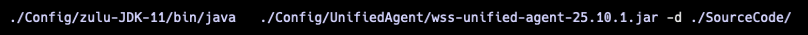
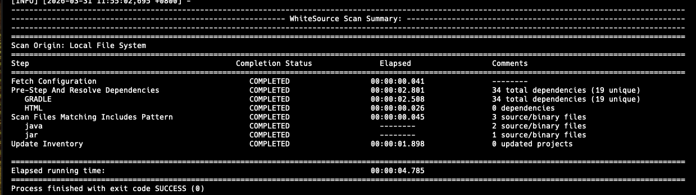
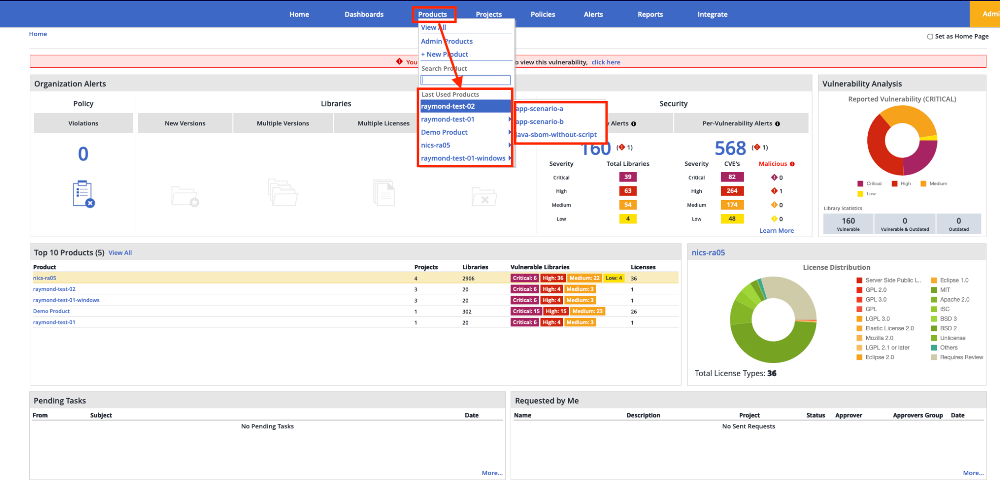
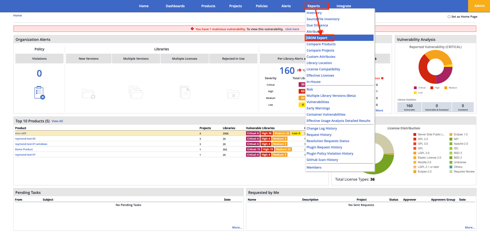
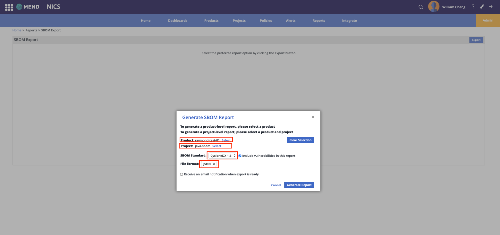
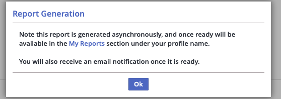
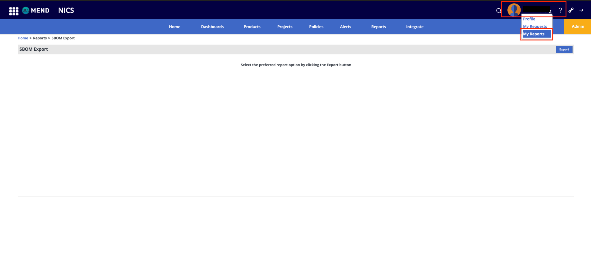
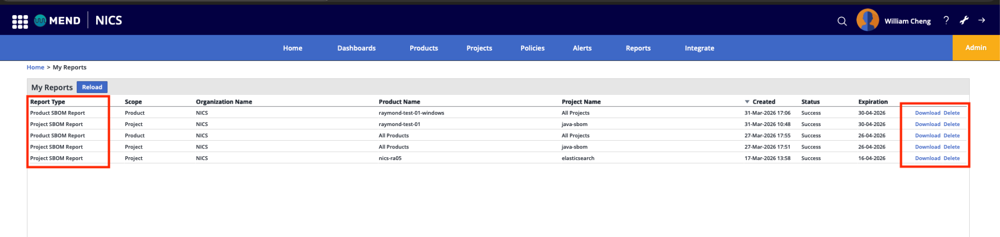

# 如何使用 Mend 產生 SBOM

本教材說明如何使用 Mend Unified Agent 為 Java 專案產生軟體物料清單（SBOM）。

透過 Mend 產出 SBOM，大致可分為兩個階段：

1. [使用 Mend Unified Agent 進行掃描](#執行-unified-agent-掃描)
   1. 在本地端執行 Mend Unified Agent，掃描指定的專案程式碼
   2. Agent 會解析專案的相依套件（dependencies）
   3. 掃描完成後，Agent 會將結果上傳至 Mend 平台
2. 從 Mend 平台匯出 SBOM
   1. [登入 Mend 控制台查看掃描結果](#在-mend-控制台查看結果)
   2. [選擇對應的 Product / Project](#mend-如何匯出-sbom)
   3. [產出並下載 SBOM（支援 CycloneDX、SPDX 等格式）](#下載-sbom-檔案)

## 事前準備

* 擁有 Mend 帳號
* 已安裝 Java 11
* 已安裝對應專案套件管理工具（Maven 或 Gradle）
* 已下載 [wss-unified-agent.jar](https://docs.mend.io/legacy-sca/latest/getting-started-with-the-unified-agent#GettingStartedwiththeUnifiedAgent-DownloadingtheUnifiedAgent)

## 設定環境變數

建議透過環境變數或 config file 將所需的金鑰與專案資訊（如 API Key、Project Name）提供給 JAR 執行檔。

Linux / macOS：

```bash
export WS_APIKEY=<your-api-key>
export WS_USERKEY=<your-user-key>
export WS_PRODUCTNAME=<your-product-name>
export WS_PROJECTNAME=<your-project-name>
export WS_WSS_URL=<your-mend-agent-url> # 請依您的 Mend 伺服器填入，例如 https://saas.whitesourcesoftware.com/agent
```
Windows（CMD）：

```bat
set WS_APIKEY=<your-api-key>
set WS_USERKEY=<your-user-key>
set WS_PRODUCTNAME=<your-product-name>
set WS_PROJECTNAME=<your-project-name>
REM 請依您的 Mend 伺服器填入，例如 https://saas.whitesourcesoftware.com/agent
set WS_WSS_URL=<your-mend-agent-url>
```
* Windows/Linux/macOS 的 set/export 只在目前 CMD/shell session 有效；若需永久生效，請寫入 config file，參考官網提供的 [config file](https://docs.mend.io/legacy-sca/latest/getting-started-with-the-unified-agent#GettingStartedwiththeUnifiedAgent-SettingUptheUnifiedAgent)

## 執行 Unified Agent 掃描

設定好環境變數後，直接執行 Unified Agent：

Windows / Linux / macOS：

```bash
java -jar wss-unified-agent.jar -d <source code dir>
```

例如：



Agent 執行時會依序：

1. 偵測建置工具（Gradle、Maven 等）
2. 解析所有相依套件
3. 將結果上傳至 Mend 伺服器

掃描完成後，terminal/cmd 會顯示 WhiteSource Scan Summary 表格，每個步驟均標示為 COMPLETED：



若 exit code 不為零，表示某個步驟失敗，請查看摘要表格上方的 log 訊息以確認錯誤原因。

## 在 Mend 控制台查看結果

在 Mend 控制台瀏覽至 `Products` → `產品名稱` → `專案名稱`，Libraries 頁籤會列出本次掃描找到的所有相依套件。



在此頁面可以：

* 在 Security 查看弱點警告
* 在 Licenses 頁籤瀏覽授權資訊
* 在 Dependencies 檢視相依關係圖

## Mend 如何匯出 SBOM

本教材說明如何使用 Mend 產出 SBOM 檔案。在 Mend 中，需先於專案中執行 SBOM 匯出作業，完成後方可下載對應檔案。

整體流程可分為兩個階段：

1. 如何匯出 SBOM
2. 下載 SBOM 檔案

### 如何匯出 SBOM



* 點擊頂部導覽列的 Reports。
* 選擇 SBOM Report。



* 在 Generate SBOM Report 介面中：
  + Select Projects： 選擇要匯出的專案 (Project)
  + Select Products： 選擇要匯出的產品 (Product)
* 選擇 SBOM 格式：
  + CycloneDX
    - 輸出檔案格式: .json/.xml
  + SPDX
    - 輸出檔案格式: .json/.xml/.tv
* 點擊 Generate Export。



### 下載 SBOM 檔案

點選 Generate Export 後不會馬上獲得報告；需要到 Reports → My Reports 下載 SBOM 檔案。





點擊對應列的 Download 即可從 Mend 下載 SBOM 檔案

## 快速判讀 SBOM 檔案內容

以下為 Mend 產生的 CycloneDX 格式報告為例，大致說明各欄位的意義。

檔案頂層結構

```json
{
  "bomFormat" : "CycloneDX", // SBOM 格式，固定為 CycloneDX
  "specVersion" : "1.6", // CycloneDX 規格版本
  "serialNumber" : "urn:uuid:996da112-...", // 此份 SBOM 的唯一識別碼
  "version" : 1, // 同一份報告的修訂版次（初次產生為 1）
  "metadata" : { ... }, // 報告元資料（見下方）
  "components" : [ ... ] // 所有掃描到的套件清單
}
```

metadata — 報告元資料

```json
"metadata": {
    "timestamp" : "2026-03-31T02:48:12Z",   // 報告產生時間（UTC）
    "tools": {
        "components": [{
            "name"    : "CycloneDX report generator",
            "version" : "1.1.0",
            "author"  : "Mend.io"            // 產生此報告的工具
        }]
    },
    "authors": [
        { "name": "Organization: XXXX" },    // 產出組織
        { "name": "Person: XXX..." }         // 負責人員
    ],
    "component": {
        "type" : "application",
        "name" : "java-sbom"                 // 被掃描的主專案名稱
    }
}
```

components — 套件清單, 每個元素代表一個相依套件，以下是一個完整範例：

```json
{
  "type" : "library",
  "bom-ref" : "spring-aop-5.3.17.jar", // 檔案內唯一參照 ID
  "group" : "org.springframework", // Maven Group ID
  "name" : "spring-aop-5.3.17.jar", // 套件名稱
  "version" : "5.3.17", // 版本號
  "hashes" : [{
    "alg" : "SHA-1",
    "content" : "b7aaf5dd40a64b3419ff779746fcaf7bea92d29d"
    // ↑ 可用來驗證 JAR 完整性
  }],
  "licenses": [{
    "license": {
      "id" : "Apache-2.0", // SPDX 授權識別碼
      "url" : "http://apache.org/licenses/LICENSE-2.0"
    }
  }],
  "purl" : "pkg:maven/org.springframework/spring-aop@5.3.17",
  // ↑ Package URL：格式為 pkg:<type>/<group>/<name>@<version>
  // 可直接用來查詢 OSV / NVD 等弱點資料庫
  "externalReferences": [{
    "type" : "website",
    "url" : "https://github.com/spring-projects/spring-framework"
  }]
}
```
