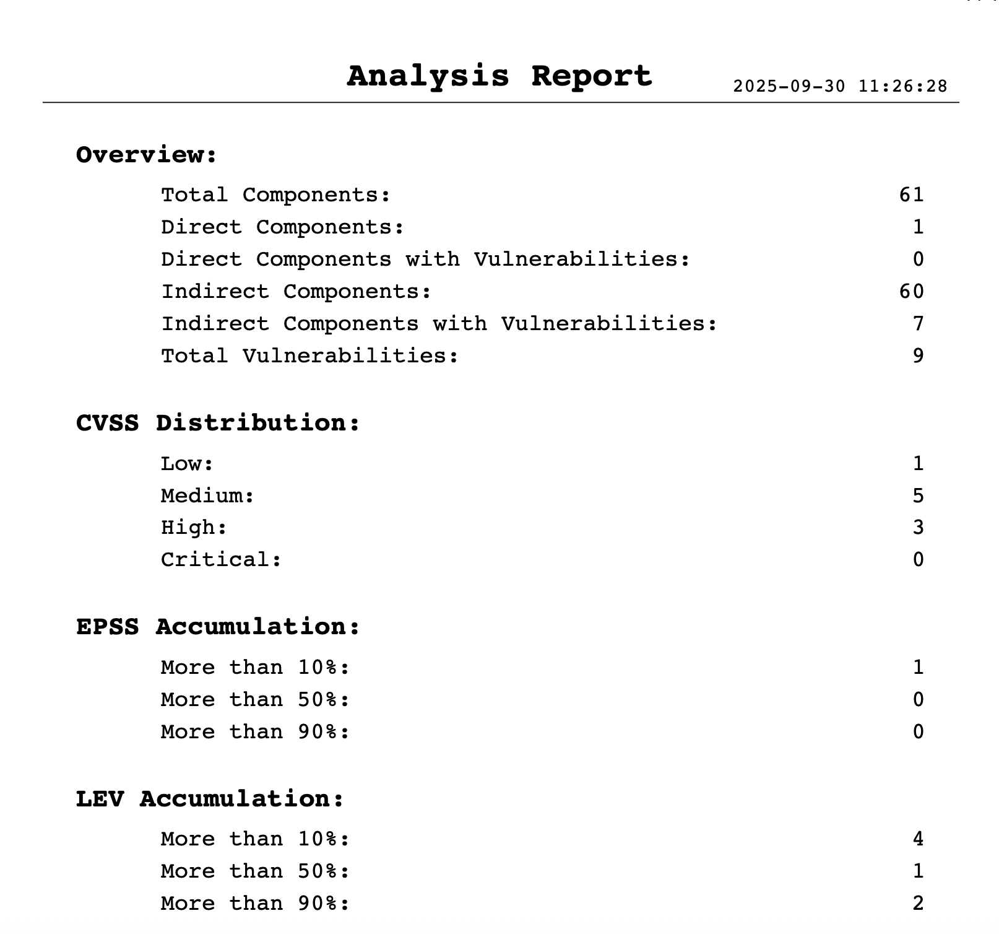

# SBOM 分析視覺化工具 ex-sbom

## 介紹

SBOM（Software Bill of Materials，軟體物料清單）是一份詳細列出軟體元件及其相依性的文件。隨著軟體供應鏈的複雜性增加，理解和管理這些元件變得越來越重要。為了幫助開發者和安全團隊更好地分析和視覺化 SBOM，我們開發了一個專門的 GUI 工具，並且於 Github 上以 MIT 授權開源。

## 運作原理

該工具在本地運行，無需將 SBOM 上傳到雲端，確保資料安全性和隱私。然而因為必須爬取外部漏洞資料庫資訊，請確保執行環境可連至網際網路。使用者選擇 SBOM 檔案（JSON 格式）後，程式會採用 osv-scanner 的相關運算函數爬取[ OSV 資料庫](https://osv.dev/list)內的元件相關資訊、爬取元件於 [FIRST 資料庫之風險評估分數（EPSS）](https://www.first.org/epss/)、並且計算元件之間的依賴拓樸，最後以圖形化介面呈現。

## 如何操作

### 下載與本地運行

1. 前往 [ex-sbom GitHub release 頁面](https://github.com/nics-tw/ex-sbom/releases/latest) 下載標示 `latest` 最新版本的壓縮檔。

2. 解壓縮下載的檔案，並在解壓後的目錄中找到可執行檔 `ex-sbom.exe`。

> 如果您有 Golang 開發環境，您也可以從 [ex-sbom GitHub repository](https://github.com/nics-tw/ex-sbom) 下載原始碼並依照說明自行編譯。

### 選擇 SBOM 檔案

1. 點選 `選擇 SBOM 檔案` (或 `Select SBOM File`) 按鈕，並選擇您想要分析的 SBOM 檔案（JSON 格式）。

2. 選擇 SBOM 檔案後，程式會開始查詢相關資訊，結果將於讀取完成時顯示在同一頁面下方。

> 如果您有多個 SBOM 檔案需要分析，可以一次選擇多個檔案進行分析，程式會將每個檔案的結果依序顯示在頁面下方，並且可透過點選不同的標籤來切換檢視。

3. 在總覽頁面當中，此工具將依照直接使用 - 多層間接使用（區分為 1 - n 級）的方式來分層顯示。頁面上每一個方塊即為一個單獨的元件。元件直接引入漏洞會以紅色底色標示，即元件本身有漏洞。而元件間接引入漏洞會以黃色底色標示，即元件本身無漏洞，但採用到其他具有漏洞的元件。

4. 點選任一個元件方塊，會顯示該元件的詳細資訊，包括名稱、版本、授權。

5. 針對元件之依賴供應鏈當中存在漏洞的情況，會在該元件的詳細資訊中顯示其供應鏈影響範圍。

6. 針對元件本身存在漏洞的情況，會在該元件的詳細資訊中顯示漏洞相關資訊，包括 CVE 編號、嚴重性分數 (CVSS)、EPSS 分數、LEV。並且於元件版本旁顯示建議修補版本。

> 此處的「建議修補版本」是以修補與該元件相關的所有 CVSS >= 7.0 漏洞為目標，提供建議版本。倘若並無 CVSS >= 7.0 漏洞的話，則以修補與該元件相關的所有漏洞為目標，提供升級幅度最小的版本。

> CVSS (Common Vulnerability Scoring System) 是一個用於評估資訊安全漏洞嚴重性的標準化框架。它提供了一個從 0 到 10 的分數範圍，用於表示漏洞的嚴重程度，並且考慮了多個因素，包括漏洞的可利用性、影響範圍以及對系統的潛在影響。CVSS 分數有助於組織安排不同漏洞修復工作的優先順序，並制定有效的安全策略。

> EPSS (Exploit Prediction Scoring System) 是一個用於預測資訊安全漏洞被利用可能性的評分系統。它基於歷史數據和機器學習模型，評估特定漏洞在未來被攻擊者利用的概率。EPSS 分數有助於組織識別高風險漏洞，從而優先考慮修復工作並加強防禦措施。

> LEV (Likely Exploited Vulnerabilities) 是一個用於評估資訊安全漏洞近期被利用可能性的指標。它基於過往 30 天內的漏洞利用數據，提供了一個從 0 到 1 的分數範圍。

針對如何運用上述指標判斷漏洞風險與考量修補優先順序，可參考 [NIST 的相關建議文件](https://nvlpubs.nist.gov/nistpubs/CSWP/NIST.CSWP.41.pdf)。其文件中建議以 `max( LEV, EPSS )` 作為評估漏洞風險的主要指標。透過參酌過去此漏洞已經被利用的機率、以及未來可能被利用的機率，動態地針對漏洞風險進行評估。

7. 如果想知道漏洞的具體細節，可以點選該漏洞，其相關的敘述、參考連結、修補版本等資訊會顯示在下方。

8. 此外，如果需要該 SBOM 的整體報告，可於總覽頁面點選 `Download PDF Report` 按鈕，下載包含所有元件及其漏洞資訊的 PDF 檔案。

