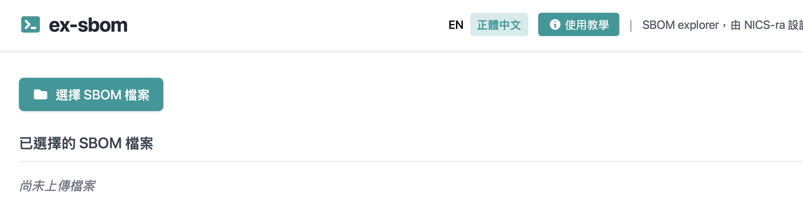
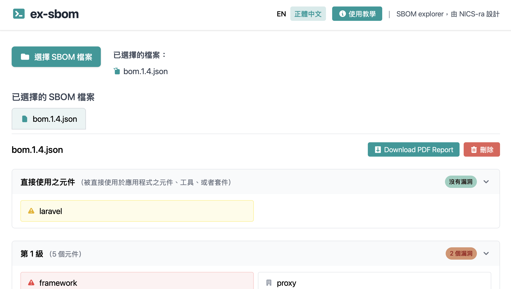
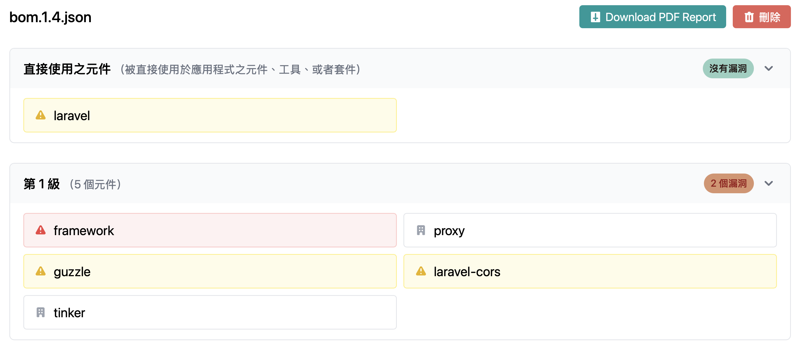
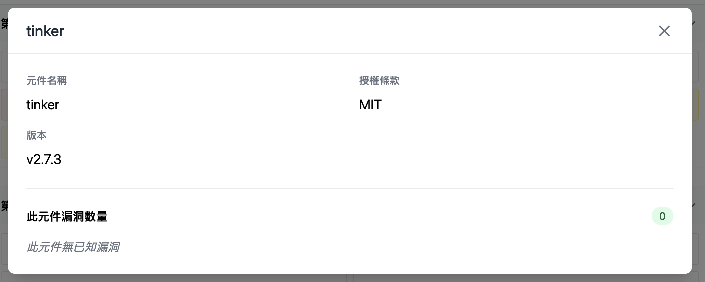
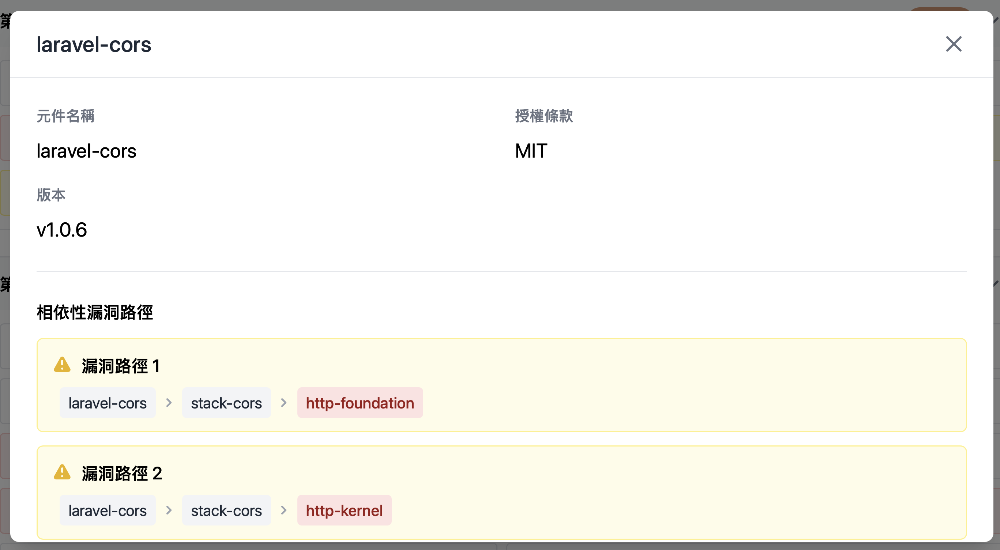
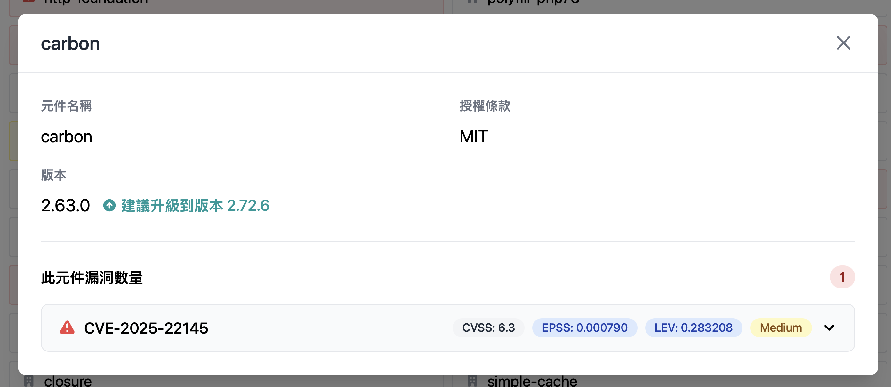
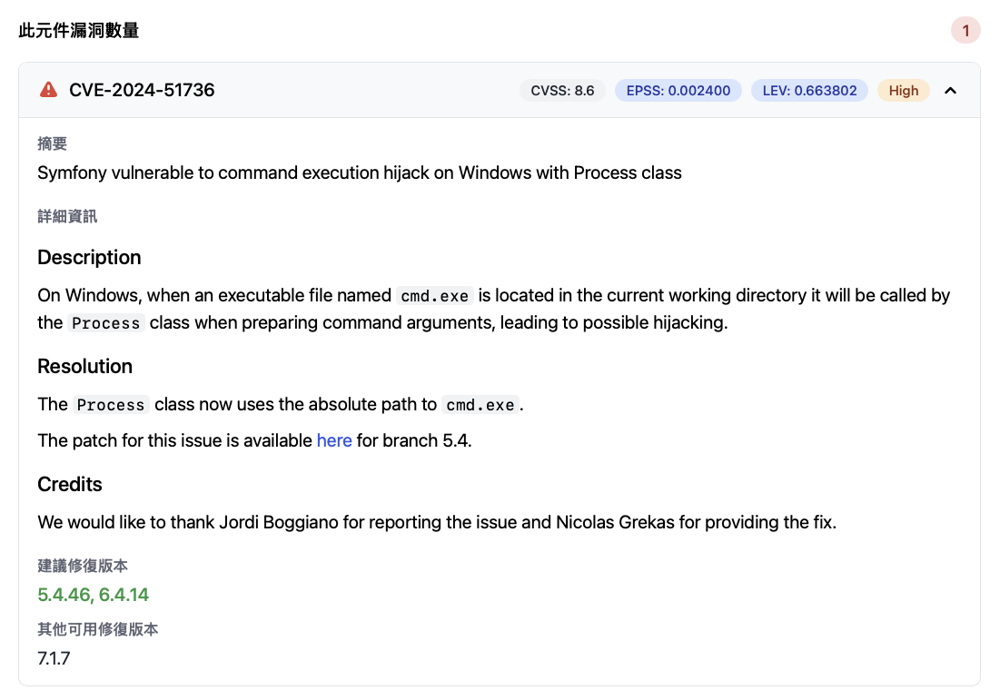

# SBOM 分析視覺化工具 ex-sbom

## 介紹

SBOM（Software Bill of Materials，軟體物料清單）是一份詳細列出軟體組件及其相依性的文件。隨著軟體供應鏈的複雜性增加，理解和管理這些組件變得越來越重要。為了幫助開發者和安全團隊更好地分析和視覺化 SBOM，我們開發了一個專門的 GUI 工具，並且於 Github 上以 MIT 授權開源。

## 運作原理

該工具在本地運行，無需將 SBOM 上傳到雲端，確保數據的安全性和隱私。然而因為需要爬取外部資訊，請確保在執行環境有可聯外之網際網路。用戶選擇 json 格式的 SBOM 檔案後，程式會採用 osv-scanner 的相關運算函數爬取 OSV 資料庫內的元件相關資訊、爬取元件於 FIRST 資料庫之 EPSS 風險評估分數、並且計算元件之間的依賴拓樸，最後以圖形化介面呈現。

## 如何操作

### 下載與本地運行

1. 前往 [ex-sbom GitHub release 頁面](https://github.com/nics-tw/ex-sbom/releases) 下載最新版本的壓縮檔。

2. 解壓縮下載的檔案，並在解壓後的目錄中找到可執行檔 `ex-sbom.exe`。

> 如果您的運行環境有 Golang 開發環境，您也可以從 [ex-sbom GitHub repository](https://github.com/nics-tw/ex-sbom) 下載原始碼並依照說明自行編譯。

### 選擇 SBOM 檔案

1. 點選 `選擇 SBOM 檔案` (或 `Select SBOM File`) 按鈕，瀏覽並選擇您想要分析的 SBOM JSON 檔案。

2. 程式會開始查詢相關資訊，完成後會將結果顯示在頁面下方。

> 如果您有多個 SBOM 檔案需要分析，可以重複此步驟，程式會將每個檔案的結果依序顯示在頁面下方，並且可透過點選不同的標籤來切換檢視。

3. 在總覽頁面當中，此工具將依照直接使用 - 多層間接使用的方式來做分層顯示。每一個獨立的元件即為一個方塊。針對本身無漏洞，但採用到有漏洞元件的情況，會以黃色底色來標示。而針對本身有漏洞的元件，則會以紅色底色來標示。

4. 點選任一個元件方塊，會顯示該元件的詳細資訊，包括名稱、版本、授權。

5. 針對元件之依賴供應鏈當中存在漏洞的情況，會在該元件的詳細資訊中顯示相關其供應鏈影響範圍。

6. 針對元件本身存在漏洞的情況，會在該元件的詳細資訊中顯示相關漏洞資訊，包括 CVE 編號、嚴重性分數 (CVSS)、EPSS 分數、LEV。並且於元件版本旁顯示該建議的修補版本。

> 此處的建議修補版本是以能修補該元件內所有 CVSS >= 7.0 的漏洞版本為主。倘若並無此類漏洞的話，則為修正元件內所有漏洞的最低版本。

> CVSS (Common Vulnerability Scoring System) 是一個用於評估資訊安全漏洞嚴重性的標準化框架。它提供了一個數值範圍（從 0 到 10），用於表示漏洞的嚴重程度，並且考慮了多個因素，包括漏洞的可利用性、影響範圍以及對系統的潛在影響。CVSS 分數有助於組織優先處理漏洞修復工作，並制定有效的安全策略。

> EPSS (Exploit Prediction Scoring System) 是一個用於預測資訊安全漏洞被利用可能性的評分系統。它基於歷史數據和機器學習模型，評估特定漏洞在未來被攻擊者利用的概率。EPSS 分數有助於組織識別高風險漏洞，從而優先考慮修復工作並加強防禦措施。

> LEV (Likely Exploited Vulnerabilities) 是一個用於評估資訊安全漏洞近期被利用可能性的指標。它基於過往 30 天內的漏洞利用數據，提供了一個從 0 到 1 的分數範圍。

針對如何運用上述指標判斷漏洞風險與考量修補優先順序，可參考 [NIST 的相關建議文件](https://nvlpubs.nist.gov/nistpubs/CSWP/NIST.CSWP.41.pdf)。其文件中建議以 `max( LEV, EPSS )` 作為評估漏洞風險的主要指標。透過參酌過去此漏洞已經被利用的機率、以及未來可能被利用的機率，動態地針對漏洞風險進行評估。

7. 如果想知道漏洞的具體細節，可以點選該漏洞，其相關的敘述、參考連結、修補版本等資訊會顯示在下方。

8. 此外，如果需要該 SBOM 的整體報告。可於總覽頁面點選 `Download PDF Report` 按鈕，下載包含所有元件及其漏洞資訊的 PDF 檔案。
