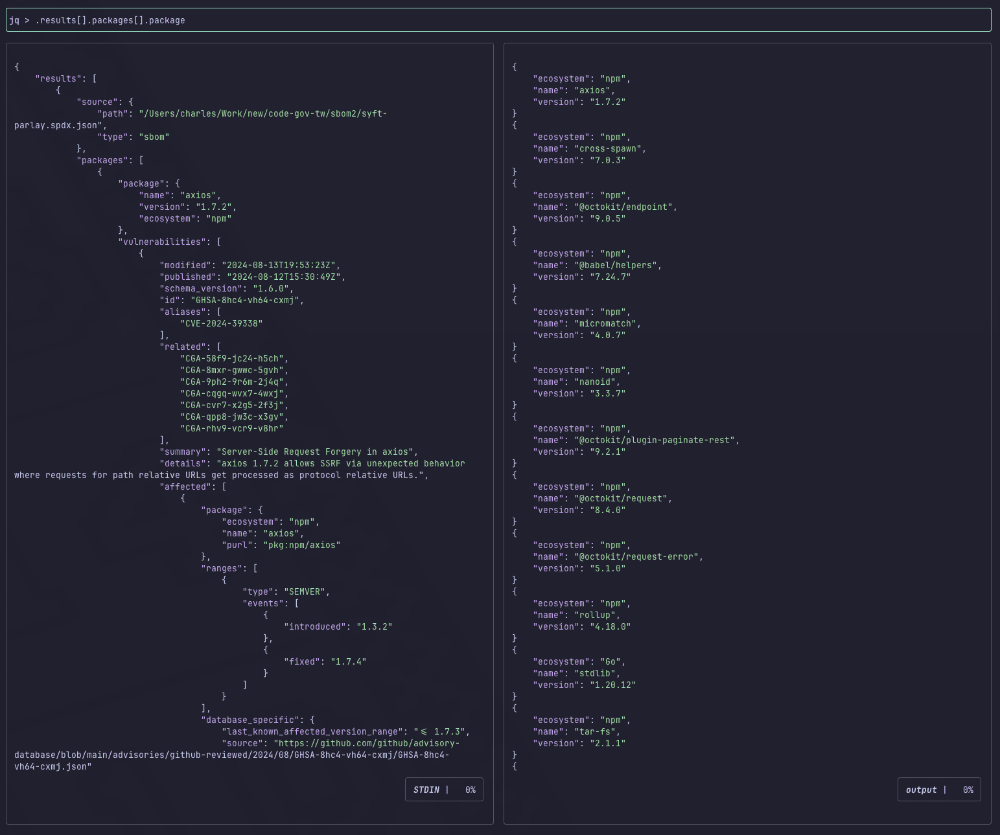
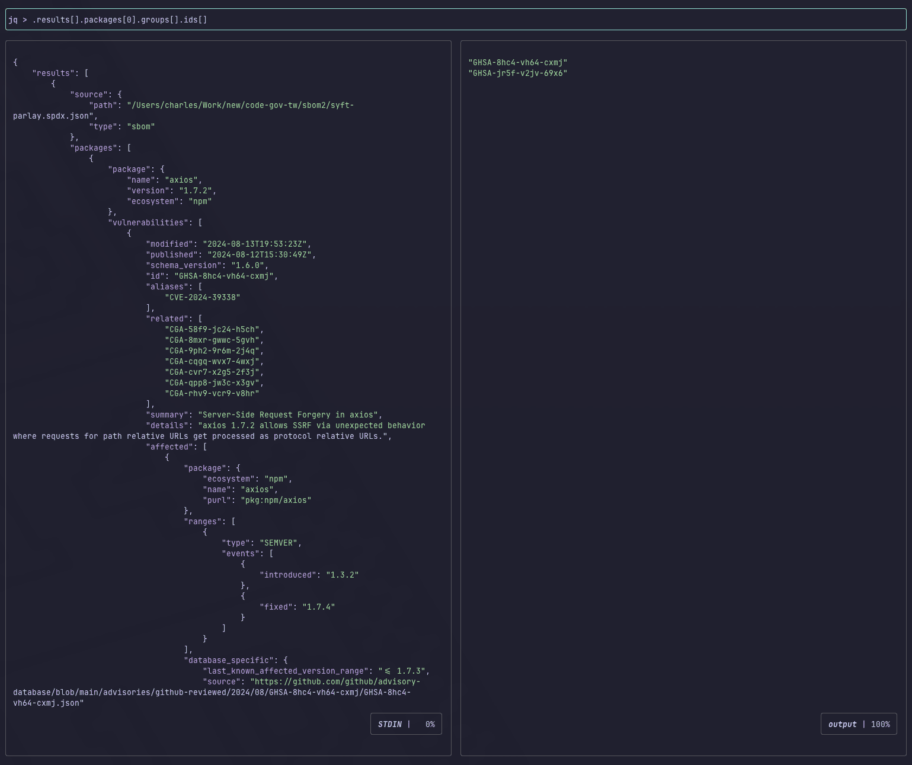
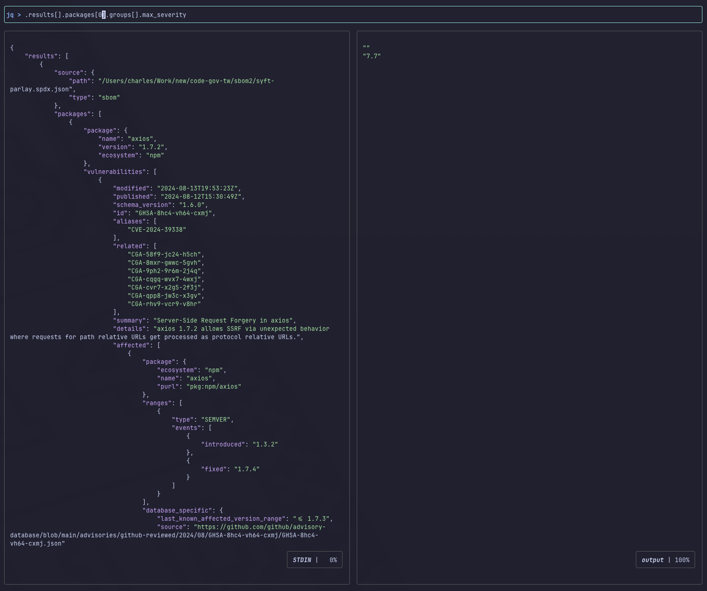
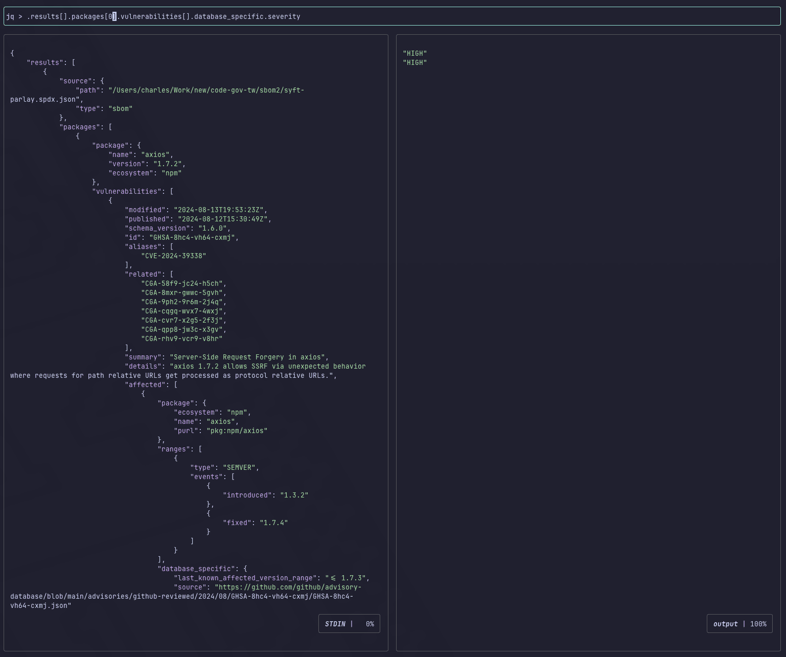
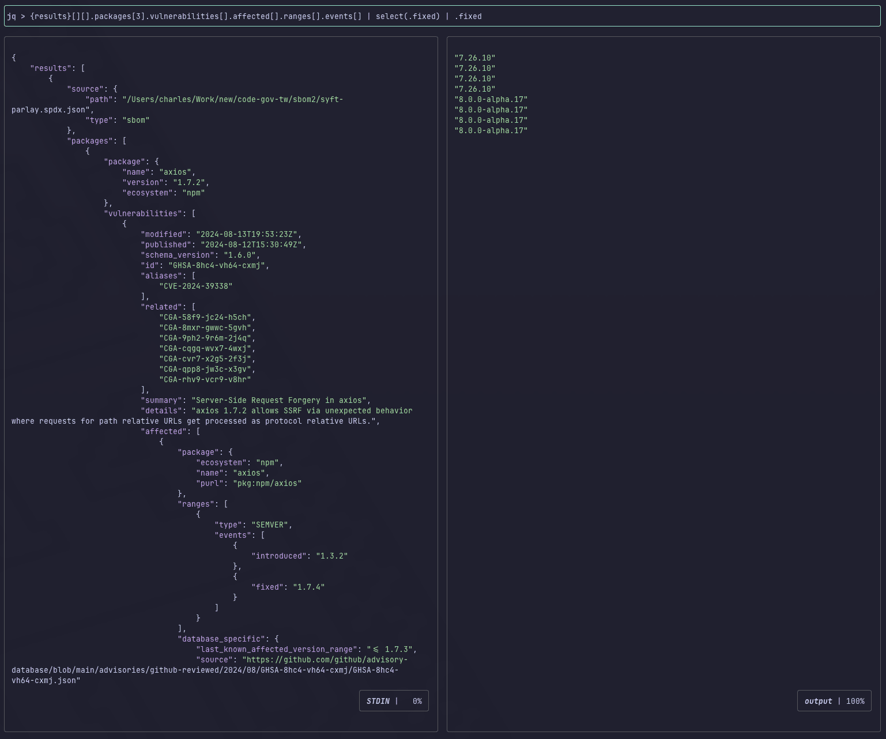

# SBOM 漏洞掃描結果判讀

## 工具介紹

- `syft`: Anchore Co. 開發的工具，主要用於生成 Software Bill of Materials (SBOM)。
- `trivy`: Aqua Co. 開發的工具，主要用於漏洞元件掃描，生成格式為表格，適合直接判讀，也可用於生成 SBOM。
- `osv-scanner`: Google 開發的工具，主要用於漏洞元件掃描，生成格式為 JSON，適合後續串接其他服務。
- `parlay`: Snyk Co. 開發的工具，用於為既有 SBOM 添增部分資料欄位，如`supplier`, `homepage`, `discription`, `licenseConcluded`等。
- `jqp`: 用於分析 JSON 資料的命令列工具。

## 流程簡介

### 通用步驟

1. 由 syft 與 trivy 分別生成 SBOM（如 syft.spdx.json 與 trivy.spdx.json）
2. 由 parlay 增添 syft.spdx.json 與 trivy.spdx.json 部分資料欄位（如 syft-parlay.spdx.json 與 trivy-parlay.spdx.json）

### 分析步驟

- 使用 osv-scanner 分析 syft-parlay.spdx.json 與 trivy-parlay.spdx.json 之漏洞元件，生成分析結果 （如 osv-syft.json）
  or
- 使用 trivy 分析 syft-parlay.spdx.json 與 trivy-parlay.spdx.json 之漏洞元件，生成分析結果 （如 trivy-report.txt）

## 範例說明

### 操作環境

- 作業系統: macOS Sequoia 15.5
- 示範專案: [moda-gov-tw/code-gov.tw](https://github.com/moda-gov-tw/code-gov-tw/tree/3f323772a32896b171b17841b569bc05f7cf4035)，commit: 3f32377

- `syft` version: 1.26.1
- `trivy` version: 0.63.0
- `osv-scanner` version: 2.0.2
- `parlay` version: 0.8.0
- `jqp` version: 0.7.0

### 指令流程

複製專案

```bash
git clone git@github.com:moda-gov-tw/code-gov-tw.git
git branch demo-commit-branch fcbd92b
git switch 3f32377
```

生成 SBOM

```bash
cd code-gov-tw && mkdir sbom
syft . -o spdx-json=./sbom/syft.spdx.json
trivy fs . --format=spdx-json --output=./sbom/trivy.spdx.json
```

增補欄位

NOTE: 由於 parlay 是逐一取得每個元件的相關資料，運行時間會與元件數量呈正比，以 code-gov-tw 為例，耗時 17 分鐘左右才增補完成。

```bash
cd sbom
parlay ecosystems enrich syft.spdx.json > syft-parlay.spdx.json
parlay ecosystems enrich trivy.spdx.json > trivy-parlay.spdx.json
```

漏洞元件掃描（ osv-scanner 做法）

```bash
osv-scanner --sbom=./syft-parlay.spdx.json --format=json --output=osv-syft.json
osv-scanner --sbom=./trivy-parlay.spdx.json --format=json --output=osv-trivy.json
```

osv-scanner 結果：

```json
{
  "results": [
    {
      "source": {
        "path": "/Users/charles/Work/new/code-gov-tw/sbom2/syft-parlay.spdx.json",
        "type": "sbom"
      },
      "packages": [
        {
          "package": {
            "name": "axios",
            "version": "1.7.2",
            "ecosystem": "npm"
          },
          "vulnerabilities": [
            {
              "modified": "2024-08-13T19:53:23Z",
              "published": "2024-08-12T15:30:49Z",
              "schema_version": "1.6.0",
              "id": "GHSA-8hc4-vh64-cxmj",
......以下省略
```

漏洞元件掃描（ trivy 做法）

```bash
trivy sbom ./syft-parlay.spdx.json --scanners vuln > trivy-vuln-syft.txt
trivy sbom ./trivy-parlay.spdx.json --scanners vuln > trivy-vuln-trivy.txt
```

trivy 結果：

```
Report Summary

┌─────────┬──────────┬─────────────────┐
│ Target  │   Type   │ Vulnerabilities │
├─────────┼──────────┼─────────────────┤
│         │ gobinary │       16        │
├─────────┼──────────┼─────────────────┤
│ Node.js │ node-pkg │       26        │
└─────────┴──────────┴─────────────────┘
Legend:
- '-': Not scanned
- '0': Clean (no security findings detected)


 (gobinary)
===========
Total: 16 (UNKNOWN: 0, LOW: 0, MEDIUM: 13, HIGH: 2, CRITICAL: 1)

┌─────────┬────────────────┬──────────┬────────┬───────────────────┬──────────────────────────────┬──────────────────────────────────────────────────────────────┐
│ Library │ Vulnerability  │ Severity │ Status │ Installed Version │        Fixed Version         │                            Title                             │
├─────────┼────────────────┼──────────┼────────┼───────────────────┼──────────────────────────────┼──────────────────────────────────────────────────────────────┤
│ stdlib  │ CVE-2024-24790 │ CRITICAL │ fixed  │ 1.20.12           │ 1.21.11, 1.22.4              │ The various Is methods (IsPrivate, IsLoopback, etc) did not  │
│         │                │          │        │                   │                              │ work as ex...                                                │
│         │                │          │        │                   │                              │ https://avd.aquasec.com/nvd/cve-2024-24790                   │
│         ├────────────────┼──────────┤        │                   ├──────────────────────────────┼──────────────────────────────────────────────────────────────┤
│         │ CVE-2023-45288 │ HIGH     │        │                   │ 1.21.9, 1.22.2               │ golang: net/http, x/net/http2: unlimited number of           │
│         │                │          │        │                   │                              │ CONTINUATION frames causes DoS                               │
│         │                │          │        │                   │                              │ https://avd.aquasec.com/nvd/cve-2023-45288                   │
│         ├────────────────┤          │        │                   ├──────────────────────────────┼──────────────────────────────────────────────────────────────┤
│         │ CVE-2024-34156 │          │        │                   │ 1.22.7, 1.23.1               │ encoding/gob: golang: Calling Decoder.Decode on a message    │
│         │                │          │        │                   │                              │ which contains deeply nested structures...                   │
│         │                │          │        │                   │                              │ https://avd.aquasec.com/nvd/cve-2024-34156                   │
│         ├────────────────┼──────────┤        │                   ├──────────────────────────────┼──────────────────────────────────────────────────────────────┤
│         │ CVE-2023-45289 │ MEDIUM   │        │                   │ 1.21.8, 1.22.1               │ golang: net/http/cookiejar: incorrect forwarding of          │
│         │                │          │        │                   │                              │ sensitive headers and cookies on HTTP redirect...            │
│         │                │          │        │                   │                              │ https://avd.aquasec.com/nvd/cve-2023-45289                   │
...以下省略
```

## 結果判讀

trivy-vuln-syft.txt 與 trivy-vuln-trivy.txt 基本上無需特別處理，直接閱讀並綜合結果即可。

osv-syft.json 與 osv-trivy.json 則需要額外處理方能較好的理解結果，以下將以 `jqp` 作爲媒介來判讀。

### 運行 jqp

NOTE: 按下 `Ctrl+c` 可以離開 jqp 操作畫面。

```bash
cat osv-syft.json | jqp
or
cat osv-trivy.json | jqp
```

#### 列出受影響的元件

在 jqp 中輸入 `.results[].packages[].package` 並按下 `Enter` 鍵：



#### 列出第零項元件的漏洞代號

輸入 `.results[].packages[0].groups[].ids[]` ，注意 "0" 需在 packages 後的 [] 輸入：



#### 列出第零項元件的漏洞分數

輸入 `.results[].packages[0].groups[].max_severity`：

NOTE: 若為空值，代表該漏洞尚未被評估級數，建議取所有漏洞的最大值。



#### 列出第零項元件的漏洞評級

輸入 `.results[].packages[0].vulnerabilities[].database_specific.severity`：



#### 列出可修復第三項元件漏洞的版本

輸入 `.results[].packages[3].vulnerabilities[].affected[].ranges[].events[] | select(.fixed) | .fixed`：

NOTE: 建議採用所有正式版本中最大值，盡量不要選擇有帶 alpha, beta, rc 等測試版後綴的版本，除非沒有其他版本可以選擇。



---

## 參考資料

- [syft document](https://github.com/anchore/syft/wiki)
- [trivy document](https://trivy.dev/latest/docs/)
- [osv-scanner document](https://google.github.io/osv-scanner/)
- [parlay repository](https://github.com/snyk/parlay)
- [jqp repository](https://github.com/noahgorstein/jqp#configuration)
