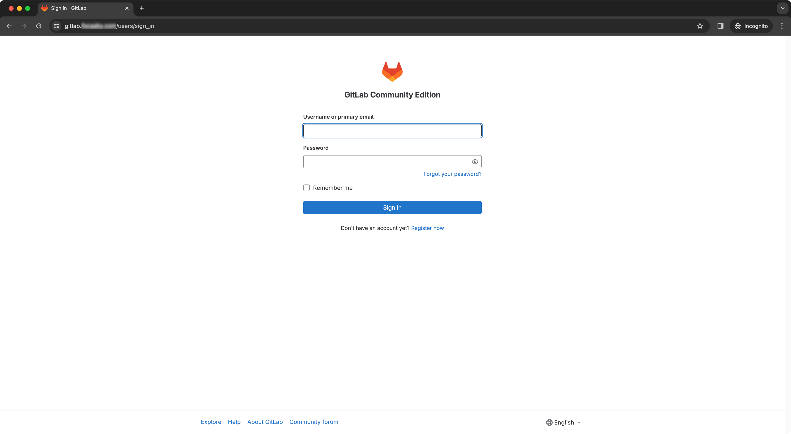
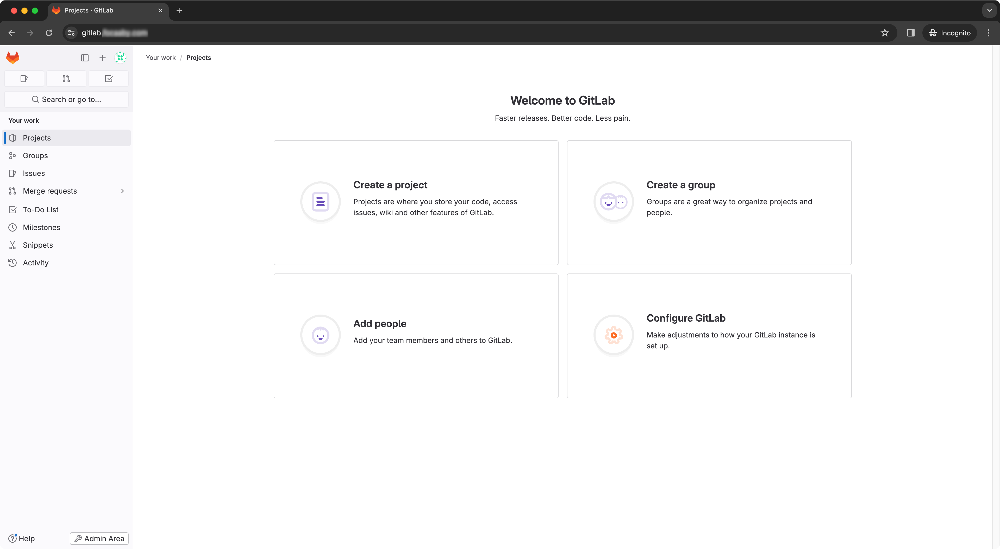
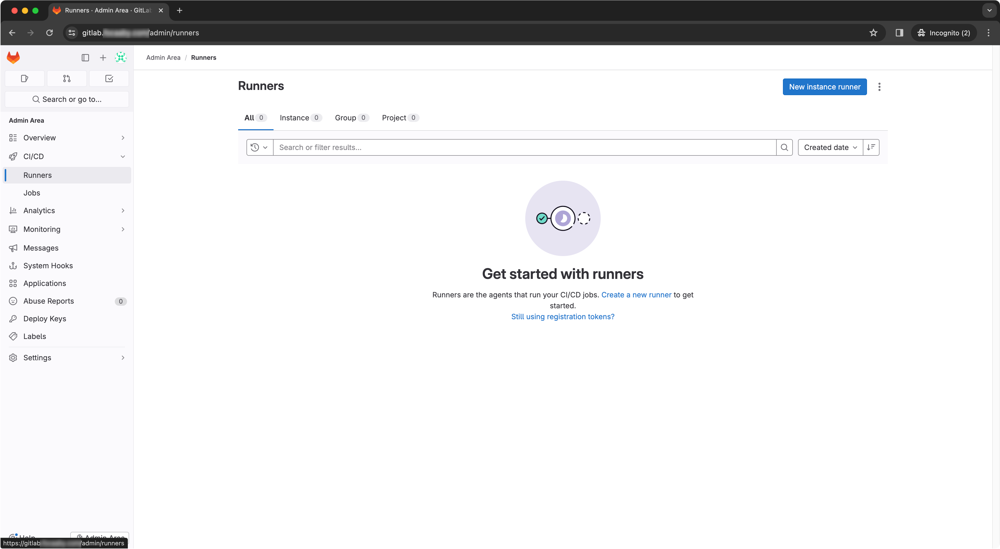
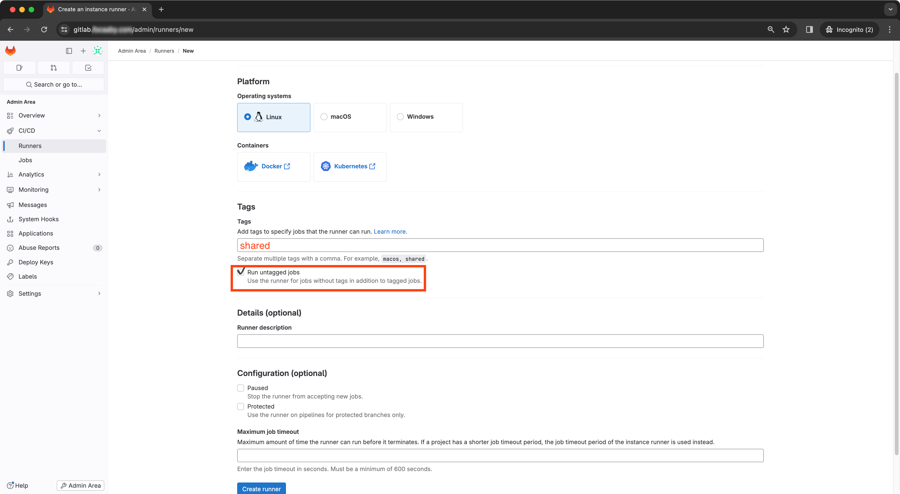
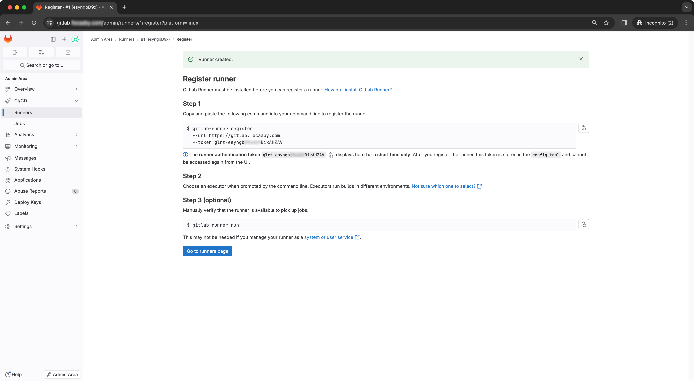
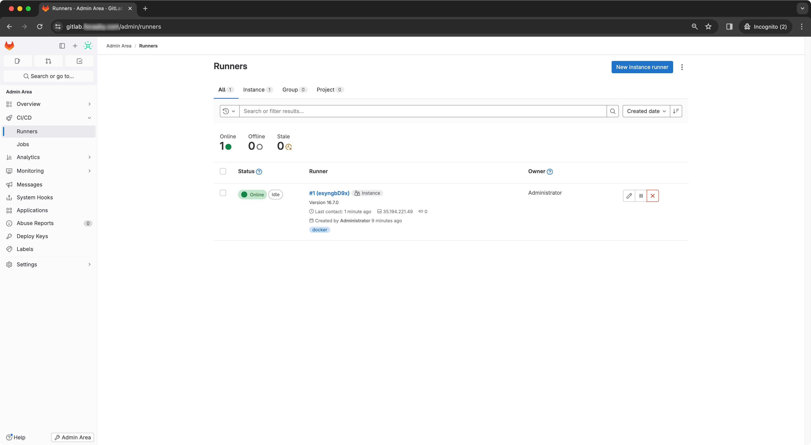

# 可維護性

廠商交付的原始碼與弱點掃描報告，機關需有獨立的驗證與佈署流程。建議機關建立自動化驗證與佈署流程，並使用工具來管理與掃描系統元件組成與可能弱點。


## 版本控制 - 建立原始碼管理平台

為讓承辦人員可以收納管理程式碼及自動化部署流程，現行有 GitHub 及 GitLab 平台。因 GitHub 自建（self-hosted）仍須採購 GitHub enterprise 才能使用相應功能；而 GitLab 則提供 Community Edition (CE) 開放原始碼版本，雖有功能上限制，但足夠作為基礎自動化驗證及部署流程，因此以下為使用 GitLab 基礎建置。

為了日後易於維護及升級便利，以下範例步驟使用 Docker 來建立 GitLab 環境作為示範，建議須依照機關環境評估以 [Official Linux package](https://about.gitlab.com/install/) 方式安裝部屬或 Docker 方式部屬。

### Prerequisite[^1]

- 需[安裝 Docker Engine](https://docs.docker.com/engine/install/) 及 docker compose plugin，請先依據 Linux distribution 安裝對應版本。
- 需有一個外部可存取的 DNS 域名給 GitLab 使用。
- 需至少兩台主機
  - GitLab 主機
  - GitLab runner 主機

### 使用 Docker 建立 GitLab 平台[^2]

1. 登入 GitLab 主機。
2. 以下範例為建立 `/srv/gitlab` 目錄，也可以建立於任一 user 家目錄。此目錄將使用於 GitLab 設定檔、log 及資料。

    ```bash
    $ sudo mkdir -p /srv/gitlab
    ```

3. 建立一個環境變數 `$GITLAB_HOME`，稍後安裝步驟會使用到。您也可以考慮增加至 `$HOME/.bashrc` 檔案。

    ```bash
    $ export GITLAB_HOME=/srv/gitlab
    ```

4. 建立以下 `docker-compose.yml`

    ```bash
    $ cat ./docker-compose.yml
    version: '3.6'
    services:
    web:
        image: gitlab/gitlab-ce:16.7.3-ce.0 # GitLab 版本
        restart: always
        hostname: 'gitlab.example.com'      # 自定義 DNS 域名名稱
        environment:
        GITLAB_OMNIBUS_CONFIG: |
            external_url 'https://gitlab.example.com'
            gitlab_rails['gitlab_shell_ssh_port'] = 2224 # 由於預設 SSH 使用 22 port，將 GitLab SSH port 設定於 2224，可以自行修改 port
        ports:
        - '80:80'
        - '443:443'
        - '2224:22'                                      # 由於預設 SSH 使用 22 port，將 GitLab SSH port 設定於 2224，可以自行修改 port
        volumes:
        - '$GITLAB_HOME/config:/etc/gitlab'
        - '$GITLAB_HOME/logs:/var/log/gitlab'
        - '$GITLAB_HOME/data:/var/opt/gitlab'
        shm_size: '256m'
    ```

5. 使用 docker compose 命令執行 GitLab。

    ```bash
    $ docker compose up -d
    [+] Running 2/2
    ✔ Network maowang_default  Created                                                                                                                                                     0.1s
    ✔ Container maowang-web-1  Started
    ```

6. 等待 GitLab container status 從 (health: starting) 變成 healthy。

    ```bash
    $ docker compose ps
    NAME            IMAGE                          COMMAND             SERVICE   CREATED          STATUS                             PORTS
    maowang-web-1   gitlab/gitlab-ce:16.7.3-ce.0   "/assets/wrapper"   web       58 seconds ago   Up 57 seconds (health: starting)   0.0.0.0:80->80/tcp, :::80->80/tcp, 0.0.0.0:443->443/tcp, :::443->443/tcp, 0.0.0.0:2224->22/tcp, :::2224->22/tcp


    $ docker compose ps
    NAME            IMAGE                          COMMAND             SERVICE   CREATED         STATUS                   PORTS
    maowang-web-1   gitlab/gitlab-ce:16.7.3-ce.0   "/assets/wrapper"   web       9 minutes ago   Up 9 minutes (healthy)   0.0.0.0:80->80/tcp, :::80->80/tcp, 0.0.0.0:443->443/tcp, :::443->443/tcp, 0.0.0.0:2224->22/tcp, :::2224->22/tcp
    ```

7. 使用 `docker exec` 命令取得預設 root user 密碼。初次使用 root 密碼後，24 小時候此檔案會被自動移除，請儲存此密碼或登入後修改 root user 密碼。

    ```bash
    $ sudo docker exec -it YOUR_GITLAB_CONTAINER_NAME  grep 'Password:' /etc/gitlab/initial_root_password

    # 範例
    $ sudo docker exec -it maowang-web-1 grep 'Password:' /etc/gitlab/initial_root_password
    Password: FMPTcFGvs5G......pBs4DFwnZZvjL+4IOJwg=
    ```

8. 預設 admin username 為 root，密碼為前一步驟輸出密碼。

    

9. 登入成功。

    

### 使用 Docker 部署 GitLab runner[^3]

1. 登入 GitLab runner 主機
2. 以下範例為建立 `/srv/gitlab-runner/` 目錄，也可以建立於任一 user 家目錄。此目錄將使用於 GitLab runner 設定檔。

    ```bash
    $ sudo mkdir -p /srv/gitlab-runner/
    ```

3. 於左側欄選單 Admin Area -> CI/CD -> Runner 至 Runner 設定頁面，點選 New Instance runner。

    

4. 填寫 Tags，以下範例為 `shared`，勾選 Run untagged jobs 以讓此 runner 無須 tag 讓全部專案使用，並點選 Create Runner。

    

5. 建立 Runner 後，可以取得 Runner token。

    

6. 回到 GitLab runner 主機，使用 docker 註冊此主機為 GitLab runner。需填入以下資訊：
   - GitLab instance URL：GitLab 域名
   - registration token：步驟 5 所產生的 token
   - runner name：自定義
   - executor type：`docker`
   - 預設 GitLab CI/CD job 使用的 Docker image：可自行定義，我這邊使用 `ubuntu:latest` image

    ```bash
    $ docker run --rm -it -v /srv/gitlab-runner/config:/etc/gitlab-runner gitlab/gitlab-runner register
    Runtime platform                                    arch=amd64 os=linux pid=7 revision=102c81ba version=16.7.0
    Running in system-mode.

    Enter the GitLab instance URL (for example, https://gitlab.com/):
    https://gitlab.example.com/
    Enter the registration token:
    glrt-esyngbD9x4UYBikAHZAV
    Verifying runner... is valid                        runner=esyngbD9x
    Enter a name for the runner. This is stored only in the local config.toml file:
    [8503d76bcb78]: gitlab-runner-1
    Enter an executor: docker+machine, instance, custom, docker-windows, virtualbox, docker-autoscaler, kubernetes, docker, parallels, shell, ssh:
    docker
    Enter the default Docker image (for example, ruby:2.7):
    ubuntu:latest
    Runner registered successfully. Feel free to start it, but if it's running already the config should be automatically reloaded!

    Configuration (with the authentication token) was saved in "/etc/gitlab-runner/config.toml"
    ```

7. 註冊後，會自動生成以下 GitLab runner 設定檔。

    ```bash
    $ sudo cat /srv/gitlab-runner/config/config.toml
    concurrent = 1 # 同時併發可執行 job 數量，可依據 GitLab runner 主機效能提高 concurrent 數量
    check_interval = 0
    shutdown_timeout = 0

    [session_server]
    session_timeout = 1800

    [[runners]]
    name = "gitlab-runner-1"
    url = "https://gitlab.example.com/"
    id = 1
    token = "glrt-esyngb...略...BikAHZAV"
    token_obtained_at = 2024-01-17T06:33:37Z
    token_expires_at = 0001-01-01T00:00:00Z
    executor = "docker"
    [runners.cache]
        MaxUploadedArchiveSize = 0
    [runners.docker]
        tls_verify = false
        image = "ubuntu:latest"
        privileged = false
        disable_entrypoint_overwrite = false
        oom_kill_disable = false
        disable_cache = false
        volumes = ["/cache"]
        shm_size = 0
        network_mtu = 0
    ```

8. 使用 docker 執行 GitLab runner。

    ```bash
    sudo docker run -d --name gitlab-runner --restart always \
        -v /srv/gitlab-runner/config:/etc/gitlab-runner \
        -v /var/run/docker.sock:/var/run/docker.sock \
        gitlab/gitlab-runner:latest
    ```

9. 回到 Runner 頁面，檢視 Runner 狀態為 running。

    


[^1]: [Installation system requirements | GitLab](https://docs.gitlab.com/ee/install/requirements.html)
[^2]: [Install GitLab using Docker | GitLab](https://docs.gitlab.com/ee/install/docker.html)
[^3]: [Run GitLab Runner in a container | GitLab](https://docs.gitlab.com/runner/install/docker.html)
