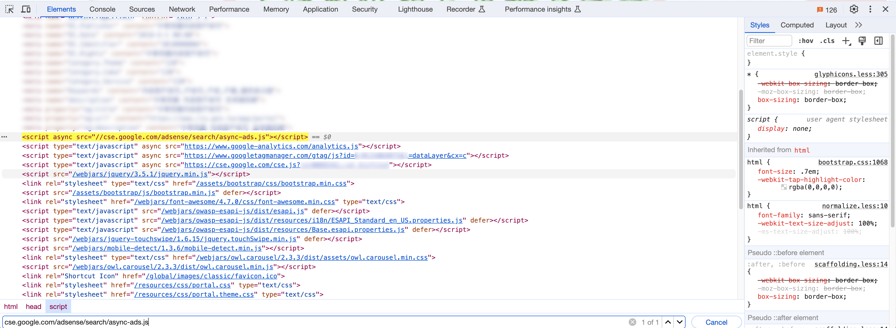

# 易用性

## 網站隱私權保護

網站隱私權保護政策中提到「**除非取得您的同意或其他法令之特別規定，本網站絕不會將您的個人資料揭露於第三人或使用於蒐集目的以外之其他用途。**」但實際上將使用者資料揭露給了第三方的服務，如下：

- 使用 Google Custom Search Engine（CSE），內部包含了 Google AdSense，讓所有使用者個人資料被迫被送到第三分私人公司。搜尋內容也會包含 Google 廣告並使他們獲益。可參考 [Google 自訂搜尋廣告政策](https://support.google.com/adsense/answer/7003954?hl=zh-Hant&sjid=6103718159839767491-AP)。建議尋找替代方案，或使用 [Google CSE 付費無廣告的服務](https://developers.google.com/custom-search/docs/paid_element?hl=zh-tw)。
- 使用 YouTube video embed 網頁，內含廣告，同上。請參考 [YouTube 內嵌影片的廣告](https://support.google.com/youtube/answer/132596?hl=zh-Hant)。建議將廣告關掉或是將影片放到自己主機上使用 HTML `<video>` 嵌入。

### 檢視 Google CSE 是否包含 Google AdSense

1. 於網站開啟[瀏覽器開發者工具](https://developer.mozilla.org/en-US/docs/Learn/Common_questions/Tools_and_setup/What_are_browser_developer_tools)。
2. 過濾篩 `adsense` 關鍵字，如 `cse.google.com/adsense/search/async-ads.js`。如過濾結果有相關 script，則代表使用的 CSE 包含了 Google AdSense，如以下截圖。

### 申請非營利組織並關閉廣告功能[^1]

可程式化搜尋引擎與 [Google For Nonprofits](https://www.google.com/nonprofits/) 和 [Google For Education](https://edu.google.com/products/productivity-tools/) 整合，以在您的非營利組織、政府機構或學校的網站上免費提供可程式化搜尋引擎，且無廣告。

請注意：這僅適用於客戶端的可程式化搜尋引擎元素。使用 JSON API 仍然將產生每 1000 次查詢 5 美元的費用。

1. 如果您還沒有搜尋引擎，首先請[建立您的搜尋引擎](https://support.google.com/programmable-search/answer/11082370?sjid=14926044283688687258-AP)。
2. 填寫[此表格以申請可程式化搜尋引擎的政府版本](https://goo.gl/forms/mW6TSiRDfqcEYfrC3)。
3. 在數個工作天內，您應該會收到一封電子郵件，告知您的搜尋引擎是否已升級為非營利版本。
4. 從搜尋[引擎清單](https://programmablesearchengine.google.com/controlpanel/all)中，選擇您想要編輯的搜尋引擎。
5. 在概觀（Overview）下，滾動至廣告（Ad）選項。
6. 切換至啟用/停用（Enable/Disable），以顯示或不顯示廣告（Ad）。

### 關閉 YouTube 個別影片的廣告功能[^2]

1. 前往 YouTube 工作室。
2. 選取左選單中的「內容」。
3. 點按相關影片旁的營利圖示   。
4. 在「營利」下拉式選單中點按「關閉」。
5. 點按「儲存」。

[^1]: [Information for non-profits](https://support.google.com/programmable-search/answer/12423873)
[^2]: [關閉個別影片的廣告功能](https://support.google.com/youtube/answer/6332943?hl=zh-Hant&sjid=11352596841959028732-AP)
